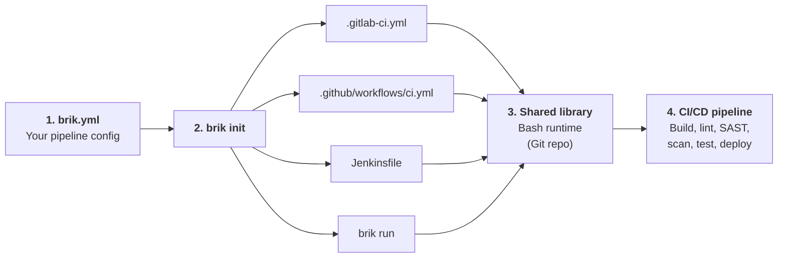
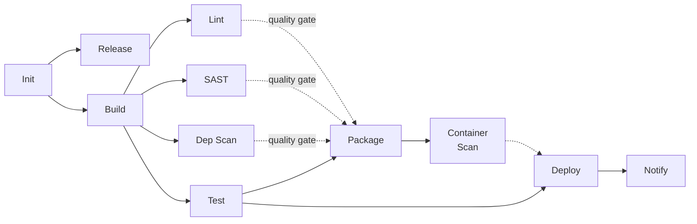

<p align="center">
  
</p>

<p align="center">
  <b>Brik, the portable pipeline standard.</b><br>
  <b>Write once. Run everywhere.</b>
</p>

<p align="center">
  <a href="https://github.com/getbrik/brik/actions/workflows/ci.yml"></a>
  <a href="https://codecov.io/gh/getbrik/brik"></a>
  <a href="#code-metrics"></a>
  <a href="#code-metrics"></a>
  <a href="#code-metrics"></a>
  <a href="LICENSE"></a>
</p>

<p align="center">
  <a href="https://github.com/getbrik/brik/issues">Issues</a> -
  <a href="https://github.com/getbrik/briklab">Briklab</a>
</p>

## What is Brik

Every team writes the same CI/CD logic -- build, test, lint, scan, deploy -- then
rewrites it when switching platforms. Brik ends this cycle.

**Write once**: describe your project in a single `brik.yml` (stack, tools, thresholds).
Brik handles the rest: a fixed pipeline with sensible defaults that works out of the box.

**Run everywhere**: the same `brik.yml` produces a production-grade pipeline on
GitLab CI, Jenkins, and GitHub Actions. No per-platform glue, no vendor lock-in.

- **4 lines to start** -- a minimal config gets you build, test, lint, and security scanning
- **Portable by design** -- Bash runtime runs identically on any CI platform
- **Battle-tested** -- ShellSpec unit tests, end-to-end tests, ShellCheck linting, kcov coverage

## How it works



1. **`brik.yml`** -- describe your project: stack, tools, thresholds. One file, platform-agnostic.
2. **`brik init`** -- generates the bootstrap file for your CI platform: `.gitlab-ci.yml`, GitHub workflow, or `Jenkinsfile`. You can also run locally with `brik run`.
3. **Shared library** -- portable Bash scripts hosted in a Git repository. Each bootstrap file references it. The library reads `brik.yml` and executes each stage.
4. **Pipeline runs** -- build, test, lint, security scan, deploy -- with sensible defaults. Same result whether on CI or locally.

## Install

```bash
# One-liner (recommended)
curl -fsSL https://raw.githubusercontent.com/getbrik/brik/main/scripts/install.sh | bash

# Homebrew (macOS/Linux)
brew install getbrik/tap/brik
```

After installation, run `brik doctor` to check your environment.

<details>
<summary><strong>Prerequisites (local usage only)</strong></summary>

These tools are only needed to run `brik` commands locally (validate, doctor, run).
On CI platforms, the shared library handles everything.

| OS | Command |
|----|---------|
| macOS | `brew install bash yq jq check-jsonschema` |
| Debian/Ubuntu | `sudo apt install -y bash jq` + [yq](https://github.com/mikefarah/yq) + `pip install check-jsonschema` |
| Fedora/RHEL | `sudo dnf install -y bash jq` + [yq](https://github.com/mikefarah/yq) + `pip install check-jsonschema` |
| Windows | `scoop install git bash yq jq python` + `pip install check-jsonschema` |

</details>

## Pipeline Flow

Every Brik pipeline follows a fixed stage sequence:



Lint, SAST, Scan, and Test all run **in parallel** after Build (GitLab `verify` stage).
The quality gate effect applies at **Package**: it waits for Test to pass and for
Lint/SAST/Scan to succeed (or be skipped).

| Stage | Purpose | Default behavior |
|-------|---------|------------------|
| Init | Setup | Validate config, detect stack, export variables |
| Release | Versioning | Compute semantic version from git tags; finalize on tag push only |
| Build | Compile | Stack-specific build (npm, mvn, pip, dotnet, cargo) |
| Lint | Code quality | Lint, format check, type checking |
| SAST | Static analysis | SAST scan, plus license and IaC scans when configured |
| Scan | Dependency scan | Dependency audit and secret scan |
| Test | Test suite | Runs in parallel with Lint/SAST/Scan |
| Package | Artifacts | Docker image build + artifact publishing (npm, maven, pypi, cargo, nuget) |
| Container Scan | Image security | Scan built container images for vulnerabilities |
| Deploy | Deployment | Multi-environment, condition-based (branch/tag) |
| Notify | Notifications | Pipeline summary (always runs on CI; opt-in locally via `--with-deploy`) |

The pipeline is fully deterministic -- no manual triggers. Release runs unconditionally
(computes version), but only finalizes on tag pushes. Package runs on tag pushes
(GitLab) or opt-in locally (`--with-package`). Deploy evaluates per-environment
conditions from `brik.yml`.

Users do not define pipeline structure. They configure behavior within each stage
via `brik.yml`.

## Supported Stacks

| Stack | Detection | Build | Test | Lint |
|-------|-----------|-------|------|------|
| **node** | `package.json` | npm/yarn/pnpm | jest/npm | eslint/biome |
| **java** | `pom.xml` / `build.gradle(.kts)` | mvn/gradle | junit/gradle | checkstyle |
| **python** | `pyproject.toml` / `setup.py` / `Pipfile` | pip/poetry/uv/pipenv | pytest/unittest/tox | ruff |
| **dotnet** | `*.csproj` / `*.sln` | dotnet build | dotnet test | dotnet-format |
| **rust** | `Cargo.toml` | cargo build | cargo | clippy |

Stack is auto-detected from project files when not specified in `brik.yml`.

## Configuration (`brik.yml`)

Brik follows a "declare what, not how" philosophy. Only `version` and `project.name`
are required -- everything else has sensible defaults per stack.

Full example (Java/Maven):

```yaml
version: 1

project:
  name: my-java-app
  stack: java
  stack_version: "21"

build:
  java_version: "21"
  command: mvn package -DskipTests

test:
  framework: junit

quality:
  lint:
    tool: checkstyle
    config: checkstyle.xml
    fix: false
  format:
    tool: google-java-format
    check: true

security:
  deps:
    severity: high
  secrets: {}
```

- JSON Schema: [`schemas/config/v1/brik.schema.json`](schemas/config/v1/brik.schema.json)
- Examples: [`examples/`](examples/) (minimal-node, java-maven, python-pytest, mono-dotnet)
- Full parameter reference: [`docs/reference.md`](docs/reference.md)

## CLI Reference

| Command | Description |
|---------|-------------|
| `brik validate` | Validate `brik.yml` against the JSON Schema |
| `brik doctor` | Check prerequisites (tools, stack detection) |
| `brik init` | Scaffold `brik.yml` and platform bootstrap file |
| `brik run stage <name>` | Execute a pipeline stage locally |
| `brik run pipeline` | Execute the full pipeline locally |
| `brik self-update` | Update brik to the latest version |
| `brik self-uninstall` | Remove brik from your system |
| `brik version` | Print version, schema, and runtime info |
| `brik help` | Print usage information |

Valid stages for `brik run stage`: `init`, `release`, `build`, `lint`, `sast`, `scan`, `test`, `package`, `container-scan`, `deploy`, `notify`.

Key options:

```bash
brik validate --config path/to/brik.yml --schema path/to/schema.json
brik doctor --workspace ./my-project
brik init --stack node --platform gitlab --dir ./my-project --non-interactive
brik run stage build --config brik.yml --workspace .
brik run pipeline --continue-on-error --with-release --with-package --with-deploy
brik self-update --channel edge --version v0.2.0
brik self-uninstall --force
brik version --verbose
```

## Platform Support

| Platform | Status | Integration |
|----------|--------|-------------|
| **GitLab CI** | Functional | Shared library with pipeline template |
| **Jenkins** | Functional | Jenkins Shared Library (CasC + Gitea) |
| **GitHub Actions** | Planned | Reusable workflows |

## Architecture

| Layer | Role |
|-------|------|
| **brik.yml** | Project configuration |
| **Shared Library** | Per platform (GitLab, Jenkins, GitHub Actions) |
| **brik-lib** | Reusable CI/CD functions (Bash) |
| **Bash Runtime** | Stage lifecycle, logging, hooks |

For a detailed explanation of the architecture, design principles, stage lifecycle,
and how to extend Brik, see [docs/architecture.md](docs/architecture.md).

## Development

### Prerequisites

```bash
brew install bash yq jq check-jsonschema shellspec shellcheck kcov
```

### Makefile

The project includes a `Makefile` with common development targets:

```bash
make test          # Run all ShellSpec tests (parallel)
make test-quick    # Run tests, stop on first failure
make lint          # Run shellcheck on all production scripts
make coverage      # Run tests with kcov coverage report
make validate      # Validate all example brik.yml files
make check         # Full pre-commit gate: lint + coverage + validate
make metrics       # Run shellmetrics on production scripts
make install       # Symlink bin/brik into /usr/local/bin (dev mode)
make uninstall     # Remove symlink
make clean         # Remove generated coverage/ directory
```

### Run tests

```bash
# All tests (via Makefile, parallel)
make test

# Or directly with ShellSpec
shellspec

# A specific spec file
shellspec runtime/bash/spec/cli/validate_spec.sh

# With verbose output
shellspec --format documentation

# With coverage (requires kcov)
make coverage
# Report in coverage/index.html
```

Tests are in `runtime/bash/spec/` and `shared-libs/*/spec/` using [ShellSpec](https://shellspec.info). The `.shellspec` config at the project root sets the shell, spec path (`--default-path "**/spec"`), and helper.

> **Note:** `ulimit -n 1024` is required on macOS when running kcov directly. The Makefile handles this automatically. See [kcov#293](https://github.com/SimonKagstrom/kcov/issues/293).

### Validate examples

```bash
# All examples (via Makefile)
make validate

# Single file
bin/brik validate --config examples/minimal-node/brik.yml
```

### Lint

```bash
# All production scripts (via Makefile)
make lint

# Single file
shellcheck bin/brik
```

## Code Metrics

Tracked automatically via [shellmetrics](https://github.com/shellspec/shellmetrics) on every push to `main`:

| Metric | Description |
|--------|-------------|
| **avg CCN** | Average cyclomatic complexity per function (< 5 = green) |
| **Functions** | Total function count across production scripts |
| **LLOC** | Logical lines of code (excludes blanks and comments) |

## Status

**Done:**
- [x] `brik.yml` JSON Schema v1
- [x] Bash Runtime (`stage.run` lifecycle)
- [x] 11 pipeline stages (init, release, build, lint, sast, scan, test, package, container-scan, deploy, notify)
- [x] 5 stacks (node, java, python, dotnet, rust)
- [x] GitLab CI shared library (enterprise-grade DAG with quality gates)
- [x] Jenkins shared library (fixed flow, CasC, E2E tested)
- [x] CLI (validate, doctor, init, run stage, run pipeline, self-update, self-uninstall, version)
- [x] Local pipeline execution (`brik run pipeline`)
- [x] Official Docker images (`ghcr.io/getbrik/brik-runner-*`)
- [x] 1600 tests (ShellSpec + ShellCheck + kcov) + 13 E2E scenarios

**Next:**
- [ ] GitHub Actions reusable workflows
- [ ] Multi-environment deploy (Git Flow, trunk-based, GitHub Flow profiles)

## Related

- [brik-images](https://github.com/getbrik/brik-images) - official Docker images for Brik CI/CD runners
- [briklab](https://github.com/getbrik/briklab) - local Docker infrastructure for testing Brik pipelines

## License

[MPL-2.0](LICENSE)
