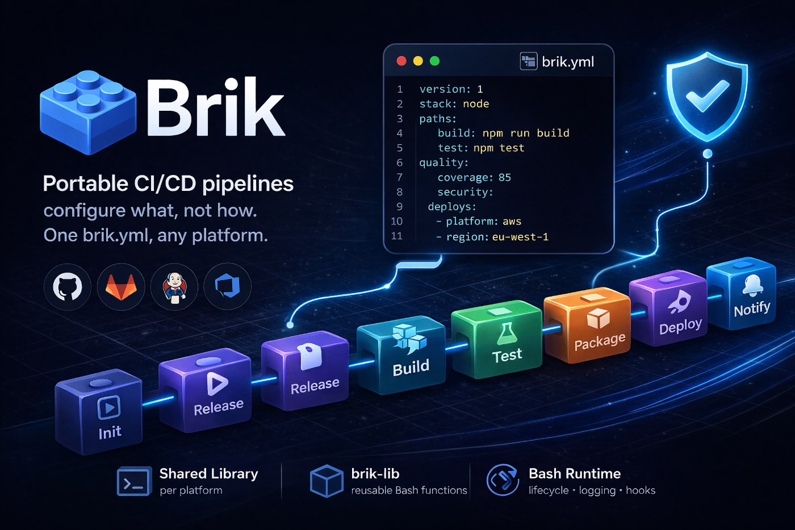
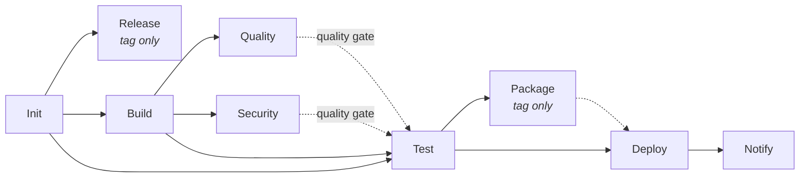

<p align="center">
  
</p>

<p align="center">
  <b>Brik, the portable pipeline standard.</b><br>
  <b>Write once. Run everywhere.</b>
</p>

<p align="center">
  <a href="https://github.com/getbrik/brik/actions/workflows/ci.yml"></a>
  <a href="https://codecov.io/gh/getbrik/brik"></a>
  <a href="LICENSE"></a>
</p>

<p align="center">
  <a href="https://github.com/getbrik/brik/issues">Issues</a> -
  <a href="https://github.com/getbrik/briklab">Briklab</a>
</p>

## What is Brik

Every team writes the same CI/CD logic -- build, test, lint, scan, deploy -- then
rewrites it when switching platforms. Brik ends this cycle.

**Write once**: describe your project in a single `brik.yml` (stack, tools, thresholds).
Brik handles the rest: a fixed pipeline with sensible defaults that works out of the box.

**Run everywhere**: the same `brik.yml` produces a production-grade pipeline on
GitLab CI, Jenkins, and GitHub Actions. No per-platform glue, no vendor lock-in.

- **4 lines to start** -- a minimal config gets you build, test, lint, and security scanning
- **Portable by design** -- Bash runtime runs identically on any CI platform
- **Battle-tested** -- ShellSpec unit tests, end-to-end tests, ShellCheck linting, kcov coverage

## How it works


1. **`brik.yml`** -- describe your project: stack, tools, thresholds. One file, platform-agnostic.
2. **`brik init`** -- generates the bootstrap file for your CI platform: `.gitlab-ci.yml`, GitHub workflow, or `Jenkinsfile`. You can also run locally with `brik run` (requires Docker).
3. **Shared library** -- portable Bash scripts hosted in a Git repository. Each bootstrap file references it. The library reads `brik.yml` and executes each stage.
4. **Pipeline runs** -- build, test, lint, security scan, deploy -- with sensible defaults. Same result whether on CI or locally.

## Install

```bash
# One-liner (recommended)
curl -fsSL https://raw.githubusercontent.com/getbrik/brik/main/scripts/install.sh | bash

# Homebrew (macOS/Linux)
brew install getbrik/tap/brik
```

After installation, run `brik doctor` to check your environment.

<details>
<summary><strong>Prerequisites (local usage only)</strong></summary>

These tools are only needed to run `brik` commands locally (validate, doctor, run).
On CI platforms, the shared library handles everything.

| OS | Command |
|----|---------|
| macOS | `brew install bash yq jq check-jsonschema` |
| Debian/Ubuntu | `sudo apt install -y bash jq` + [yq](https://github.com/mikefarah/yq) + `pip install check-jsonschema` |
| Fedora/RHEL | `sudo dnf install -y bash jq` + [yq](https://github.com/mikefarah/yq) + `pip install check-jsonschema` |
| Windows | `scoop install git bash yq jq python` + `pip install check-jsonschema` |

</details>

## Pipeline Flow

Every Brik pipeline follows a fixed stage sequence:



| Stage | Purpose | Default behavior |
|-------|---------|------------------|
| Init | Setup | Validate config, detect stack, export variables |
| Release | Versioning | Semantic version from git tags (tag push only) |
| Build | Compile | Stack-specific build (npm, mvn, pip, dotnet, cargo) |
| Quality | Code quality | Lint, format check, dependency audit, coverage |
| Security | Security scans | Dependency scan, secret scan, container scan |
| Test | Test suite | Runs after quality/security gates pass |
| Package | Artifacts | Docker image build (tag push only) |
| Deploy | Deployment | Multi-environment, condition-based (branch/tag) |
| Notify | Notifications | Pipeline summary (always runs) |

The pipeline is fully deterministic -- no manual triggers. Quality and Security act
as **quality gates**: Test only starts when they pass (or are disabled). Release and
Package run automatically on tag pushes and are skipped on branches. Deploy always
runs but the runtime evaluates per-environment conditions from `brik.yml`.

Users do not define pipeline structure. They configure behavior within each stage
via `brik.yml`.

## Supported Stacks

| Stack | Detection | Build | Test | Lint |
|-------|-----------|-------|------|------|
| **node** | `package.json` | npm/yarn/pnpm | jest/mocha/vitest | eslint |
| **java** | `pom.xml` / `build.gradle` | mvn/gradle | junit | checkstyle |
| **python** | `pyproject.toml` / `setup.py` | pip/poetry/uv/pipenv | pytest | ruff/flake8 |
| **dotnet** | `*.csproj` / `*.sln` | dotnet build | xunit/nunit | dotnet format |
| **rust** | `Cargo.toml` | cargo build | cargo test | clippy |

Stack is auto-detected from project files when not specified in `brik.yml`.

## Configuration (`brik.yml`)

Brik follows a "declare what, not how" philosophy. Only `version` and `project.name`
are required -- everything else has sensible defaults per stack.

Full example (Java/Maven):

```yaml
version: 1

project:
  name: my-java-app
  stack: java

build:
  java_version: "21"
  command: mvn package -DskipTests

test:
  framework: junit

quality:
  enabled: true
  lint:
    tool: checkstyle
    config: checkstyle.xml
    fix: false
  format:
    tool: google-java-format
    check: true
  deps:
    severity: high

security:
  dependency_scan: true
  secret_scan: true
  container_scan: false
```

- JSON Schema: [`schemas/config/v1/brik.schema.json`](schemas/config/v1/brik.schema.json)
- Examples: [`examples/`](examples/) (minimal-node, java-maven, python-pytest, mono-dotnet)
- Full parameter reference: [`docs/reference.md`](docs/reference.md)

## CLI Reference

| Command | Description |
|---------|-------------|
| `brik validate` | Validate `brik.yml` against the JSON Schema |
| `brik doctor` | Check prerequisites (tools, stack detection) |
| `brik init` | Scaffold `brik.yml` and platform bootstrap file |
| `brik run stage <name>` | Execute a pipeline stage locally |
| `brik run pipeline` | Execute the full pipeline locally |
| `brik self-update` | Update brik to the latest version |
| `brik self-uninstall` | Remove brik from your system |
| `brik version` | Print version, schema, and runtime info |
| `brik help` | Print usage information |

Key options:

```bash
brik validate --config path/to/brik.yml
brik doctor --workspace ./my-project
brik init --stack node --platform gitlab
brik run stage build --config brik.yml --workspace .
brik run pipeline --with-package --continue-on-error
brik self-update --channel edge
brik version --verbose
```

## Platform Support

| Platform | Status | Integration |
|----------|--------|-------------|
| **GitLab CI** | Functional | Shared library with pipeline template |
| **Jenkins** | PoC | Jenkins Shared Library |
| **GitHub Actions** | Planned | Reusable workflows |

## Architecture

| Layer | Role |
|-------|------|
| **brik.yml** | Project configuration |
| **Shared Library** | Per platform (GitLab, Jenkins, GitHub Actions) |
| **brik-lib** | Reusable CI/CD functions (Bash) |
| **Bash Runtime** | Stage lifecycle, logging, hooks |

For a detailed explanation of the architecture, design principles, stage lifecycle,
and how to extend Brik, see [docs/architecture.md](docs/architecture.md).

## Development

### Prerequisites

```bash
brew install bash yq jq check-jsonschema shellspec shellcheck kcov
```

### Run tests

```bash
# All tests
shellspec

# A specific spec file
shellspec runtime/bash/spec/cli/validate_spec.sh

# With verbose output
shellspec --format documentation

# With coverage (requires kcov)
ulimit -n 1024 && shellspec --kcov
# Report in coverage/index.html
```

Tests are in `runtime/bash/spec/` using [ShellSpec](https://shellspec.info). The `.shellspec` config at the project root sets the shell, spec path, and helper.

> **Note:** `ulimit -n 1024` is required on macOS where the default file descriptor limit is too high for kcov's `dup2()` call. See [kcov#293](https://github.com/SimonKagstrom/kcov/issues/293).

### Validate examples

```bash
# Single file
bin/brik validate --config examples/minimal-node/brik.yml

# All examples
for f in examples/*/brik.yml; do bin/brik validate --config "$f"; done
```

### Lint

```bash
shellcheck bin/brik
```

## Status

**Done:**
- [x] `brik.yml` JSON Schema v1
- [x] Bash Runtime (`stage.run` lifecycle)
- [x] 9 pipeline stages (init, release, build, quality, security, test, package, deploy, notify)
- [x] 5 stacks (node, java, python, dotnet, rust)
- [x] GitLab CI shared library (enterprise-grade DAG with quality gates)
- [x] CLI (validate, doctor, init, run, self-update, self-uninstall, version)
- [x] 1006 tests (ShellSpec + ShellCheck + kcov) + 13 E2E scenarios

**Next:**
- [ ] Type checking, coherence validators, security scanning execution
- [ ] Local pipeline execution (`brik run pipeline`)
- [ ] Jenkins shared library
- [ ] GitHub Actions reusable workflows
- [ ] Multi-environment deploy (Git Flow, trunk-based, GitHub Flow profiles)
- [ ] Official Docker images (`ghcr.io/getbrik/brik-runner-*`)

## Related

- [briklab](https://github.com/getbrik/briklab) - local Docker infrastructure for testing Brik pipelines

## License

[MPL-2.0](LICENSE)
