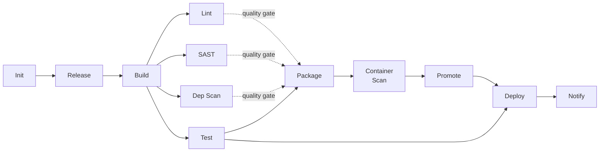

<p align="center">
  
</p>

<p align="center">
  <b>CI/CD as configuration, not code.</b><br>
  Write it once. Run it on GitLab, Jenkins, GitHub Actions, and your laptop.<br>
  <i>Stop maintaining pipelines. Start shipping.</i>
</p>

<p align="center">
  <a href="https://github.com/getbrik/brik/actions/workflows/ci.yml"></a>
  <a href="https://codecov.io/gh/getbrik/brik"></a>
  <a href="#code-metrics"></a>
  <a href="#code-metrics"></a>
  <a href="#code-metrics"></a>
  <a href="LICENSE"></a>
</p>

<p align="center">
  <a href="docs/README.md">Documentation</a> -
  <a href="https://github.com/getbrik/brik/issues">Issues</a> -
  <a href="https://github.com/getbrik/briklab">Briklab</a>
</p>

---

## The problem Brik solves

CI/CD logic is the same everywhere. Build the code. Run the tests. Scan for vulnerabilities. Push the image. Deploy. Notify.

Yet every team rewrites it. Per project. Per platform. Per migration.

- Move from GitLab to GitHub Actions? Rewrite the pipeline.
- Add Jenkins for a customer? Rewrite again, in Groovy.
- Onboard a new repo? Copy-paste the last one and pray.
- Tighten a coverage threshold across 40 services? Forty pull requests.

Brik treats CI/CD like the solved problem it is. The logic lives in one place. Platforms are thin adapters. You describe your project, not the pipeline.

## What you write

A realistic `brik.yml` for a deployable Node service looks like this:

```yaml
version: 1

project:
  name: orders-api
  stack: node

test:
  coverage:
    threshold: 80

deploy:
  workflow: trunk-based
  environments:
    staging:
      target: k8s
      namespace: orders-staging
    production:
      target: helm
      chart: ./charts/orders-api
```

That is the entire pipeline definition. No `.gitlab-ci.yml` with 400 lines of YAML. No `Jenkinsfile` with custom Groovy. No bash glue you maintain.

Only `version` and `project.name` are required -- the stack is auto-detected, every other field has a per-stack default. The rest of `brik.yml` is where you override what actually matters for *your* project: coverage thresholds, deploy targets, notification channels, registries, secrets. You configure your project. You never write pipeline logic.

From that single file, Brik produces:

- a working GitLab pipeline via a one-line `include:`
- a working Jenkins pipeline via the Brik shared library
- a working local run via `brik integrate`
- a release flow that triggers only on tags

## Pipeline at a glance

Every Brik pipeline runs the same 12 stages in the same order:


```mermaid
flowchart LR
    init["Init"] --> release["Release"]
    release --> build["Build"]
    build --> lint["Lint"]
    build --> sast["SAST"]
    build --> scan["Dep Scan"]
    build --> test["Test"]
    lint -. quality gate .-> package["Package"]
    sast -. quality gate .-> package
    scan -. quality gate .-> package
    test --> package
    package --> cscan["Container<br/>Scan"]
    cscan --> promote["Promote"]
    promote --> deploy["Deploy"]
    test --> deploy
    deploy --> notify["Notify"]
```

Lint, SAST, dependency scan, and tests fan out in parallel after Build. The quality gate sits at Package: nothing gets packaged unless tests pass and the three security stages succeed. Nothing deploys without a green test.

That is not a convention. It is the structural shape of the pipeline. You cannot accidentally ship broken or unverified code by editing the pipeline, because there is no pipeline to edit.

## What makes Brik different

### 🗺️ A fixed flow, but a smart plan

The 12 stages are non-negotiable. The decision of which stages actually *run* on this commit is computed up front:

- A **docs-only commit** skips the build, lint, and test grid. No runner container spins up for a stage nothing changed.
- A **tag push** runs the release path: Release, Package, Promote.
- A feature branch is **snapshot context**: the pipeline keeps going past failures so the operator sees the full picture.
- A tagged release is **release context**: fail-fast, because a broken stage in a release pipeline is not a learning opportunity.

The plan is one platform-agnostic JSON document. GitLab, Jenkins, and `brik integrate` consume the same plan. Same commit, same plan, same outcome, anywhere. Inspect any decision with `brik plan --explain`.

### 🛡️ Security that knows the difference between "we can fix this" and "the vendor won't"

Brik separates two axes for every stage result:

- **Technical**: did the command exit zero?
- **Business**: given the context, does that result block the release?

The mapping is a pure function. Consequence: a CVE with an available upstream fix **blocks** a release pipeline. A CVE the vendor will not fix stays a **warning** even in release, because someone already accepted the risk and there is nothing to do but mitigate. A lint *warning* never blocks a release; a lint *error* does.

The same model handles coverage drops, dependency audit results, container scan findings, and license violations. One decision matrix. Auditable. Centralised in [`lib/pipeline/business.sh`](lib/pipeline/business.sh).

This is what makes Brik usable on a release pipeline that ships every day without either crying wolf or shipping a known-broken artifact.

### 🐚 Bash, because Bash is the universal CI runtime

Brik is written in Bash. Not as a stylistic choice. Because Bash is the only language guaranteed available on every CI runner, every container image, every VM, and every developer laptop.

- No compilation step.
- No runtime install.
- No language-version drift between local and CI.
- Same code path locally and on every platform.

Bash has limits, and Brik treats them seriously: 3635 ShellSpec tests, 80% coverage gate enforced in CI, ShellCheck on every file, end-to-end runs against real GitLab and Jenkins instances in [briklab](https://github.com/getbrik/briklab) on every release.

### 💻 Same pipeline on your laptop

```bash
brik integrate                # full pipeline locally
brik stage test              # one stage
brik plan --explain              # show what will run on this commit, and why
brik validate                    # validate brik.yml against the schema
brik doctor                      # check prerequisites
```

The local runner uses the same Bash code path as the CI adapters. Reproducing a CI failure locally is `brik stage <name>`, not "clone the repo, install a 600 MB runner image, and pray".

## How the layers fit

| Layer | Role | Replaced when you switch platform? |
|-------|------|------------------------------------|
| **brik.yml** | Project configuration. The only file you write. | No |
| **brik-lib** | CI/CD business logic in Bash. Build, test, scan, deploy, package. | No |
| **Shared Library** | Per-platform adapter. Reads `brik.yml`, runs the fixed flow via native CI constructs. | Yes (Brik ships them) |
| **Bash Runtime** | `stage.run`: lifecycle, logging, hooks, structured reports. | No |

Three of the four layers are platform-agnostic. The platform adapter is thin by design: read config, map the fixed flow to the platform, invoke `stage.run`. No business logic in adapters. Ever.

See [docs/concepts/architecture.md](docs/concepts/architecture.md) for the full design.

## Supported stacks

| Stack | Auto-detected from | Build | Test | Lint |
|-------|--------------------|-------|------|------|
| **node** | `package.json` | npm / yarn / pnpm | jest / npm test | eslint / biome |
| **java** | `pom.xml` / `build.gradle(.kts)` | maven / gradle | junit / gradle | checkstyle |
| **python** | `pyproject.toml` / `requirements.txt` | pip / poetry / uv / pipenv | pytest / unittest / tox | ruff |
| **dotnet** | `*.csproj` / `*.sln` | dotnet build | dotnet test | dotnet format |
| **rust** | `Cargo.toml` | cargo build | cargo test | clippy |

The stack is detected from project files when not specified. Every stack ships with a runner image: [brik-images](https://github.com/getbrik/brik-images) (Alpine or slim bases, multi-arch, rebuilt weekly for CVE fixes).

## Platform support

| Platform | Status | How it ships |
|----------|--------|--------------|
| **GitLab CI** | ✅ Functional | Shared library + pipeline template (`include:` one line) |
| **Jenkins** | ✅ Functional | Jenkins Shared Library (works with Configuration-as-Code + Gitea) |
| **GitHub Actions** | 🚧 Bootstrap shipped, reusable workflows in progress | `brik init --platform github` scaffolds today |
| **Local CLI** | ✅ Functional | `brik integrate` |

## Get started

| You use | Start here |
|---------|------------|
| GitLab CI | [docs/getting-started/gitlab.md](docs/getting-started/gitlab.md) |
| Jenkins | [docs/getting-started/jenkins.md](docs/getting-started/jenkins.md) |
| Local CLI | [docs/getting-started/local.md](docs/getting-started/local.md) |

Install Brik on macOS or Linux:

```bash
brew tap getbrik/tap
brew install brik

brik doctor    # check prerequisites
brik init      # scaffold brik.yml + your platform bootstrap
brik validate  # confirm the config is valid
brik integrate
```

Full documentation: **[docs/README.md](docs/README.md)**.

## Configuration

Brik follows a "declare what, not how" rule. Only `version` and `project.name` are required. Every other field has a per-stack default you can override.

- Configuration reference: [docs/configuration/overview.md](docs/configuration/overview.md)
- JSON Schema (source of truth): [schemas/config/v1/brik.schema.json](schemas/config/v1/brik.schema.json)
- Working examples: [examples/](examples/) (minimal-node, java-maven, python-pytest, mono-dotnet)

## Quality, in numbers

- ✅ **3635** ShellSpec tests, 0 failures
- ✅ **80%** Codecov gate on project and patch, enforced in CI
- ✅ **~60** end-to-end scenarios on real GitLab + Jenkins instances per release
- ✅ **ShellCheck** clean on every source file
- ✅ **shellmetrics** tracks cyclomatic complexity, function count, and LLOC on every push to `main`

## Code metrics

Tracked automatically via [shellmetrics](https://github.com/shellspec/shellmetrics): average cyclomatic complexity per function, total function count, logical lines of code. The badges at the top of this README are live.

## Code coverage

Measured by [ShellSpec](https://shellspec.info) with [kcov](https://github.com/SimonKagstrom/kcov) on every push and pull request, published to [Codecov](https://codecov.io/gh/getbrik/brik). Project and patch gates are both set to 80%.

## Related projects

- [brik-images](https://github.com/getbrik/brik-images) - official Docker images for Brik runners (Node, Python, Java, Rust, .NET, base). Multi-arch, scanned, rebuilt weekly.
- [briklab](https://github.com/getbrik/briklab) - local Docker infrastructure for testing Brik pipelines against real GitLab and Jenkins.
- [homebrew-tap](https://github.com/getbrik/homebrew-tap) - the Homebrew tap for `brew install brik`.

## Transparency notice

We use AI-assisted development ([Claude Code](https://claude.ai/code) and [ECC](https://github.com/affaan-m/ECC)) to accelerate implementation. Every contribution, human or AI-generated, goes through the same gates: code review, ShellSpec coverage, ShellCheck, end-to-end runs on briklab, and CI.

## License

[MPL-2.0](LICENSE)
