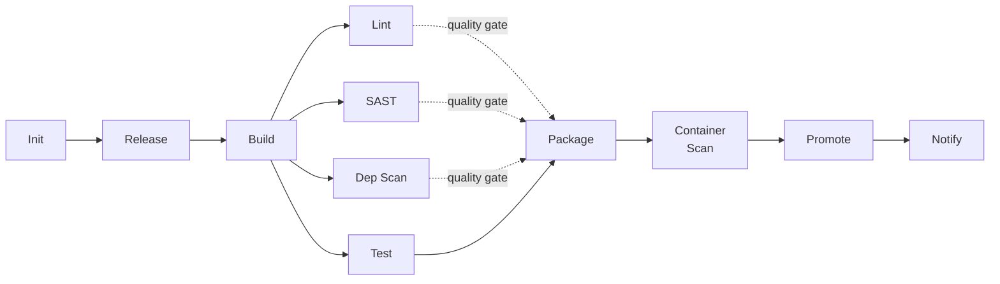
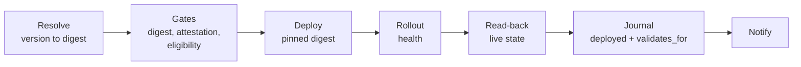

<p align="center">
  
</p>

<p align="center">
  <b>CI/CD as configuration, not code.</b><br>
  Write it once. Run it on GitLab, Jenkins, GitHub Actions, and your laptop.<br>
  <i>Stop maintaining pipelines. Start shipping.</i>
</p>

<p align="center">
  <a href="https://github.com/getbrik/brik/actions/workflows/ci.yml"></a>
  <a href="https://codecov.io/gh/getbrik/brik"></a>
  <a href="#code-metrics"></a>
  <a href="#code-metrics"></a>
  <a href="#code-metrics"></a>
  <a href="LICENSE"></a>
</p>

<p align="center">
  <a href="docs/README.md">Documentation</a> -
  <a href="https://github.com/getbrik/brik/issues">Issues</a> -
  <a href="https://github.com/getbrik/briklab">Briklab</a>
</p>

---

## The problem Brik solves

CI/CD logic is the same everywhere. Build the code. Run the tests. Scan for vulnerabilities. Push the image. Deploy. Notify.

Yet every team rewrites it. Per project. Per platform. Per migration.

- Move from GitLab to GitHub Actions? Rewrite the pipeline.
- Add Jenkins for a customer? Rewrite again, in Groovy.
- Onboard a new repo? Copy-paste the last one and pray.
- Tighten a coverage threshold across 40 services? Forty pull requests.

Brik treats CI/CD like the solved problem it is. The logic lives in one place. Platforms are thin adapters. You describe your project, not the pipeline.

## What you write

A realistic `brik.yml` for a deployable Node service looks like this:

```yaml
version: 1

project:
  name: orders-api
  stack: node

test:
  coverage:
    threshold: 80

artifacts:
  channels:
    release:                            # where CI publishes, where CD resolves
      registry: registry.example.com/orders/orders-api
  evidence:
    repo: https://git.example.com/orders/evidence.git   # append-only journal

deploy:
  environments:
    staging:
      target: k8s
      namespace: orders-staging
      accepts_channel: release
      validates_for: production         # a green staging run grants production
      gates:
        require_digest: true            # never deploy a mutable tag
    production:
      target: helm
      chart: ./charts/orders-api
      accepts_channel: release
      config_ref: main                  # env config redeploys without a new version
      gates:
        require_digest: true
        require_attestation: true       # verify SBOM + SLSA provenance
        requires_eligibility: [artifact_validated_for]   # staging vouched for it
```

That is the entire definition -- the CI flow, the CD flow, the promotion chain between environments, and the gates that protect production. No `.gitlab-ci.yml` with 400 lines of YAML. No `Jenkinsfile` with custom Groovy. No bash glue you maintain.

Only `version` and `project.name` are required -- the stack is auto-detected, every other field has a per-stack default. The rest of `brik.yml` is where you override what actually matters for *your* project: coverage thresholds, deploy targets, notification channels, registries, secrets. You configure your project. You never write pipeline logic.

From that single file, Brik produces:

- a working GitLab pipeline via a one-line `include:`
- a working Jenkins pipeline via the Brik shared library
- a working local run via `brik integrate`
- a release flow that triggers only on tags
- a decoupled CD flow: `brik deploy --version <v> --environment <e>`, the same verb whether it is triggered from GitLab, Jenkins, or your laptop

## Two flows, one configuration

Brik is not one pipeline. It is **two fixed flows** selected by the trigger,
running from the same repository and the same `brik.yml`:

- a **push, tag, or merge request** runs the **CI flow**, which builds and
  publishes one immutable, signed artifact;
- an explicit **deploy trigger** (`Run pipeline` with
  `BRIK_DEPLOY_VERSION` + `BRIK_DEPLOY_ENVIRONMENT`, a parameterized
  Jenkins job, or `brik deploy` on your laptop) runs the **CD flow**, which
  takes an artifact that already exists and proves it before deploying it.

The two flows are decoupled in time: build once, deploy that version to any
environment, any number of times, days later.

### The CI flow

Produce and publish verifiable evidence:


```mermaid
flowchart LR
    init["Init"] --> release["Release"]
    release --> build["Build"]
    build --> lint["Lint"]
    build --> sast["SAST"]
    build --> scan["Dep Scan"]
    build --> test["Test"]
    lint -. quality gate .-> package["Package"]
    sast -. quality gate .-> package
    scan -. quality gate .-> package
    test --> package
    package --> cscan["Container<br/>Scan"]
    cscan --> promote["Promote"]
    promote --> notify["Notify"]
```

Lint, SAST, dependency scan, and tests fan out in parallel after Build. The
quality gate sits at Package: nothing gets packaged unless tests pass and
the three security stages succeed. Container Scan signs and attaches the
SBOM and SLSA provenance to the image digest. Promote copies the artifact
**and its evidence graph** to the release channel, refusing to overwrite a
different digest already published under the same version.

### The CD flow

Verify, then deploy a pinned digest:


```mermaid
flowchart LR
    resolve["Resolve<br/>version to digest"] --> gates["Gates<br/>digest, attestation,<br/>eligibility"]
    gates --> deploy["Deploy<br/>pinned digest"]
    deploy --> health["Rollout<br/>health"]
    health --> readback["Read-back<br/>live state"]
    readback --> journal["Journal<br/>deployed + validates_for"]
    journal --> notify["Notify"]
```

The CD flow resolves the version to a digest in the channel the environment
accepts, walks the fail-closed gates, deploys the pinned digest, checks the
rollout health, reads the live state back, and journals the result -- a
`deployed` event for this environment, and, when the deploy heads a chain, a
`validates_for` grant of the same digest for the next one (a green deploy on
staging can bless production). `brik status --environment <e>` then reports
the environment as three layers -- the journal, the definition a deploy
would apply now, and the live digest -- and flags any drift between them.

That is not a convention. It is the structural shape of both flows. You
cannot accidentally ship broken or unverified code by editing the pipeline,
because there is no pipeline to edit.

## What makes Brik different

### 🗺️ A fixed flow, but a smart plan

The 12 stages are non-negotiable. The decision of which stages actually *run* on this commit is computed up front:

- A **docs-only commit** skips the build, lint, and test grid. No runner container spins up for a stage nothing changed.
- A **tag push** runs the release path: Release, Package, Promote.
- A feature branch is **snapshot context**: the pipeline keeps going past failures so the operator sees the full picture.
- A tagged release is **release context**: fail-fast, because a broken stage in a release pipeline is not a learning opportunity.

The plan is one platform-agnostic JSON document. GitLab, Jenkins, and `brik integrate` consume the same plan. Same commit, same plan, same outcome, anywhere. Inspect any decision with `brik plan --explain`.

### 📜 Declared end to end: schemas, manifests, parameters

Brik does not hide its behavior in code. Everything that shapes a pipeline
is a **declaration you can read, validate, and audit**:

- **Your project** is `brik.yml`, validated against a published
  [JSON Schema](schemas/config/v1/brik.schema.json). The configuration
  reference docs are *generated* from that schema -- they cannot drift.
- **The pipeline itself** is described by YAML manifests in a registry
  ([lib/registry/manifests/](lib/registry/manifests/)): 12 stage manifests
  (what runs, in which runner class, whether it needs the Docker socket),
  6 stack manifests (how node, java, python, dotnet, rust, and docker
  projects are detected, built, and tested), and capability **provider**
  manifests (which signing backends exist, what each one requires).
  The manifests compile into one registry; user-supplied extensions plug in
  via `BRIK_REGISTRY_EXTENSIONS_DIRS` and are validated by the same
  contract-test harness (`brik extension`).
- **The operator surface** is one manifest:
  [lib/registry/pipeline-params.yml](lib/registry/pipeline-params.yml)
  declares every user-facing pipeline parameter (`BRIK_DEPLOY_VERSION`,
  `BRIK_DRY_RUN`, ...), its type, default, and which flow it drives. A
  blocking parity test guarantees the GitLab "Run pipeline" form and the
  Jenkins "Build with Parameters" form expose exactly that list -- the same
  knobs, everywhere, by construction.
- **Your infrastructure** is a referential of declared endpoints,
  credential references, and policies (see the next section).

Every one of these declarations is enforced by a schema, fail-closed, at
runtime. The document an auditor reads is the document the pipeline obeys.
See [docs/concepts/schemas.md](docs/concepts/schemas.md).

### 📦 Runner classes: the right image for every stage, pinned and provable

Stages do not run on "whatever image the runner has". Each stage manifest
declares a **runner class** -- `base`, `stack`, `analysis`, `scanner`, or
`deploy` -- and a single registry
([lib/registry/runner_classes.yml](lib/registry/runner_classes.yml)) maps
each class to its OCI image from
[brik-images](https://github.com/getbrik/brik-images) (multi-arch, scanned,
rebuilt weekly for CVE fixes). The `stack` class is dynamic: Init detects
your stack and posts the matching toolchain image to every downstream stage.

Both adapters and the local containerized runner resolve images through the
same registry, so the linter really runs in the analysis image and the
deploy really runs in the deploy image -- on GitLab, on Jenkins, and on
your laptop. Point `BRIK_RUNNER_CLASSES_FILE` at an alternate copy to use a
mirror, a digest-pinned fleet, or an air-gapped registry without touching
the bundled default. And because the actually-executed image is stamped
into the report and into the SLSA builder identity
(`<orchestrator-url>/-/brik/<runner-class>`), "which image ran this stage"
is an auditable fact, not a guess.

### 🛡️ Supply-chain security built in, not bolted on

**CI produces immutable, signed evidence.** Every artifact is digest-addressed and carries signed SBOM and SLSA provenance. The attestations travel with the image; verification happens at deploy time, not later.

**CD verifies before deploying.** Three gates answer three questions:
- **Digest gate**: is this exactly the artifact you built? (registry content-addressing)
- **Attestation gate**: who built it and where does it come from? (signed provenance verified against your trust material)
- **Eligibility gate**: does it have the blessing for this environment? (signed promotion journal, append-only, bound to the digest)

The gates run in order. Every gate is fail-closed: missing trust material, an unreachable journal, or an unverifiable signature refuses the deploy. Never a silent pass.

**Infrastructure as config.** Endpoints, credentials, policies, and trust material live in a mandatory infrastructure referential. Credentials are references (`env://`, `file://`), never values. Brik validates the referential eagerly at init and deploy (fail-closed) and stamps its fingerprint into every plan, so you can trace back to the exact infrastructure declaration that gated a deployment. TLS posture is declared per endpoint -- plain HTTP and `insecure` are legal but loud, and there is no silent fallback.

**Credential isolation by phase.** Signing credentials stay in the signing container only (scoped via `BRIK_SIGNING_` prefix on GitLab/Jenkins). Deploy credentials are separate from CI publish credentials, so revoking one does not strand the other. Token lifetime is a provider parameter, not Brik code -- rotate at the secret-manager level and redeploys pick up the new secret transparently.

**Honest SLSA claims.** Build L1 claimed on every profile (provenance attached, verified at deploy). L2 claimable when the signing credential is scoped to the signing phase only. L3 never claimed -- self-hosted builders cannot guarantee the isolation it requires.

See [`docs/concepts/artifact-attestation.md`](docs/concepts/artifact-attestation.md) for the full gates and [`docs/concepts/local-execution.md`](docs/concepts/local-execution.md) for how local runs declare divergences from CI.

### 🧭 Security that knows the difference between "we can fix this" and "the vendor won't"

Brik separates two axes for every stage result:

- **Technical**: did the command exit zero?
- **Business**: given the context, does that result block the release?

The mapping is a pure function. Consequence: a CVE with an available upstream fix **blocks** a release pipeline. A CVE the vendor will not fix stays a **warning** even in release, because someone already accepted the risk and there is nothing to do but mitigate. A lint *warning* never blocks a release; a lint *error* does.

The same model handles coverage drops, dependency audit results, container scan findings, and license violations. One decision matrix. Auditable. Centralised in [`lib/pipeline/business.sh`](lib/pipeline/business.sh).

This is what makes Brik usable on a release pipeline that ships every day without either crying wolf or shipping a known-broken artifact.

### 🐚 Bash, because Bash is the universal CI runtime

Brik is written in Bash. Not as a stylistic choice. Because Bash is the only language guaranteed available on every CI runner, every container image, every VM, and every developer laptop.

- No compilation step.
- No runtime install.
- No language-version drift between local and CI.
- Same code path locally and on every platform.

Bash has limits, and Brik treats them seriously: 5100+ ShellSpec examples in the core suite plus dedicated adapter suites, an 80% coverage gate enforced in CI, ShellCheck on every file, and end-to-end runs against real GitLab and Jenkins instances in [briklab](https://github.com/getbrik/briklab).

### 💻 Same pipeline on your laptop

```bash
brik integrate                                       # full CI flow locally
brik stage test                                      # one stage
brik deploy --version v1.2.3 --environment staging   # CD: verify and deploy a built version
brik promote --version v1.2.3                        # copy artifact + evidence to the release channel
brik authorize --version v1.2.3 --for production     # grant a digest for an environment
brik status --environment staging                    # journal + desired + live, with drift
brik plan --explain                                  # show what will run on this commit, and why
brik validate                                        # validate brik.yml against the schema
brik doctor                                          # check prerequisites
```

Each stage of a local run executes in its runner-class container, exactly
like CI -- and the divergences that remain (no keyless signing, host
Docker socket) are declared, not silent. See
[docs/concepts/local-execution.md](docs/concepts/local-execution.md).

The local runner uses the same Bash code path and the same runner images as the CI adapters. Reproducing a CI failure locally is `brik stage <name>` in the same container the CI job used -- not "read the runner docs and pray".

## How the layers fit

| Layer | Role | Replaced when you switch platform? |
|-------|------|------------------------------------|
| **brik.yml** | Project configuration. The only file you write. | No |
| **Registry manifests** | Declarative description of stages, stacks, runner classes, capability providers, and pipeline parameters. | No |
| **Infrastructure referential** | Declared endpoints, credential references, trust material, and policy. One instance per infrastructure. | No (one per infra, not per platform) |
| **brik-lib** | CI/CD business logic in Bash. Build, test, scan, sign, verify, deploy, package. | No |
| **Shared Library** | Per-platform adapter. Reads `brik.yml`, runs the fixed flows via native CI constructs. | Yes (Brik ships them) |
| **Bash Runtime** | `stage.run`: lifecycle, logging, hooks, structured reports. | No |

Everything except the thin platform adapter is platform-agnostic. The adapter reads config, maps the fixed flows to the platform, and invokes `stage.run`. No business logic in adapters. Ever.

See [docs/concepts/architecture.md](docs/concepts/architecture.md) for the full design.

## Supported stacks

| Stack | Auto-detected from | Build | Test | Lint |
|-------|--------------------|-------|------|------|
| **node** | `package.json` | npm / yarn / pnpm | jest / npm test | eslint / biome |
| **java** | `pom.xml` / `build.gradle(.kts)` | maven / gradle | junit / gradle | checkstyle |
| **python** | `pyproject.toml` / `requirements.txt` | pip / poetry / uv / pipenv | pytest / unittest / tox | ruff |
| **dotnet** | `*.csproj` / `*.sln` | dotnet build | dotnet test | dotnet format |
| **rust** | `Cargo.toml` | cargo build | cargo test | clippy |
| **docker** | `Dockerfile` / `Containerfile` | docker build | -- | -- |

The stack is detected from project files when not specified, and each stack is itself a declarative manifest in the registry. Every stack ships with a runner image: [brik-images](https://github.com/getbrik/brik-images) (Alpine or slim bases, multi-arch, rebuilt weekly for CVE fixes).

## Platform support

| Platform | Status | How it ships |
|----------|--------|--------------|
| **GitLab CI** | ✅ Functional | Shared library + pipeline template (`include:` one line) |
| **Jenkins** | ✅ Functional | Jenkins Shared Library (works with Configuration-as-Code + Gitea) |
| **GitHub Actions** | 🚧 Bootstrap shipped, reusable workflows in progress | `brik init --platform github` scaffolds today |
| **Local CLI** | ✅ Functional | `brik integrate` |

## Get started

| You use | Start here |
|---------|------------|
| GitLab CI | [docs/getting-started/gitlab.md](docs/getting-started/gitlab.md) |
| Jenkins | [docs/getting-started/jenkins.md](docs/getting-started/jenkins.md) |
| Local CLI | [docs/getting-started/local.md](docs/getting-started/local.md) |

Install Brik on macOS or Linux:

```bash
brew tap getbrik/tap
brew install brik

brik doctor    # check prerequisites
brik init      # scaffold brik.yml + your platform bootstrap
brik validate  # confirm the config is valid
brik integrate
```

Full documentation: **[docs/README.md](docs/README.md)**.

## Configuration

Brik follows a "declare what, not how" rule, at every level. Only `version` and `project.name` are required in `brik.yml`; every other field has a per-stack default you can override. Beneath the project file, the pipeline itself, the operator parameters, and the infrastructure are declarations too:

- Configuration reference: [docs/configuration/overview.md](docs/configuration/overview.md) -- generated from the schema, drift-gated in CI
- JSON Schemas (the contracts, enforced fail-closed at runtime): [schemas/](schemas/) -- see [docs/concepts/schemas.md](docs/concepts/schemas.md)
- Registry manifests (stages, stacks, runner classes, providers): [lib/registry/manifests/](lib/registry/manifests/)
- Pipeline parameters (one manifest, parity-tested on every platform surface): [lib/registry/pipeline-params.yml](lib/registry/pipeline-params.yml)
- Infrastructure referential (endpoints, credential references, policy): [docs/concepts/artifact-attestation.md](docs/concepts/artifact-attestation.md)
- Working examples: [examples/](examples/) (minimal-node, java-maven, python-pytest, mono-dotnet)

## Quality, in numbers

- ✅ **5100+** ShellSpec examples in the core suite, 0 failures -- plus dedicated suites for the GitLab, Jenkins, and local adapters
- ✅ **80%** Codecov gate on project and patch, enforced in CI
- ✅ **22** live end-to-end scenarios against real GitLab and Jenkins instances in [briklab](https://github.com/getbrik/briklab) -- including digest-pinned CD, signed-attestation keystones, promotion-chain refusals, and channel promotion with immutability enforcement
- ✅ **29** JSON Schemas govern every contract (config, referential, plan, journal events, reports), validated fail-closed at runtime
- ✅ **Drift gates in CI**: the generated configuration reference must match the schema, the compiled registry cache must match the manifests, and every platform surface must match the pipeline-params manifest
- ✅ **ShellCheck** clean on every source file
- ✅ **shellmetrics** tracks cyclomatic complexity, function count, and LLOC on every push to `main`

## Code metrics

Tracked automatically via [shellmetrics](https://github.com/shellspec/shellmetrics): average cyclomatic complexity per function, total function count, logical lines of code. The badges at the top of this README are live.

## Code coverage

Measured by [ShellSpec](https://shellspec.info) with [kcov](https://github.com/SimonKagstrom/kcov) on every push and pull request, published to [Codecov](https://codecov.io/gh/getbrik/brik). Project and patch gates are both set to 80%.

## Related projects

- [brik-images](https://github.com/getbrik/brik-images) - official Docker images for Brik runners (Node, Python, Java, Rust, .NET, base). Multi-arch, scanned, rebuilt weekly.
- [briklab](https://github.com/getbrik/briklab) - local Docker infrastructure for testing Brik pipelines against real GitLab and Jenkins.
- [homebrew-tap](https://github.com/getbrik/homebrew-tap) - the Homebrew tap for `brew install brik`.

## Transparency notice

We use AI-assisted development ([Claude Code](https://claude.ai/code) and [ECC](https://github.com/affaan-m/ECC)) to accelerate implementation. Every contribution, human or AI-generated, goes through the same gates: code review, ShellSpec coverage, ShellCheck, end-to-end runs on briklab, and CI.

## License

[MPL-2.0](LICENSE)
