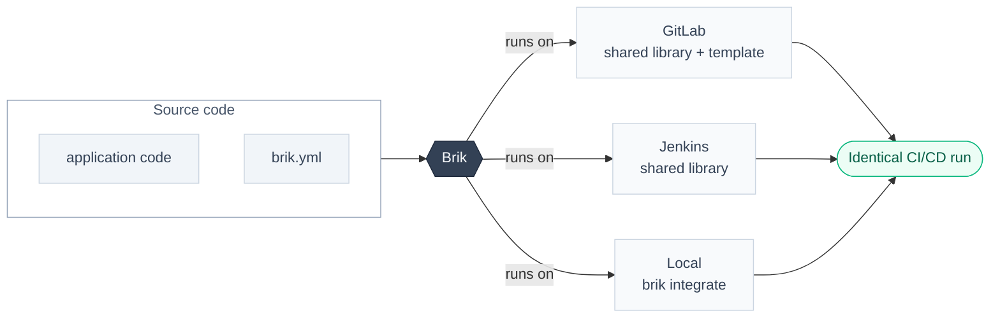
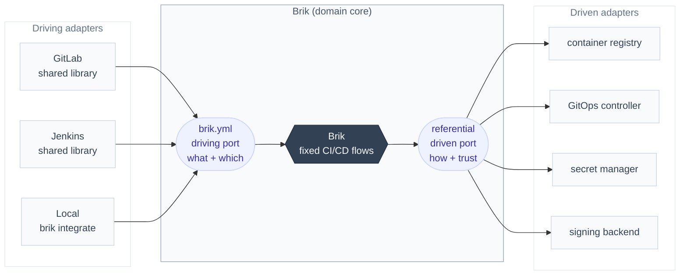
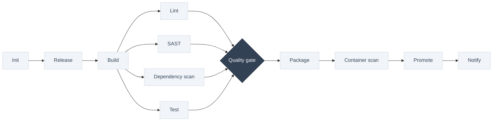
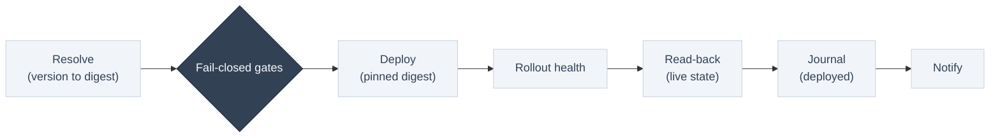

<p align="center">
  
</p>

<p align="center">
  <b>CI/CD as configuration, not code.</b><br>
  Write it once. Run it on GitLab, Jenkins, GitHub Actions, and your laptop.<br>
  <i>Stop maintaining pipelines. Start shipping.</i>
</p>

<p align="center">
  <a href="https://github.com/getbrik/brik/actions/workflows/ci.yml"></a>
  <a href="https://github.com/getbrik/brik/security/code-scanning"></a>
  <a href="https://codecov.io/gh/getbrik/brik"></a>
  <a href="#quality-in-numbers"></a>
  <a href="#quality-in-numbers"></a>
  <a href="#quality-in-numbers"></a>
  <a href="LICENSE"></a>
</p>

<p align="center">
  <a href="docs/README.md">Documentation</a> -
  <a href="https://github.com/getbrik/brik/issues">Issues</a> -
  <a href="https://github.com/getbrik/briklab">Briklab</a>
</p>

---

## The problem Brik solves

Your CI/CD logic is business-critical code. Every pipeline does the same handful
of things (*build, test, scan, package, deploy, notify*) and the know-how that
does them is yours. Yet that know-how never becomes portable code. It stays
trapped in each platform's dialect:

- **Written in vendor syntax.** The same intent is *YAML* for one platform and
  *Groovy* for the next, so your business logic is locked to a dialect instead of
  living as code you own.
- **Not reusable across platforms.** Change platforms and you rewrite everything.
  The real cost of lock-in is not a licence fee; it is losing your delivery
  methodology the day you migrate.
- **Not runnable on your laptop.** Because the logic only exists in the platform's
  native dialect, you cannot execute it locally. You debug it through the CI server,
  one push at a time.

## The inversion

**A platform should *execute* delivery logic, not *define* it.**

Brik turns the relationship around. **Brik is the portable core** that holds
your delivery logic (the fixed CI/CD flows). The platform that triggers a run and
the infrastructure that run reaches both sit outside it, as interchangeable
**adapters**; the file you write, the `brik.yml`, configures the core itself.
Switch GitLab for Jenkins, or one signer for another, and the core never changes. **You
describe your project, not the pipeline.** The sections below answer the three
pains above, in order: you own the code, it runs everywhere, and it runs on your
laptop.

## Configuration, not vendor syntax

The `brik.yml` is the interface between Brik and the CI orchestrator that drives
it (GitLab, Jenkins, or your laptop). It defines the **CI/CD pipeline**: the
flows, the stages, and the destinations they target. The orchestrator only
triggers Brik and hands it credentials; the pipeline itself lives here, written
once and identical on every platform.

A `brik.yml` for a deployable Node service (CI, GitOps CD, and a promotion
gate) describing **what** to run and **which** destinations to target, each by
its authority and path. No vendor syntax, no URL schemes to trust, no secrets:

```yaml
version: 1

project:
  name: orders-api
  stack: node                              # auto-detected; pin the toolchain when you need to
  stack_version: "22"

release:
  strategy: semver
  tag_prefix: v

test:
  framework: jest

publish:
  docker:                                  # authority + path, never a scheme or a secret
    registry: nexus.acme.test:8082         #   where to publish (host:port)
    image: platform/orders-api             #   what to call it (repository path)

artifacts:
  evidence:                                # append-only journal: promotions + deployments
    host: gitea.acme.test:3000
    repo: platform/orders-evidence
    branch: main
    sign: true                             # sign each evidence commit

deploy:
  environments:
    staging:
      target: gitops                       # ArgoCD reconciles a config repo (pull-based)
      accepts_channel: release
      validates_for: production            # a green staging deploy vouches for production
      host: gitea.acme.test:3000           # config-repo authority
      repo: platform/orders-config         #   path
      path: k8s/staging                    #   manifests subfolder
      app_name: orders-staging
      gates:
        require_digest: true               # never deploy a mutable tag
    production:
      target: gitops
      accepts_channel: release
      host: gitea.acme.test:3000
      repo: platform/orders-config-prod
      path: k8s/production
      app_name: orders-prod
      gates:
        require_digest: true
        require_attestation: true          # verify the signed SBOM + SLSA provenance
        requires_eligibility: [artifact_validated_for]   # staging vouched for this digest
```

That single file is the project's whole delivery *intent*: the CI flow, the CD
flow, the promotion chain between environments, and the gates that protect
production. It is configuration you own, not code locked to a vendor (no
hand-written `.gitlab-ci.yml`, no custom-Groovy `Jenkinsfile`, no bash glue).

Notice what is **not** there: no `https://`, no registry password, no
`controller:`. Whether a destination is reached over TLS with which trust, which
credential authenticates it, and which signing backend it uses are not the
project's concern: that wiring lives in the **infrastructure referential**
(next section). The `brik.yml` names destinations by authority and path; it
never carries a secret, not even a secret's variable name.

And it is as large as your project needs, no larger. Only `version` and
`project.name` are required; the stack is auto-detected and every other field
has a per-stack default. You configure your project. You never write pipeline
logic.

> [!NOTE]
> This shows Brik's **target configuration model**. For the exact fields the
> shipped schema validates today, see the
> **[`brik.yml` reference](docs/reference/configuration/README.md)**.

## One definition, every platform

The `brik.yml` you just wrote runs **unchanged on every platform**. None of your
delivery logic lives in the CI server: each platform is a thin **adapter** (a
shared library that knows only how to hand Brik the platform's trigger and
credentials and let it run). All the logic stays in Brik and in your `brik.yml`,
so switching CI vendor, or reproducing the exact run on your laptop, changes
nothing about what runs or where it lands.


```mermaid
flowchart LR
    subgraph repo["Source code"]
        direction TB
        APP["application code"]:::source
        PIPE["brik.yml"]:::source
    end

    BRIK{{"Brik"}}:::tool

    repo --> BRIK

    BRIK -- runs on --> GL["GitLab<br/>shared library + template"]:::platform
    BRIK -- runs on --> JK["Jenkins<br/>shared library"]:::platform
    BRIK -- runs on --> LO["Local<br/>brik integrate"]:::platform

    GL --> RUN(["Identical CI/CD run"]):::outcome
    JK --> RUN
    LO --> RUN

    classDef source fill:#f1f5f9,stroke:#cbd5e1,color:#334155
    classDef tool fill:#334155,stroke:#1e293b,color:#f8fafc
    classDef platform fill:#f8fafc,stroke:#cbd5e1,color:#334155
    classDef outcome fill:#ecfdf5,stroke:#10b981,color:#065f46
    style repo fill:#ffffff,stroke:#94a3b8,color:#475569
```

Each platform ships as a small shared library you wire in once and then forget:

| Platform | Status | How it ships |
|----------|--------|--------------|
| **GitLab CI** | ✅ Functional | Shared library + pipeline template (`include:` one line) |
| **Jenkins** | ✅ Functional | Jenkins Shared Library (works with Configuration-as-Code + Gitea) |
| **GitHub Actions** | 🚧 Bootstrap shipped, reusable workflows in progress | `brik init --platform github` scaffolds today |
| **Local CLI** | ✅ Functional | `brik integrate` |

## The infrastructure referential

The `brik.yml` is only one half of the picture. It names *what* runs and *which*
destination it targets (by authority and path), then deliberately stops: no URL
scheme, no credential, not even a secret's variable name.

The other half (*how* each destination is reached and trusted) lives in a
second file, the **infrastructure referential**: the interface between Brik and
the CI/CD toolchain infrastructure. It defines the access to each component of
that infra (protocol, endpoints, credentials, tokens, signing backends) behind
the names the `brik.yml` uses. Same friendly YAML, opposite concern: written
**once for the whole platform** by whoever runs it, so every project reuses it
and most teams never open it.

Seen together, the two files are Brik's **ports** in the ports-and-adapters
sense. Brik is the domain core; it owns the fixed CI/CD flows and exposes two
ports. The `brik.yml` is the **driving port** (the CI orchestrator calls in
through it). The referential is the **driven port** (Brik reaches out through it
to the infrastructure). The CI platforms from the previous section are the
**driving adapters**; the registries, GitOps controllers, and signing backends
are the **driven adapters**, each interchangeable, and the core never names a
vendor.


```mermaid
flowchart LR
    subgraph DRIVE["Driving adapters"]
        direction TB
        GL["GitLab<br/>shared library"]:::adapter
        JK["Jenkins<br/>shared library"]:::adapter
        LO["Local<br/>brik integrate"]:::adapter
    end

    subgraph CORE["Brik (domain core)"]
        direction TB
        PPORT(["brik.yml<br/>driving port<br/>what + which"]):::port
        ENGINE{{"Brik<br/>fixed CI/CD flows"}}:::tool
        IPORT(["referential<br/>driven port<br/>how + trust"]):::port
        PPORT --> ENGINE --> IPORT
    end

    subgraph DRIVEN["Driven adapters"]
        direction TB
        REG["container registry"]:::adapter
        GO["GitOps controller"]:::adapter
        SEC["secret manager"]:::adapter
        SIGN["signing backend"]:::adapter
    end

    GL --> PPORT
    JK --> PPORT
    LO --> PPORT
    IPORT --> REG
    IPORT --> GO
    IPORT --> SEC
    IPORT --> SIGN

    classDef adapter fill:#f8fafc,stroke:#cbd5e1,color:#334155
    classDef port fill:#eef2ff,stroke:#c7d2fe,color:#3730a3
    classDef tool fill:#334155,stroke:#1e293b,color:#f8fafc
    style CORE fill:#f8fafc,stroke:#94a3b8,color:#475569
    style DRIVE fill:#ffffff,stroke:#e2e8f0,color:#64748b
    style DRIVEN fill:#ffffff,stroke:#e2e8f0,color:#64748b
```

> [!TIP]
> The referential declares endpoints, credentials, bindings, and policy (once
> for the whole platform). See the
> **[infrastructure referential reference](docs/reference/infrastructure-referential.md)**
> for what goes in it and how to set one up.

### Pluggable components, proven by contract

Those capabilities the referential names (signing and attestation, the GitOps
controller, the secret manager) are the core's **driven adapters**, and none is
hardwired to one tool. Each is served by an interchangeable **provider** behind a
versioned **capability contract**: the operations Brik codes against, independent
of the tool that implements them.
Cosign provides artifact attestation today; the contract is what lets a
different signer take its place without touching Brik's code. `brik provider
test <id>` proves a provider honours that contract (its manifest, the required
operations, and the infra-free unit obligations) and the
[briklab](https://github.com/getbrik/briklab) suite proves the behavioural ones
(fail-closed verification, signing-key confinement, no secret on the command
line) end to end against real infrastructure.

## Runs on your laptop too

The laptop is not a second-class simulation of CI; it is the same execution.
Brik runs the **same Bash code path** and the **same pinned runner images**
locally that it runs on the platform, so `brik integrate` reproduces the full CI
flow on your machine before you ever push.

- **Same code, same images.** A stage runs the identical module and OCI image on
  your laptop and in CI; there is no separate "local mode" that drifts.
- **Divergences are declared, not silent.** Where a local run cannot match CI
  (no signing backend, no remote registry), the difference is an explicit,
  declared divergence rather than a quiet skip.
- **Profiles choose how much infrastructure is in reach.** The referential is
  selected as a **profile** for the context it runs in. The built-in `p-local`
  default declares no endpoints, no credentials and no signing, so `build`,
  `lint` and `test` run with zero setup; the moment a stage needs a real
  registry or a signing key, it fails closed instead of inventing one. Richer
  profiles wire in real endpoints for an orchestrated platform or a fuller local
  setup.

A profile is just a different set of **driven adapters** behind the same driven
port: the core and your `brik.yml` never change, only how much of the toolchain a
given audience or execution platform (your laptop versus the CI orchestrator)
is allowed to reach. That is what lets a local run take a deliberately degraded
posture, with no credentials to push an image or deploy to production, while CI
runs the full one from the same commit.

> [!TIP]
> See **[Local execution](docs/concepts/local-execution.md)** for how the local
> code path and runner images stay identical to CI.

## Two flows, one configuration

Brik is not one pipeline. It is **two fixed flows selected by the trigger**,
running from the same repository and the same `brik.yml`:

- a **push, tag, or merge request** runs the **CI flow**, which builds and
  publishes one immutable, signed artifact;
- an explicit **deploy trigger** (`brik deploy`, a `Run pipeline` form, or a
  parameterized Jenkins job) runs the **CD flow**, which takes an artifact that
  already exists and proves it before deploying it.

The two flows are **decoupled in time**: build once, deploy that version to any
environment, any number of times, days later.

### CI Flow


```mermaid
flowchart LR
    init["Init"]:::stage --> release["Release"]:::stage --> build["Build"]:::stage
    build --> lint["Lint"]:::stage
    build --> sast["SAST"]:::stage
    build --> scan["Dependency scan"]:::stage
    build --> test["Test"]:::stage
    lint --> qg
    sast --> qg
    scan --> qg
    test --> qg
    qg{"Quality gate"}:::gate --> package["Package"]:::stage
    package --> cscan["Container scan"]:::stage
    cscan --> promote["Promote"]:::stage
    promote --> notify["Notify"]:::stage

    classDef stage fill:#f1f5f9,stroke:#cbd5e1,color:#334155
    classDef gate fill:#334155,stroke:#1e293b,color:#f8fafc
```

The quality gate sits at Package: nothing is packaged unless tests
pass and the security stages succeed. Container Scan signs an SBOM and SLSA
provenance onto the image digest; Promote copies the artifact *and its
evidence* to the release channel.

### CD Flow


```mermaid
flowchart LR
    resolve["Resolve<br/>(version to digest)"]:::stage --> gates
    gates{"Fail-closed gates"}:::gate --> deploy["Deploy<br/>(pinned digest)"]:::stage
    deploy --> health["Rollout health"]:::stage
    health --> readback["Read-back<br/>(live state)"]:::stage
    readback --> journal["Journal<br/>(deployed)"]:::stage
    journal --> notify["Notify"]:::stage

    classDef stage fill:#f1f5f9,stroke:#cbd5e1,color:#334155
    classDef gate fill:#334155,stroke:#1e293b,color:#f8fafc
```

Resolve the version to a digest, walk the fail-closed gates (digest,
attestation, eligibility), deploy the pinned digest, read the live state back,
and journal the result.
`brik status --environment <e>` then reports the environment as three layers
and flags any drift.

> [!TIP] 
> You cannot accidentally ship broken or unverified code by editing the pipeline,
> because there is no pipeline to edit. See **[Fixed flows](docs/concepts/fixed-flows.md)**.

## Core concepts

Brik is a small set of ideas. Each links to a dedicated page that goes from the
functional "what it does for you" to the configuration and the source of truth.

| Concept | In one sentence | Learn more |
|---------|-----------------|------------|
| **Fixed flows** | Two flows selected by trigger (CI builds one signed artifact, CD deploys a pinned digest), never one monolith you edit. | [Fixed flows](docs/concepts/fixed-flows.md) |
| **The plan** | A reproducible per-commit JSON document that decides which stages run and why, identical on every platform (`brik plan --explain`). | [Plan](docs/concepts/plan.md) |
| **Declarations everywhere** | Your project, the pipeline, the operator knobs, and your infrastructure are all schema-validated declarations, enforced fail-closed at runtime. | [Declarations](docs/concepts/declarations.md) |
| **Runner classes** | Each stage runs in a pinned, provable OCI image chosen by its declared class, the same image on your laptop and in CI. | [Runner classes](docs/concepts/runner-classes.md) |
| **Supply-chain gates** | CI signs evidence; CD enforces three fail-closed gates (digest, attestation, eligibility) before deploying. | [Supply chain](docs/concepts/supply-chain.md) |
| **Business vs technical** | A pure decision matrix separating "did it exit zero" from "does that block the release", so a daily pipeline neither cries wolf nor ships known-broken. | [Business outcome](docs/concepts/business-outcome.md) |

> [!TIP] 
> For the layered architecture behind these, see [Architecture](docs/concepts/architecture.md).

## Supported stacks

| Stack | Auto-detected from | Build | Test | Lint |
|-------|--------------------|-------|------|------|
| **node** | `package.json` | npm / yarn / pnpm | jest / npm test | eslint / biome |
| **java** | `pom.xml` / `build.gradle(.kts)` | maven / gradle | junit / gradle | checkstyle |
| **python** | `pyproject.toml` / `requirements.txt` | pip / poetry / uv / pipenv | pytest / unittest / tox | ruff |
| **dotnet** | `*.csproj` / `*.sln` | dotnet build | dotnet test | dotnet format |
| **rust** | `Cargo.toml` | cargo build | cargo test | clippy |
| **docker** | `Dockerfile` / `Containerfile` | docker build | -- | -- |

Each stack is itself a declarative manifest and ships with a runner image from
[Brik images](https://github.com/getbrik/brik-images) (multi-arch, scanned,
rebuilt weekly for CVE fixes).

## Get started

| You use | Start here |
|---------|------------|
| GitLab CI | [docs/getting-started/gitlab.md](docs/getting-started/gitlab.md) |
| Jenkins | [docs/getting-started/jenkins.md](docs/getting-started/jenkins.md) |
| Local CLI | [docs/getting-started/local.md](docs/getting-started/local.md) |

Install Brik on macOS or Linux:

```bash
brew tap getbrik/tap
brew install brik

brik doctor    # check prerequisites
brik init      # scaffold brik.yml + your platform bootstrap
brik validate  # confirm the config is valid
brik integrate # run the full CI flow locally
```

> [!TIP]
> Full documentation: see **[docs/README.md](docs/README.md)**.

## Quality, in numbers

- ✅ **5300+** ShellSpec examples in the core suite, 0 failures, plus dedicated suites for the GitLab, Jenkins, and local adapters
- ✅ **80%** Codecov gate on project and patch, enforced in CI
- ✅ **22** live end-to-end scenarios against real GitLab and Jenkins instances in [briklab](https://github.com/getbrik/briklab): digest-pinned CD, signed-attestation keystones with capability-contract conformance, promotion-chain refusals, channel immutability
- ✅ **29** JSON Schemas govern every contract (config, referential, plan, journal events, reports), validated fail-closed at runtime
- ✅ **Drift gates in CI**: the generated config reference, the compiled registry cache, and every platform parameter surface must all match their source of truth
- ✅ **ShellCheck** clean on every file; **shellmetrics** tracks complexity, function count, and LLOC on every push to `main` (the badges above are live)

## Related projects

- [brik-images](https://github.com/getbrik/brik-images): official Docker images for Brik runners. Multi-arch, scanned, rebuilt weekly.
- [briklab](https://github.com/getbrik/briklab): local Docker infrastructure for testing Brik pipelines against real GitLab and Jenkins.
- [homebrew-tap](https://github.com/getbrik/homebrew-tap): the Homebrew tap for `brew install brik`.

## Transparency notice

We use AI-assisted development ([Claude Code](https://claude.ai/code) + [ECC](https://github.com/affaan-m/ECC)) to accelerate implementation:

- Every contribution (human or AI-generated) follows the same quality gates: code review, test coverage, E2E testing, and CI checks.
- AI-generated code is not perfect. Regular refactoring passes address its shortcomings, and the overall productivity gains are still significant.

## License

[MPL-2.0](LICENSE)
