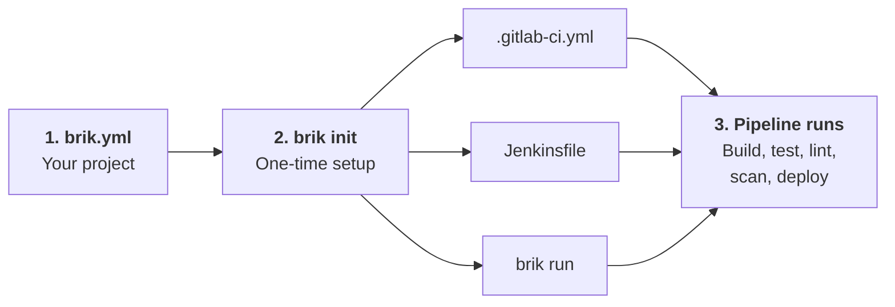
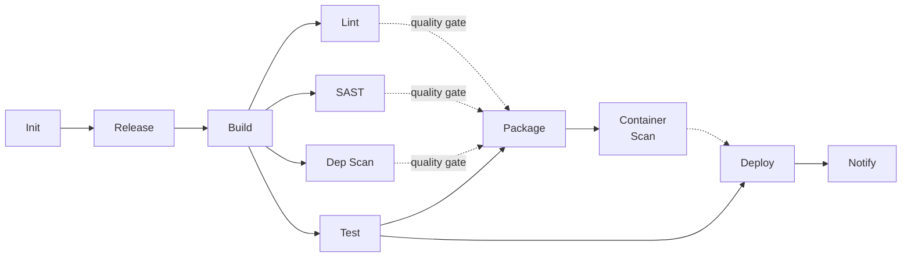

<p align="center">
  
</p>

<p align="center">
  <b>A complete CI/CD pipeline, out of the box.</b><br>
  <b>Describe your project. Brik does the rest.</b>
</p>

<p align="center">
  <a href="https://github.com/getbrik/brik/actions/workflows/ci.yml"></a>
  <a href="https://codecov.io/gh/getbrik/brik"></a>
  <a href="#code-metrics"></a>
  <a href="#code-metrics"></a>
  <a href="#code-metrics"></a>
  <a href="LICENSE"></a>
</p>

<p align="center">
  <a href="docs/README.md">Documentation</a> -
  <a href="https://github.com/getbrik/brik/issues">Issues</a> -
  <a href="https://github.com/getbrik/briklab">Briklab</a>
</p>

## The problem

CI/CD pipelines are:

- Rewritten in every project
- Tied to specific platforms
- Hard to maintain and evolve

Even though... they all do the same thing.

## The solution: Brik

Brik provides a **ready-to-use CI/CD pipeline** that works out of the box.

- No need to write pipeline logic
- No need to learn platform-specific syntax

You just describe your project in `brik.yml`.

## What you write

```yaml
version: 1

project:
  name: my-node-app
  stack: node

test:
  coverage:
    threshold: 80

deploy:
  workflow: trunk-based
  environments:
    staging:
      target: k8s
      namespace: staging
    production:
      target: helm
      chart: ./charts/my-app
```

That's it. Brik gives you build, test, lint, security scanning, and deployment,
with sensible defaults you can override.

## How it works


```mermaid
flowchart LR
    A["<b>1. brik.yml</b><br/>Your project"]
    B["<b>2. brik init</b><br/>One-time setup"]
    GL[".gitlab-ci.yml"]
    JK["Jenkinsfile"]
    LO["brik run"]
    C["<b>3. Pipeline runs</b><br/>Build, test, lint,<br/>scan, deploy"]

    A --> B
    B --> GL
    B --> JK
    B --> LO
    GL --> C
    JK --> C
    LO --> C
```

1. **Describe your project** -- stack, tools, thresholds in `brik.yml`.
2. **Run `brik init` once** -- it generates a thin bootstrap file for your
   platform (`.gitlab-ci.yml`, `Jenkinsfile`). You can also run locally with
   `brik run`.
3. **Your pipeline runs** -- build, test, lint, security scan, deploy. Same
   behavior on every platform.

## Pipeline flow

Every Brik pipeline follows a fixed stage sequence:


```mermaid
flowchart LR
    init["Init"]
    release["Release"]
    build["Build"]
    lint["Lint"]
    sast["SAST"]
    scan["Dep Scan"]
    test["Test"]
    package["Package"]
    cscan["Container<br/>Scan"]
    deploy["Deploy"]
    notify["Notify"]

    init --> release
    release --> build
    build --> lint
    build --> sast
    build --> scan
    build --> test
    lint -.->|quality gate| package
    sast -.->|quality gate| package
    scan -.->|quality gate| package
    test --> package
    package --> cscan
    test --> deploy
    cscan -.-> deploy
    deploy --> notify
```

Lint, SAST, Scan, and Test all run **in parallel** after Build. The quality gate
applies at **Package**: it waits for Test to pass and for Lint/SAST/Scan to
succeed. See [the fixed flow](docs/concepts/fixed-flow.md) for the full stage
table and behavior.

## Getting started

| Platform | Start here |
|----------|------------|
| GitLab CI | [docs/getting-started/gitlab.md](docs/getting-started/gitlab.md) |
| Jenkins | [docs/getting-started/jenkins.md](docs/getting-started/jenkins.md) |
| Local (CLI) | [docs/getting-started/local.md](docs/getting-started/local.md) |

Full documentation lives in **[docs/README.md](docs/README.md)**.

## Supported stacks

| Stack | Detection | Build | Test | Lint |
|-------|-----------|-------|------|------|
| **node** | `package.json` | npm/yarn/pnpm | jest/npm | eslint/biome |
| **java** | `pom.xml` / `build.gradle(.kts)` | mvn/gradle | junit/gradle | checkstyle |
| **python** | `pyproject.toml` / `setup.py` / `requirements.txt` | pip/poetry/uv/pipenv | pytest/unittest/tox | ruff |
| **dotnet** | `*.csproj` / `*.sln` | dotnet build | dotnet test | dotnet-format |
| **rust** | `Cargo.toml` | cargo build | cargo | clippy |

Stack is auto-detected from project files when not specified in `brik.yml`.

## Platform support

| Platform | Status | Integration |
|----------|--------|-------------|
| **GitLab CI** | Functional | Shared library with pipeline template |
| **Jenkins** | Functional | Jenkins shared library (CasC + Gitea) |
| **GitHub Actions** | `brik init --platform github` scaffolds a bootstrap; reusable workflows in progress | Reusable workflows |

## Configuration

Brik follows a "declare what, not how" philosophy. Only `version` and
`project.name` are required -- everything else has sensible per-stack defaults.

```yaml
version: 1
project:
  name: my-app
  stack: node
```

- Configuration reference: [docs/configuration/overview.md](docs/configuration/overview.md)
- JSON Schema (source of truth): [schemas/config/v1/brik.schema.json](schemas/config/v1/brik.schema.json)
- Worked examples: [examples/](examples/) (minimal-node, java-maven, python-pytest, mono-dotnet)

## Architecture

| Layer | Role |
|-------|------|
| **brik.yml** | Project configuration |
| **Shared Library** | Per platform (GitLab, Jenkins, GitHub Actions) |
| **brik-lib** | Reusable CI/CD functions (Bash) |
| **Bash Runtime** | Stage lifecycle, logging, hooks |

For the design, the stage lifecycle, and how to extend Brik, see
[docs/concepts/architecture.md](docs/concepts/architecture.md).

## Code coverage

Measured by [ShellSpec](https://shellspec.info) with
[kcov](https://github.com/SimonKagstrom/kcov) on every push and pull request,
then published to [Codecov](https://codecov.io/gh/getbrik/brik) with an 80%
project and patch gate.

## Code metrics

Tracked automatically via [shellmetrics](https://github.com/shellspec/shellmetrics)
on every push to `main`: average cyclomatic complexity per function, total
function count, and logical lines of code.

## Related

- [brik-images](https://github.com/getbrik/brik-images) - official Docker images for Brik CI/CD runners
- [briklab](https://github.com/getbrik/briklab) - local Docker infrastructure for testing Brik pipelines

## Transparency Notice

We use AI-assisted development ([Claude Code](https://claude.ai/code) + [Everything Claude Code](https://github.com/aspect-build/everything-claude-code)) to accelerate implementation:

- Every contribution (human or AI-generated) follows the same quality gates: code review, test coverage, E2E testing, and CI checks.
- AI-generated code is not perfect. Regular refactoring passes address its shortcomings, and the overall productivity gains are significant.

## License

[MPL-2.0](LICENSE)
