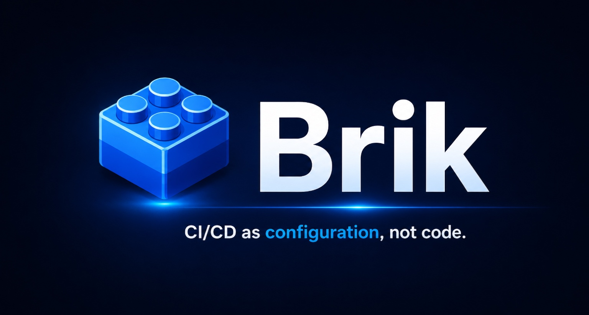
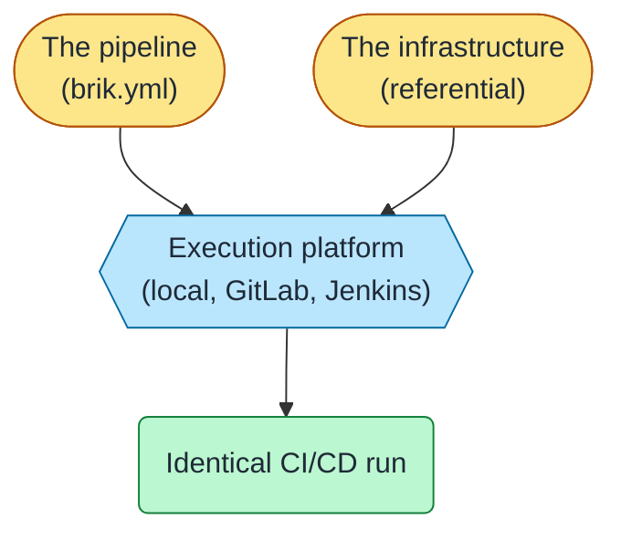
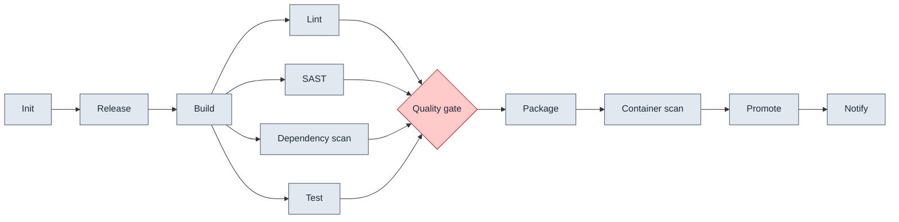
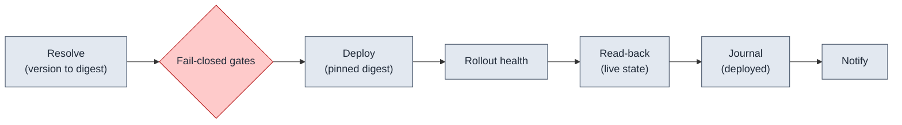

<p align="center">
  
</p>

<p align="center">
  <b>CI/CD as configuration, not code.</b><br>
  Write it once. Run it on GitLab, Jenkins, GitHub Actions, and your laptop.<br>
  <i>Stop maintaining pipelines. Start shipping.</i>
</p>

<p align="center">
  <a href="https://github.com/getbrik/brik/actions/workflows/ci.yml"></a>
  <a href="https://github.com/getbrik/brik/security/code-scanning"></a>
  <a href="https://codecov.io/gh/getbrik/brik"></a>
  <a href="#quality-in-numbers"></a>
  <a href="#quality-in-numbers"></a>
  <a href="#quality-in-numbers"></a>
  <a href="LICENSE"></a>
</p>

<p align="center">
  <a href="docs/README.md">Documentation</a> -
  <a href="https://github.com/getbrik/brik/issues">Issues</a> -
  <a href="https://github.com/getbrik/briklab">Briklab</a>
</p>

---

## The problem Brik solves

Your CI/CD logic is business-critical code, yet it lives trapped in each
platform's dialect. Every pipeline does the same handful of things: *build, test,
scan, package, deploy, notify*. But the know-how that does them is written in *YAML*
for one platform and in *Groovy* for the next. Change platforms, and you rewrite
everything. That is the real cost of lock-in: not a licence fee, but losing your
delivery methodology the day you migrate.

Components and shared libraries organise that code, yet they make the logic
*reusable, not portable*. The know-how stays written in the platform's native
dialect. So the same intent leaks into vendor syntax, drifts as it is copied
between projects, and cannot run on your laptop, where your machine executes
different code than the platform does.

**Brik inverts this. A platform should *execute* delivery logic, not *define* it.**

The logic lives in one portable place, and each platform becomes a thin adapter
that runs it. **You describe your project, not the pipeline.**

## What you write

A fully-featured `brik.yml` for a deployable Node service, bringing CI, GitOps CD, and promotion gates into one file:

```yaml
version: 1

project:
  name: orders-api
  stack: node                 # auto-detected; pin the toolchain when you need to
  stack_version: "22"

publish:
  docker:
    registry: registry.example.com
    username_var: BRIK_PUBLISH_DOCKER_USER       # credentials are references,
    password_var: BRIK_PUBLISH_DOCKER_PASSWORD   #   never values

artifacts:
  channels:
    release:                                     # CI publishes here; CD resolves a digest here
      registry: registry.example.com/orders/orders-api
  evidence:                                      # append-only journal: promotions + deployments
    repo: https://git.example.com/orders/evidence.git
    token_var: BRIK_GIT_TOKEN

deploy:
  environments:
    staging:
      target: gitops                             # ArgoCD reconciles a config repo (pull-based)
      controller: argocd
      repo: https://git.example.com/orders/config-deploy.git
      app_name: orders-staging
      accepts_channel: release
      config_ref: main                           # env config redeploys without a new version
      validates_for: production                  # a green staging deploy grants production
      gates:
        require_digest: true                     # never deploy a mutable tag
    production:
      target: gitops
      controller: argocd
      repo: https://git.example.com/orders/config-deploy-prod.git
      app_name: orders-prod
      accepts_channel: release
      gates:
        require_digest: true
        require_attestation: true                        # verify the signed SBOM + SLSA provenance
        requires_eligibility: [artifact_validated_for]   # staging vouched for this digest
```

That single file is the entire delivery definition: the CI flow, the CD flow,
the promotion chain between environments, and the gates that protect production.
It is configuration, not code. There is no platform pipeline to author and keep
in sync alongside it: no hand-written `.gitlab-ci.yml`, no custom-Groovy
`Jenkinsfile`, no bash glue. The same file drives GitLab, Jenkins, and your
laptop.

And it is as large as your project needs, no larger. Only `version` and
`project.name` are required; the stack is auto-detected and every other field
has a per-stack default. The rest is where you override what matters for *your*
project, such as coverage thresholds, deploy targets, registries, and secrets.
You configure your project. You never write pipeline logic.

> [!TIP]
> See the **[`brik.yml` reference](docs/reference/configuration/README.md)** for every
> top-level section, each on its own page: purpose, behaviour, when it runs, and how to
> configure it.

## Two portable configurations

Delivery splits into two declarations you author once, and neither is written in
a platform's dialect:

- **`brik.yml` is the pipeline**: *what* runs (build, test, scan, deploy) and the
  project's intent (stack, thresholds, channels, environments).
- **The [infrastructure referential](docs/reference/infrastructure-referential.md)
  is the infrastructure**: *where* the pipeline lands and *with which credentials
  and trust* (registries, git host, signing backend, deploy targets), kept out of
  `brik.yml` and out of the platform.

A platform, local, GitLab, or Jenkins, only *executes* the two. The same pair
runs unchanged everywhere, so switching CI vendor, or reproducing the exact run
on your laptop, changes nothing about what runs or where it lands.


```mermaid
flowchart TD
    PIPE(["The pipeline<br/>(brik.yml)"]):::config
    INFRA(["The infrastructure<br/>(referential)"]):::config
    PLAT{{"Execution platform<br/>(local, GitLab, Jenkins)"}}:::platform
    RUN("Identical CI/CD run"):::outcome

    PIPE --> PLAT
    INFRA --> PLAT
    PLAT --> RUN

    classDef config fill:#fde68a,stroke:#b45309,color:#1f2937
    classDef platform fill:#bae6fd,stroke:#0369a1,color:#1f2937
    classDef outcome fill:#bbf7d0,stroke:#15803d,color:#1f2937
```

## Two flows, one configuration

Brik is not one pipeline. It is **two fixed flows selected by the trigger**,
running from the same repository and the same `brik.yml`:

- a **push, tag, or merge request** runs the **CI flow**, which builds and
  publishes one immutable, signed artifact;
- an explicit **deploy trigger** (`brik deploy`, a `Run pipeline` form, or a
  parameterized Jenkins job) runs the **CD flow**, which takes an artifact that
  already exists and proves it before deploying it.

The two flows are **decoupled in time**: build once, deploy that version to any
environment, any number of times, days later.

### CI Flow


```mermaid
flowchart LR
    init["Init"]:::stage --> release["Release"]:::stage --> build["Build"]:::stage
    build --> lint["Lint"]:::stage
    build --> sast["SAST"]:::stage
    build --> scan["Dependency scan"]:::stage
    build --> test["Test"]:::stage
    lint --> qg
    sast --> qg
    scan --> qg
    test --> qg
    qg{"Quality gate"}:::gate --> package["Package"]:::stage
    package --> cscan["Container scan"]:::stage
    cscan --> promote["Promote"]:::stage
    promote --> notify["Notify"]:::stage

    classDef stage fill:#e2e8f0,stroke:#475569,color:#1f2937
    classDef gate fill:#fecaca,stroke:#b91c1c,color:#1f2937
```

The quality gate sits at Package: nothing is packaged unless tests
pass and the security stages succeed. Container Scan signs an SBOM and SLSA
provenance onto the image digest; Promote copies the artifact *and its
evidence* to the release channel.

### CD Flow


```mermaid
flowchart LR
    resolve["Resolve<br/>(version to digest)"]:::stage --> gates
    gates{"Fail-closed gates"}:::gate --> deploy["Deploy<br/>(pinned digest)"]:::stage
    deploy --> health["Rollout health"]:::stage
    health --> readback["Read-back<br/>(live state)"]:::stage
    readback --> journal["Journal<br/>(deployed)"]:::stage
    journal --> notify["Notify"]:::stage

    classDef stage fill:#e2e8f0,stroke:#475569,color:#1f2937
    classDef gate fill:#fecaca,stroke:#b91c1c,color:#1f2937
```

Resolve the version to a digest, walk the fail-closed gates (digest,
attestation, eligibility), deploy the pinned digest, read the live state back,
and journal the result.
`brik status --environment <e>` then reports the environment as three layers
and flags any drift.

> [!TIP] 
> You cannot accidentally ship broken or unverified code by editing the pipeline,
> because there is no pipeline to edit. See **[Fixed flows](docs/concepts/fixed-flows.md)**.

## Core concepts

Brik is a small set of ideas. Each links to a dedicated page that goes from the
functional "what it does for you" to the configuration and the source of truth.

| Concept | In one sentence | Learn more |
|---------|-----------------|------------|
| **Fixed flows** | Two flows selected by trigger (CI builds one signed artifact, CD deploys a pinned digest), never one monolith you edit. | [Fixed flows](docs/concepts/fixed-flows.md) |
| **The plan** | A reproducible per-commit JSON document that decides which stages run and why, identical on every platform (`brik plan --explain`). | [Plan](docs/concepts/plan.md) |
| **Declarations everywhere** | Your project, the pipeline, the operator knobs, and your infrastructure are all schema-validated declarations, enforced fail-closed at runtime. | [Declarations](docs/concepts/declarations.md) |
| **Runner classes** | Each stage runs in a pinned, provable OCI image chosen by its declared class, the same image on your laptop and in CI. | [Runner classes](docs/concepts/runner-classes.md) |
| **Supply-chain gates** | CI signs evidence; CD enforces three fail-closed gates (digest, attestation, eligibility) before deploying. | [Supply chain](docs/concepts/supply-chain.md) |
| **Business vs technical** | A pure decision matrix separating "did it exit zero" from "does that block the release", so a daily pipeline neither cries wolf nor ships known-broken. | [Business outcome](docs/concepts/business-outcome.md) |
| **Local execution** | The same Bash code path and runner images on your laptop, with divergences from CI declared, not silent. | [Local execution](docs/concepts/local-execution.md) |

> [!TIP] 
> For the layered architecture behind these, see [Architecture](docs/concepts/architecture.md).

## Supported stacks

| Stack | Auto-detected from | Build | Test | Lint |
|-------|--------------------|-------|------|------|
| **node** | `package.json` | npm / yarn / pnpm | jest / npm test | eslint / biome |
| **java** | `pom.xml` / `build.gradle(.kts)` | maven / gradle | junit / gradle | checkstyle |
| **python** | `pyproject.toml` / `requirements.txt` | pip / poetry / uv / pipenv | pytest / unittest / tox | ruff |
| **dotnet** | `*.csproj` / `*.sln` | dotnet build | dotnet test | dotnet format |
| **rust** | `Cargo.toml` | cargo build | cargo test | clippy |
| **docker** | `Dockerfile` / `Containerfile` | docker build | -- | -- |

Each stack is itself a declarative manifest and ships with a runner image from
[Brik images](https://github.com/getbrik/brik-images) (multi-arch, scanned,
rebuilt weekly for CVE fixes).

## Platform support

| Platform | Status | How it ships |
|----------|--------|--------------|
| **GitLab CI** | ✅ Functional | Shared library + pipeline template (`include:` one line) |
| **Jenkins** | ✅ Functional | Jenkins Shared Library (works with Configuration-as-Code + Gitea) |
| **GitHub Actions** | 🚧 Bootstrap shipped, reusable workflows in progress | `brik init --platform github` scaffolds today |
| **Local CLI** | ✅ Functional | `brik integrate` |

## Get started

| You use | Start here |
|---------|------------|
| GitLab CI | [docs/getting-started/gitlab.md](docs/getting-started/gitlab.md) |
| Jenkins | [docs/getting-started/jenkins.md](docs/getting-started/jenkins.md) |
| Local CLI | [docs/getting-started/local.md](docs/getting-started/local.md) |

Install Brik on macOS or Linux:

```bash
brew tap getbrik/tap
brew install brik

brik doctor    # check prerequisites
brik init      # scaffold brik.yml + your platform bootstrap
brik validate  # confirm the config is valid
brik integrate # run the full CI flow locally
```

> [!TIP]
> Full documentation: see **[docs/README.md](docs/README.md)**.

## Quality, in numbers

- ✅ **5100+** ShellSpec examples in the core suite, 0 failures, plus dedicated suites for the GitLab, Jenkins, and local adapters
- ✅ **80%** Codecov gate on project and patch, enforced in CI
- ✅ **22** live end-to-end scenarios against real GitLab and Jenkins instances in [briklab](https://github.com/getbrik/briklab): digest-pinned CD, signed-attestation keystones, promotion-chain refusals, channel immutability
- ✅ **29** JSON Schemas govern every contract (config, referential, plan, journal events, reports), validated fail-closed at runtime
- ✅ **Drift gates in CI**: the generated config reference, the compiled registry cache, and every platform parameter surface must all match their source of truth
- ✅ **ShellCheck** clean on every file; **shellmetrics** tracks complexity, function count, and LLOC on every push to `main` (the badges above are live)

## Related projects

- [brik-images](https://github.com/getbrik/brik-images) - official Docker images for Brik runners. Multi-arch, scanned, rebuilt weekly.
- [briklab](https://github.com/getbrik/briklab) - local Docker infrastructure for testing Brik pipelines against real GitLab and Jenkins.
- [homebrew-tap](https://github.com/getbrik/homebrew-tap) - the Homebrew tap for `brew install brik`.

## Transparency notice

We use AI-assisted development ([Claude Code](https://claude.ai/code) + [ECC](https://github.com/affaan-m/ECC)) to accelerate implementation:

- Every contribution (human or AI-generated) follows the same quality gates: code review, test coverage, E2E testing, and CI checks.
- AI-generated code is not perfect. Regular refactoring passes address its shortcomings, and the overall productivity gains are still significant.

## License

[MPL-2.0](LICENSE)
