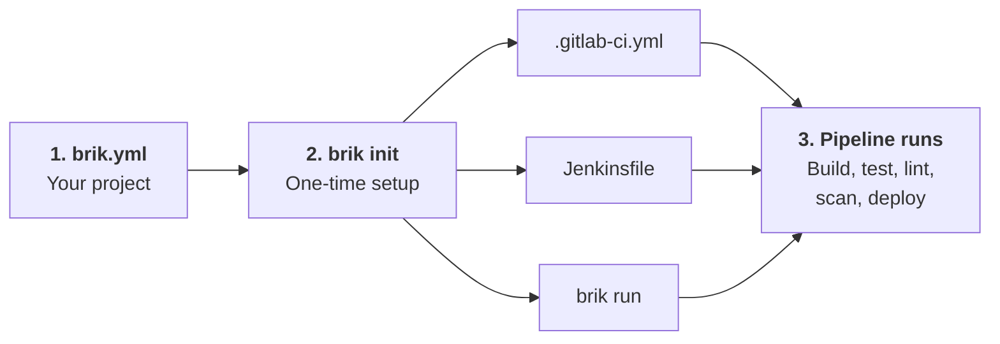
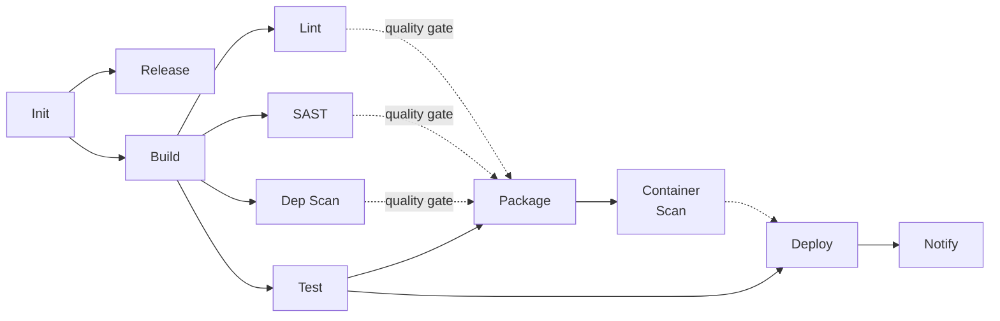

<p align="center">
  
</p>

<p align="center">
  <b>A complete CI/CD pipeline, out of the box.</b><br>
  <b>Describe your project. Brik does the rest.</b>
</p>

<p align="center">
  <a href="https://github.com/getbrik/brik/actions/workflows/ci.yml"></a>
  <a href="https://codecov.io/gh/getbrik/brik"></a>
  <a href="#code-metrics"></a>
  <a href="#code-metrics"></a>
  <a href="#code-metrics"></a>
  <a href="LICENSE"></a>
</p>

<p align="center">
  <a href="https://github.com/getbrik/brik/issues">Issues</a> -
  <a href="https://github.com/getbrik/briklab">Briklab</a>
</p>

## The problem

CI/CD pipelines are:

- Rewritten in every project
- Tied to specific platforms
- Hard to maintain and evolve

Even though… they all do the same thing.

## The solution: Brik

Brik provides a **ready-to-use CI/CD pipeline** that works out of the box.

- No need to write pipeline logic  
- No need to learn platform-specific syntax  

You just describe your project in `brik.yml`.

## What you write

```yaml
version: 1

project:
  name: my-node-app
  stack: node

test:
  coverage:
    threshold: 80

deploy:
  workflow: trunk-based
  environments:
    staging:
      target: k8s
      namespace: staging
    production:
      target: helm
      chart: ./charts/my-app
```

That’s it. Brik gives you build, test, lint, security scanning, and deployment (with sensible defaults you can override).

## How it works


```mermaid
flowchart LR
    A["<b>1. brik.yml</b><br/>Your project"]
    B["<b>2. brik init</b><br/>One-time setup"]
    GL[".gitlab-ci.yml"]
    JK["Jenkinsfile"]
    LO["brik run"]
    C["<b>3. Pipeline runs</b><br/>Build, test, lint,<br/>scan, deploy"]

    A --> B
    B --> GL
    B --> JK
    B --> LO
    GL --> C
    JK --> C
    LO --> C
```

1. **Describe your project** -- stack, tools, thresholds in `brik.yml`
2. **Run `brik init` once** -- generates a thin bootstrap file for your platform (`.gitlab-ci.yml`, `Jenkinsfile`). You can also run locally with `brik run`.
3. **Your pipeline runs** -- build, test, lint, security scan, deploy. Same behavior on every platform.

## Getting started

### GitLab CI

1. Clone the Brik repo onto your GitLab instance (`brik/brik`)
2. Push the GitLab templates as a separate project (`brik/gitlab-templates`)
3. Add a `.gitlab-ci.yml` to your project:

```yaml
include:
  - project: 'brik/gitlab-templates'
    ref: v0.1.0
    file: '/templates/pipeline.yml'
```

Requires a Runner with Docker executor. Use [brik-images](https://github.com/getbrik/brik-images)
as runner images or ensure your images have bash, git, yq, jq, and your stack tools.

See [shared-libs/gitlab/README.md](shared-libs/gitlab/README.md) for the full setup guide
(runner configuration, image requirements, troubleshooting).

### Jenkins

1. Clone the Brik repo to a Git server accessible by Jenkins (GitHub, Gitea, etc.)
2. Add it as a **trusted** Global Pipeline Library in Jenkins (via CasC or UI)
3. Add a `Jenkinsfile` to your project:

```groovy
@Library('brik') _
brikPipeline()
```

Agents must have bash 4+, yq, jq, and your stack tools. Use [brik-images](https://github.com/getbrik/brik-images)
as Docker agents or install the tools on your nodes.

See [shared-libs/jenkins/README.md](shared-libs/jenkins/README.md) for the full setup guide
(CasC configuration, sandbox settings, variable mapping, troubleshooting).

### Local (CLI)

For running pipelines locally or validating your `brik.yml`:

```bash
# One-liner
curl -fsSL https://raw.githubusercontent.com/getbrik/brik/main/scripts/install.sh | bash

# or Homebrew (macOS/Linux)
brew install getbrik/tap/brik
```

Then run `brik doctor` to check your environment.

On CI, [brik-images](https://github.com/getbrik/brik-images) (`ghcr.io/getbrik/brik-runner-*`)
provide pre-built runner images with all prerequisites and stack tools included.
The shared library handles image selection automatically (see Getting started above).

For local usage, install the required tools:

| Brik core | Stack tools |
|-----------|-------------|
| bash 4+, [yq](https://github.com/mikefarah/yq), [jq](https://jqlang.github.io/jq/), [check-jsonschema](https://github.com/python-jsonschema/check-jsonschema) | **node**: node, npm/yarn/pnpm |
| | **java**: java, mvn/gradle |
| | **python**: python3, pip3/poetry/uv |
| | **rust**: rustc, cargo |
| | **dotnet**: dotnet |

## Pipeline Flow

Every Brik pipeline follows a fixed stage sequence:


```mermaid
flowchart LR
    init["Init"]
    release["Release"]
    build["Build"]
    lint["Lint"]
    sast["SAST"]
    scan["Dep Scan"]
    test["Test"]
    package["Package"]
    cscan["Container<br/>Scan"]
    deploy["Deploy"]
    notify["Notify"]

    init --> release
    init --> build
    build --> lint
    build --> sast
    build --> scan
    build --> test
    lint -.->|quality gate| package
    sast -.->|quality gate| package
    scan -.->|quality gate| package
    test --> package
    package --> cscan
    test --> deploy
    cscan -.-> deploy
    deploy --> notify
```

Lint, SAST, Scan, and Test all run **in parallel** after Build (GitLab `verify` stage).
The quality gate effect applies at **Package**: it waits for Test to pass and for
Lint/SAST/Scan to succeed (or be skipped).

| Stage | Purpose | Default behavior |
|-------|---------|------------------|
| Init | Setup | Validate config, detect stack, export variables |
| Release | Versioning | Compute semantic version from git tags; finalize on tag push only |
| Build | Compile | Stack-specific build (npm, mvn, pip, dotnet, cargo) |
| Lint | Code quality | Lint, format check, type checking |
| SAST | Static analysis | SAST scan, plus license and IaC scans when configured |
| Scan | Dependency scan | Dependency audit and secret scan |
| Test | Test suite | Runs in parallel with Lint/SAST/Scan |
| Package | Artifacts | Docker image build + artifact publishing (npm, maven, pypi, cargo, nuget) |
| Container Scan | Image security | Scan built container images for vulnerabilities |
| Deploy | Deployment | Multi-environment with Git workflow profiles, condition-based (branch/tag) |
| Notify | Notifications | Pipeline summary (always runs on CI; included locally when using `--with-deploy`) |

The pipeline is fully deterministic -- no manual triggers. Release runs unconditionally
(computes version), but only finalizes on tag pushes. Package runs on tag pushes
(GitLab) or opt-in locally (`--with-package`). Deploy evaluates per-environment
conditions from `brik.yml`.

Users do not define pipeline structure. They configure behavior within each stage
via `brik.yml`.

## Supported Stacks

| Stack | Detection | Build | Test | Lint |
|-------|-----------|-------|------|------|
| **node** | `package.json` | npm/yarn/pnpm | jest/npm | eslint/biome |
| **java** | `pom.xml` / `build.gradle(.kts)` | mvn/gradle | junit/gradle | checkstyle |
| **python** | `pyproject.toml` / `setup.py` / `requirements.txt` | pip/poetry/uv/pipenv | pytest/unittest/tox | ruff |
| **dotnet** | `*.csproj` / `*.sln` | dotnet build | dotnet test | dotnet-format |
| **rust** | `Cargo.toml` | cargo build | cargo | clippy |

Stack is auto-detected from project files when not specified in `brik.yml`.

## Deploy

Brik supports multi-environment deployment driven by Git workflow conventions.
Choose a workflow profile and Brik provides sensible per-environment defaults
(branch/tag conditions, target, namespace). Your `brik.yml` overrides any default.

| Workflow | Environments | Trigger |
|----------|--------------|---------|
| **trunk-based** | staging, production | `main` branch, `v*` tags |
| **git-flow** | dev, staging, production | `develop`, `release/*`, `v*` tags |
| **github-flow** | preview, production | `feature/*`, `main` branch |

Deploy targets:

| Target | Description |
|--------|-------------|
| **k8s** | `kubectl apply` with optional kustomize |
| **gitops** | Clone config repo, update image tag, push (controller: `argocd`) |
| **helm** | `helm upgrade --install` with values and namespace |
| **compose** | `docker compose up` locally or via SSH |
| **ssh** | rsync + restart command over SSH |

Deployment strategies: **rolling** (default), **blue-green** (service selector switch), **canary** (replica scaling).

Post-deploy health checks: HTTP polling with configurable timeout/interval, Kubernetes rollout status.

Conditions support `==` and `=~` operators and compound `AND`/`OR` expressions:

```yaml
deploy:
  environments:
    production:
      when: "tag =~ 'v*' AND branch == 'main'"
```

## Configuration (`brik.yml`)

Brik follows a "declare what, not how" philosophy. Only `version` and `project.name`
are required -- everything else has sensible defaults per stack.

Full example (Java/Maven):

```yaml
version: 1

project:
  name: my-java-app
  stack: java
  stack_version: "21"

build:
  java_version: "21"
  command: mvn package -DskipTests

test:
  framework: junit

quality:
  lint:
    tool: checkstyle
    config: checkstyle.xml
    fix: false
  format:
    tool: google-java-format
    check: true

security:
  deps:
    severity: high
  secrets: {}

deploy:
  workflow: trunk-based   # or git-flow, github-flow
  environments:
    staging:
      target: k8s
      namespace: staging
    production:
      target: helm
      chart: ./charts/my-app
      namespace: production
```

- JSON Schema: [`schemas/config/v1/brik.schema.json`](schemas/config/v1/brik.schema.json)
- Examples: [`examples/`](examples/) (minimal-node, java-maven, python-pytest, mono-dotnet)
- Full parameter reference: [`docs/reference.md`](docs/reference.md)
- Credentials and secrets configuration: [`docs/credentials.md`](docs/credentials.md)

## CLI Reference

| Command | Description |
|---------|-------------|
| `brik validate` | Validate `brik.yml` against the JSON Schema |
| `brik doctor` | Check prerequisites (tools, stack detection) |
| `brik init` | Scaffold `brik.yml` and platform bootstrap file |
| `brik run stage <name>` | Execute a pipeline stage locally |
| `brik run pipeline` | Execute the full pipeline locally |
| `brik self-update` | Update brik to the latest version |
| `brik self-uninstall` | Remove brik from your system |
| `brik version` | Print version, schema, and runtime info |
| `brik help` | Print usage information |

Valid stages for `brik run stage`: `init`, `release`, `build`, `lint`, `sast`, `scan`, `test`, `package`, `container-scan`, `deploy`, `notify`.

Key options:

```bash
brik validate --config path/to/brik.yml --schema path/to/schema.json
brik doctor --workspace ./my-project
brik init --stack node --platform gitlab --dir ./my-project --non-interactive
brik run stage build --config brik.yml --workspace .
brik run pipeline --continue-on-error --with-release --with-package --with-deploy
brik self-update --channel edge --version v0.2.0
brik self-uninstall --force
brik version --verbose
```

## Platform Support

| Platform | Status | Integration |
|----------|--------|-------------|
| **GitLab CI** | Functional | Shared library with pipeline template |
| **Jenkins** | Functional | Jenkins Shared Library (CasC + Gitea) |
| **GitHub Actions** | Planned | Reusable workflows |

## Architecture

| Layer | Role |
|-------|------|
| **brik.yml** | Project configuration |
| **Shared Library** | Per platform (GitLab, Jenkins, GitHub Actions) |
| **brik-lib** | Reusable CI/CD functions (Bash) |
| **Bash Runtime** | Stage lifecycle, logging, hooks |

For a detailed explanation of the architecture, design principles, stage lifecycle,
and how to extend Brik, see [docs/architecture.md](docs/architecture.md).

## Development

### Prerequisites

```bash
brew install bash yq jq check-jsonschema shellspec shellcheck kcov
```

### Makefile

The project includes a `Makefile` with common development targets:

```bash
make test          # Run all ShellSpec tests (parallel)
make test-quick    # Run tests, stop on first failure
make lint          # Run shellcheck on all production scripts
make coverage      # Run tests with kcov coverage report
make validate      # Validate all example brik.yml files
make check         # Full pre-commit gate: lint + coverage + validate
make metrics       # Run shellmetrics on production scripts
make install       # Symlink bin/brik into /usr/local/bin (dev mode)
make uninstall     # Remove symlink
make clean         # Remove generated coverage/ directory
```

### Run tests

```bash
# All tests (via Makefile, parallel)
make test

# Or directly with ShellSpec
shellspec

# A specific spec file
shellspec spec/cli/validate_spec.sh

# With verbose output
shellspec --format documentation

# With coverage (requires kcov)
make coverage
# Report in coverage/index.html
```

Tests are in `spec/` and `shared-libs/*/spec/` using [ShellSpec](https://shellspec.info). The `.shellspec` config at the project root sets the shell, spec path (`--default-path "**/spec"`), and helper.

> **Note:** `ulimit -n 1024` is required on macOS when running kcov directly. The Makefile handles this automatically. See [kcov#293](https://github.com/SimonKagstrom/kcov/issues/293).

### Validate examples

```bash
# All examples (via Makefile)
make validate

# Single file
bin/brik validate --config examples/minimal-node/brik.yml
```

### Lint

```bash
# All production scripts (via Makefile)
make lint

# Single file
shellcheck bin/brik
```

## Code Metrics

Tracked automatically via [shellmetrics](https://github.com/shellspec/shellmetrics) on every push to `main`:

| Metric | Description |
|--------|-------------|
| **avg CCN** | Average cyclomatic complexity per function (< 5 = green) |
| **Functions** | Total function count across production scripts |
| **LLOC** | Logical lines of code (excludes blanks and comments) |

## Status

**Done:**
- [x] `brik.yml` JSON Schema v1
- [x] Bash Runtime (`stage.run` lifecycle)
- [x] 11 pipeline stages (init, release, build, lint, sast, scan, test, package, container-scan, deploy, notify)
- [x] 5 stacks (node, java, python, dotnet, rust)
- [x] GitLab CI shared library (enterprise-grade DAG with quality gates)
- [x] Jenkins shared library (fixed flow, CasC, E2E tested)
- [x] CLI (validate, doctor, init, run stage, run pipeline, self-update, self-uninstall, version)
- [x] Local pipeline execution (`brik run pipeline`)
- [x] Official Docker images (`ghcr.io/getbrik/brik-runner-*`)
- [x] Multi-environment deploy with Git workflow profiles (trunk-based, git-flow, github-flow)
- [x] Deploy targets: k8s, gitops (argocd), helm, compose, ssh
- [x] Deployment strategies: rolling, blue-green, canary
- [x] Health checks (HTTP polling, k8s rollout)
- [x] 2016 tests (ShellSpec + ShellCheck + kcov, 92% coverage) + 24 E2E scenarios (GitLab + Jenkins)

**Next:**
- [ ] GitHub Actions reusable workflows

## Related

- [brik-images](https://github.com/getbrik/brik-images) - official Docker images for Brik CI/CD runners
- [briklab](https://github.com/getbrik/briklab) - local Docker infrastructure for testing Brik pipelines

## Transparency Notice

We use AI-assisted development ([Claude Code](https://claude.ai/code) + [Everything Claude Code](https://github.com/aspect-build/everything-claude-code)) to accelerate implementation:

- Every contribution (human or AI-generated) follows the same quality gates: code review, test coverage, E2E testing, and CI checks.
- AI-generated code is not perfect. Regular refactoring passes address its shortcomings, and the overall productivity gains are significant.

## License

[MPL-2.0](LICENSE)
