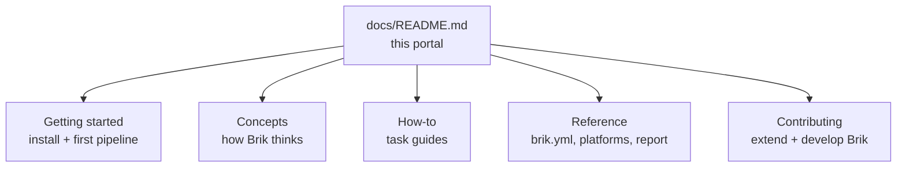

# Brik Documentation

Brik is a portable CI/CD pipeline. You describe your project in a `brik.yml`
file; Brik runs two fixed flows (CI for build, test, scan, package, sign and CD
for verify, deploy a pinned digest) the same way on GitLab CI, Jenkins, and
locally. You configure *what* happens; you never write pipeline logic.

This portal is split by audience, then by the kind of help you need.

## For users and operators

### Getting started: tutorials

Install Brik and run your first pipeline.

- [GitLab CI](getting-started/gitlab.md): add the pipeline template to a GitLab project
- [Jenkins](getting-started/jenkins.md): add the shared library to a Jenkins job
- [Local](getting-started/local.md): install the CLI, validate and run pipelines on your machine

### Concepts: how Brik works, and why

- [Architecture](concepts/architecture.md): the layered model and design principles
- [Fixed flows](concepts/fixed-flows.md): the two flows (CI builds one signed artifact, CD deploys a pinned digest), their fixed order, and the quality gate
- [The plan](concepts/plan.md): the reproducible per-commit decision of which stages run, and why
- [Declarations](concepts/declarations.md): project, pipeline, parameters, and infrastructure as schema-validated declarations
- [Runner classes](concepts/runner-classes.md): the pinned, provable OCI image each stage runs in
- [Supply-chain gates](concepts/supply-chain.md): signed evidence in CI; the three fail-closed gates (digest, attestation, eligibility) in CD
- [Business vs technical outcome](concepts/business-outcome.md): the two-axis model that decides when a result blocks a release
- [Pipeline context](concepts/pipeline-context.md): snapshot vs release, and the fail-fast behaviour each implies
- [Local execution](concepts/local-execution.md): the containerized local mode and its declared divergences from CI
- [Data layout](concepts/data-layout.md): what Brik writes on disk at runtime (`brik-artifacts/`, `.brik-logs/`)

### How-to: task guides

- [Manage credentials](how-to/manage-credentials.md): credential indirection, the infrastructure referential, signing-credential isolation
- [Choose an infrastructure profile](how-to/choose-infra-profile.md): pick and configure a referential posture (`p-open`, `p-entreprise`, `p-lab`, `p-local`)
- [Configure org policy](how-to/configure-org-policy.md): the org-wide policy and referential (DSI / security teams)
- [Accept a finding](how-to/accept-a-finding.md): accept a finding with traceability; the CD deployment gates
- [Manage findings](how-to/manage-findings.md): the SARIF pipeline, presets, severity resolution
- [Use extensions](how-to/use-extensions.md): plug in user-supplied registry extensions
- [Troubleshoot](how-to/troubleshoot.md): common failures, attestation and promotion-journal issues

### Reference: look it up

- [`brik.yml` reference](reference/configuration/README.md): every top-level section, with a dedicated page each
- [Configuration overview](reference/configuration/overview.md): "declare what, not how", three-tier resolution
- [Stacks](reference/configuration/stacks): minimum viable `brik.yml` and gotchas per stack
- [GitLab CI](reference/platforms/gitlab.md): the canonical GitLab integration reference
- [Jenkins](reference/platforms/jenkins.md): the canonical Jenkins integration reference
- [Pipeline report](reference/pipeline-report.md): the `aggregate-report.{json,md,html}` field contract
- [Infrastructure referential](reference/infrastructure-referential.md): the document kinds and fields of the `BRIK_INFRA_DIR` tree

## For contributors

Extending or developing Brik itself.

- [Layout](contributing/layout.md): the domain notions and the `lib/` tree
- [Stage lifecycle](contributing/stage-lifecycle.md): what `stage.run` does around every stage
- [Extending a stack](contributing/extending-stack.md): add support for a new language
- [Extending a stage](contributing/extending-stage.md): add a stage to the fixed flow
- [Extension authoring](contributing/extension-authoring.md): author and contract-test a registry extension
- [Development](contributing/development.md): prerequisites, Makefile targets, running tests
- [Briklab](contributing/briklab.md): the local end-to-end test infrastructure
- [Test architecture](contributing/test-architecture.md): the spec layers and how they map to `lib/`
- Subsystem deep-dives: [planning](contributing/planning/README.md), [registry](contributing/registry/README.md), [test matrix](contributing/test-matrix)
