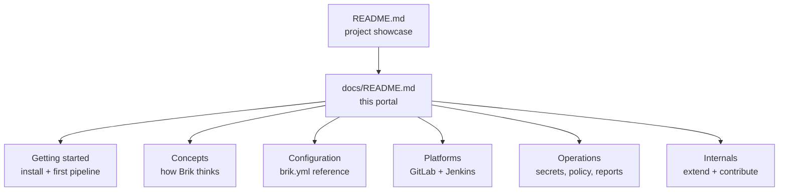

# Brik Documentation

Brik is a portable CI/CD pipeline. You describe your project in a `brik.yml`
file; Brik runs a fixed pipeline -- build, test, lint, security scans, package,
deploy, notify -- the same way on GitLab CI, Jenkins, and locally. You configure
*what* happens at each stage; you never write pipeline logic.

This is the documentation portal. Pick the section that matches what you need.

## Getting started

Install Brik and run your first pipeline.

- [GitLab CI](getting-started/gitlab.md) -- add the pipeline template to a GitLab project
- [Jenkins](getting-started/jenkins.md) -- add the shared library to a Jenkins job
- [Local](getting-started/local.md) -- install the CLI, validate and run pipelines on your machine

## Concepts

How Brik works, and why it is shaped this way.

- [Architecture](concepts/architecture.md) -- the 4-layer model, supply-chain security architecture, and design principles
- [Fixed flow](concepts/fixed-flow.md) -- the 12 stages, their order, the parallel verify group, the quality gate, security stages (Container Scan, Promote, Deploy)
- [Pipeline context](concepts/pipeline-context.md) -- snapshot vs release, and how that decides fail-fast behavior
- [Plan](concepts/plan.md) -- the reproducible per-commit plan: which stages run, why, the safe/balanced selection modes, and the infrastructure referential fingerprint
- [Business outcome](concepts/business-outcome.md) -- the tech/business two-axis model and the decision matrix
- [Data layout](concepts/data-layout.md) -- the on-disk layout (`brik-artifacts/`, `.brik-logs/`) Brik produces at runtime
- [Artifact attestation](concepts/artifact-attestation.md) -- supply-chain security gates, the builder-identity convention, signed evidence, and deployment eligibility
- [Local execution](concepts/local-execution.md) -- the containerized local mode: one runner-class container per stage, infrastructure referential mounts, declared divergences from CI (no keyless signing)
- [Schemas](concepts/schemas.md) -- every contract under `schemas/` is a versioned JSON Schema, enforced fail-closed at runtime and the source the reference docs are generated from

## Configuration

The `brik.yml` reference. The JSON Schema is the source of truth; the reference
pages are generated from it.

- [Overview](configuration/overview.md) -- "declare what, not how", three-tier resolution, what is required
- [Reference](configuration/reference/) -- one page per top-level `brik.yml` section
- [Stacks](configuration/stacks/) -- minimum viable `brik.yml` and gotchas per stack

## Platforms

Integrating Brik with a CI platform.

- [GitLab CI](platforms/gitlab.md) -- runner images, pipeline variables, cache relocation, coverage reports
- [Jenkins](platforms/jenkins.md) -- shared library, parameters, Docker agents, variable mapping

## Operations

Running Brik in production: supply-chain security, credentials, policy, and the pipeline report.

- [Credentials](operations/credentials.md) -- credential indirection, infrastructure referential, signing credential isolation (SLSA L2), per-platform secret setup
- [Policy](operations/policy.md) -- the org-wide `brik-policy.yml` and the infrastructure referential (DSI / security teams)
- [Risk management](operations/risk-management.md) -- when and how to accept a finding with traceability; CD deployment gates
- [Findings](operations/findings.md) -- the SARIF pipeline, presets, severity resolution
- [Pipeline report](operations/pipeline-report.md) -- the `aggregate-report.{json,md,html}` field contract
- [Troubleshooting](operations/troubleshooting.md) -- common failures, attestation verification, promotion journal issues

## Internals

For contributors and advanced integrators.

- [Layout](internals/layout.md) -- the domain notions and the `lib/` tree (ten domain directories)
- [Stage lifecycle](internals/stage-lifecycle.md) -- what `stage.run` does around every stage
- [Extending a stack](internals/extending-stack.md) -- add support for a new language
- [Extending a stage](internals/extending-stage.md) -- add a stage to the fixed flow
- [Development](internals/development.md) -- prerequisites, Makefile targets, running tests
- [Briklab](internals/briklab.md) -- the local end-to-end test infrastructure
