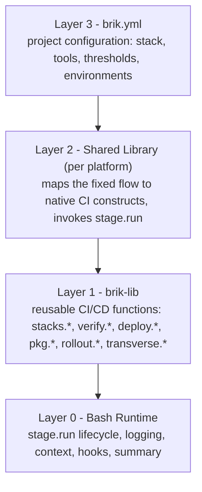

# Architecture

This page explains how Brik is structured and why. For the directory-level map
of the codebase see [internals/layout.md](../internals/layout.md); for what the
runtime does around each stage see
[internals/stage-lifecycle.md](../internals/stage-lifecycle.md).

## Why Brik

CI/CD pipelines share the same logic across projects -- build, test, lint,
deploy -- yet every team rewrites that logic per platform. Switch from GitLab to
GitHub Actions? Rewrite everything. Add Jenkins? Rewrite again. The business
logic is the same; only the orchestration differs.

Brik separates the concerns:

- **Business logic** lives in portable Bash scripts (build, test, lint, scan, deploy).
- **Orchestration** is handled by thin platform adapters (GitLab templates, the
  Jenkins shared library, GitHub Actions workflows).
- **Configuration** is declarative: you write `brik.yml` to say *what* you need,
  not *how* to run it.

One set of CI/CD functions. Any platform. No duplication.

## Design principles

These guide every implementation decision in Brik.

1. **Fixed flow, not custom pipelines.** Every pipeline follows the same stage
   sequence (see [fixed flow](fixed-flow.md)). Users configure behavior within
   stages; they never define pipeline structure. This buys consistency,
   auditability, and predictability.
2. **Declarative configuration.** `brik.yml` is the only user interface. Users
   declare their stack, tools, thresholds, and environments -- never pipeline
   logic. Sensible per-stack defaults mean a valid config can be five lines.
3. **Bash portability.** All CI/CD business logic is portable Bash. Bash is on
   every CI runner, container, and VM. No compilation step, no runtime
   dependency beyond standard Unix tools.
4. **Thin platform adapters.** Shared libraries for each platform are thin: read
   `brik.yml`, map the fixed flow to native constructs, invoke `stage.run`. No
   business logic is allowed in a shared library.
5. **`module.function` naming.** Public functions use a dotted namespace
   mirroring the module hierarchy: `stacks.node.build`, `verify.lint.run`,
   `deploy.k8s.run`, `config.get`. Self-documenting, collision-free.
6. **Test everything.** Every Bash function has a ShellSpec test, every source
   file passes ShellCheck, coverage stays at or above 80%, and end-to-end runs
   happen on [briklab](../internals/briklab.md).

## The four layers

**Layer 0 -- Bash Runtime** (`lib/pipeline/`). The execution framework that
wraps every stage: `stage.run` (lifecycle engine), structured logging,
execution context, pre/post hooks, error handling, step summaries. It knows
nothing about CI/CD -- it only runs functions with observability.

**Layer 1 -- brik-lib** (`lib/{stages,stacks,deployments,rollout,package-managers,transverse,cli}/`).
Reusable CI/CD business functions organized by domain. Each function performs
one CI/CD action for one stack or tool. Layer 1 depends on Layer 0 for logging
and context but knows nothing about any CI platform.

**Layer 2 -- Shared Library** (`shared-libs/<platform>/`). Thin adapters that
bridge a CI platform to the Bash layers. Each adapter reads `brik.yml`, extracts
configuration, and calls `stage.run` per stage. See [GitLab](../platforms/gitlab.md)
and [Jenkins](../platforms/jenkins.md).

**Layer 3 -- brik.yml** (`schemas/config/v1/brik.schema.json`). The user-facing
configuration file, validated against a JSON Schema. Only `version` and
`project.name` are required. See [configuration](../configuration/overview.md).

## How a run flows through the layers

1. The CI platform detects a bootstrap file (`.gitlab-ci.yml`, `Jenkinsfile`).
2. The bootstrap file loads the shared library (Layer 2).
3. The shared library reads `brik.yml` (Layer 3).
4. The shared library runs the [fixed flow](fixed-flow.md), one stage at a time.
5. Each stage is executed via `stage.run` (Layer 0).
6. `stage.run` calls brik-lib functions (Layer 1).

## Key architectural decisions

**Why Bash?** It is the only language guaranteed available on every CI runner,
container, and VM -- no compilation, no runtime install, no dependency
management. The trade-off is reduced expressiveness, but CI/CD logic is mostly
glue code and command invocation, which Bash handles well.

**Why a fixed flow?** Custom pipelines create inconsistency across teams. A
fixed flow guarantees every project follows the same quality gates, security
scans, and deployment process. Flexibility lives *inside* stages, via config.

**Why thin adapters?** Business logic in platform-specific files means
maintaining N copies of the same logic. Thin adapters push all logic into the
portable Bash layer, so a fix benefits every platform at once.

**Why JSON Schema?** `brik.yml` validation must be fast, offline, and
tool-agnostic. JSON Schema provides all three; `jv` and `yq` make validation a
single command with clear error messages.

## See also

- [Fixed flow](fixed-flow.md) -- the 11 stages and their order
- [Data layout](data-layout.md) -- the runtime on-disk contract (`brik-artifacts/` vs `.brik-logs/`)
- [Layout](../internals/layout.md) -- the nine domain notions and the `lib/` tree
- [Stage lifecycle](../internals/stage-lifecycle.md) -- the `stage.run` lifecycle in detail
- [Business outcome](business-outcome.md) -- the tech/business two-axis result model
