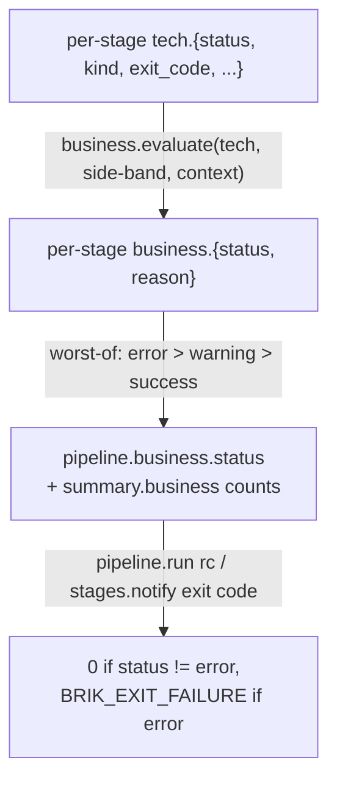

# Business Outcome

Brik separates two orthogonal axes for every stage result. This is the model
that lets a failing stage block a release but only warn on a feature branch,
and lets a CVE with no upstream fix stay a warning while a fixable one blocks.

- **Technical axis** -- what the stage logic actually returned. Captured in
  `tech.status` (`success | failed | skipped`) and `tech.kind` (a human label
  derived from the exit code). Lives in `<stage>.tech.*`.
- **Business axis** -- what that technical outcome *means* for the user, given
  the pipeline context. Captured in `business.status`
  (`success | warning | error`) and `business.reason` (an explanation string).
  Lives in `<stage>.business.*`.

The translation is a pure function in
[`lib/pipeline/business.sh`](../../lib/pipeline/business.sh): it reads its
inputs from named flags, prints a JSON object on stdout, and never touches the
report backend or shell state.

## `business.evaluate`

```
business.evaluate \
  --tech-status   success|failed|skipped \
  --context       snapshot|release \
  [--findings-ignored <integer>=0] \
  [--tech-kind <string>=""]
```

Output on stdout:

```json
{"status":"success|warning|error","reason":"..."}
```

Exit code: `0` on success, `BRIK_EXIT_INVALID_INPUT` (`2`) on a malformed flag.

For every stage that runs through `stage.run`, `_stage._finalize_fragment` calls
`_stage._record_business`, and `_stage._record_business` is the function that
invokes `business.evaluate`. Inputs come from the report backend
(`tech.status`, `tech.kind`, `business.findings.ignored.total`) and the resolved
[pipeline context](pipeline-context.md). The result is persisted under
`business.{status, reason}` and snapshotted into the per-stage fragment.

## Decision matrix

The mapping is fixed and centralised. `business.evaluate` consumes four inputs
-- tech status, the fix-exists counters, side-band signals, and the pipeline
context -- and emits one row:

| `tech.status` | side-band | `pipeline.context` | `business.status` | `business.reason` |
|---|---|---|---|---|
| `success` | none | * | `success` | empty string |
| `success` | `findings.ignored.total > 0` | * | `warning` | `"findings accepted by policy"` |
| `success` | `findings.failing.no_fix > 0` | * | `warning` | `"findings without upstream fix"` |
| `failed` | `fix_class = has_fix` | snapshot | `warning` | `"<kind> (fix available)"` |
| `failed` | `fix_class = has_fix` | release | `error` | `"<kind> (fix available, not applied)"` |
| `failed` | `fix_class = no_fix` | snapshot | `warning` | `"<kind> (no fix available)"` |
| `failed` | `fix_class = no_fix` | release | `warning` | `"<kind> (no fix available, accepted)"` |
| `failed` | `fix_class = unknown` | snapshot | `warning` | `"<kind> (fix classification unknown)"` |
| `failed` | `fix_class = unknown` | release | `error` | `"<kind> (fix classification unknown, strict)"` |
| `skipped` | * | * | `success` | `"not applicable"` |

When several `fix_class` counters are non-zero the priority is
`has_fix > unknown > no_fix-only`. When all three are zero the default is
`has_fix` -- conservative: it blocks in release. `<kind>` defaults to `failure`
when `--tech-kind` is omitted.

## The fix-exists axis

The `fix_class` axis is what distinguishes "the dependency has a CVE we can
upgrade" (`has_fix` -- blocks release) from "the vendor will not fix this and we
have a mitigation in place" (`no_fix` -- stays a warning even in release). It
comes from `fix_classifier` annotations on each SARIF finding
(`brikFixClassification` in `{has_fix, no_fix, unknown}`), optionally filtered
by `severity.is_tool_blocking` for the lint and format stages so tool *warnings*
do not push release pipelines to error.

The supporting modules that produce these inputs:

| Module | Role |
|--------|------|
| `lib/transverse/fix_classifier.sh` | Annotates each SARIF result with `brikFixClassification` and, for lint/format, `brikToolBlocking`. |
| `lib/transverse/severity.sh` | Pure mapping: tool-native severity to the canonical 5-bucket scale, plus an `is_tool_blocking` boolean. |
| `lib/transverse/binary_path.sh` | Locates a CLI binary (workspace, `$PATH`, `BRIK_HOME/tools/`) so a missing tool becomes a typed finding, not a generic failure. |
| `lib/transverse/coverage.sh` | Parses Cobertura/Jacoco/LCOV; turns a threshold breach into a SARIF result that flows through the same pipeline. |
| `lib/transverse/gating.sh` | Reads `release.trigger` / `package.trigger` / `deploy.trigger` and decides whether each schedulable stage runs in the current context. |

See [findings](../how-to/manage-findings.md) for the full SARIF pipeline these
modules feed.

## Aggregation chain



The runtime exit code is a function of `pipeline.business.status`, not of
`tech.status`. The aggregate report (Markdown / HTML / JSON) carries both axes
side by side: each stage row shows `Status` (tech) and `Business`, and the
header carries the `Business outcome` block with the per-bucket counts.

## Example

```bash
result=$(business.evaluate \
  --tech-status success \
  --context snapshot \
  --findings-ignored 14 \
  --tech-kind ok)

status=$(jq -r .status <<<"$result")  # warning
reason=$(jq -r .reason <<<"$result")  # findings accepted by policy
```

Callers must populate `--findings-ignored` from the stage's own side-band signal
(for example `business.findings.ignored.total` after a scanner runs), resolve
`--context` from `pipeline.commit.tag`, and persist the returned `status` and
`reason` under the fragment's `business.{status, reason}` block.

## See also

- [Pipeline context](pipeline-context.md) -- how `--context` is resolved and the gatekeeper contract
- [Findings](../how-to/manage-findings.md) -- the SARIF pipeline that produces the fix-exists counters
- [Risk management](../how-to/accept-a-finding.md) -- when the matrix outcome should be overridden, and how
- [Pipeline report](../reference/pipeline-report.md) -- where `tech.*` and `business.*` are recorded
