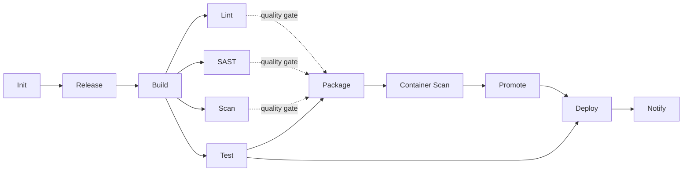

# The Fixed Flow

Every Brik pipeline runs the same 12 stages in the same order. You do not
define pipeline structure; you configure behavior *within* each stage through
`brik.yml`. This is deliberate: a fixed flow makes pipelines consistent,
auditable, and predictable across every project and every platform.

## CI flow and CD flow

Brik has two entrypoints, selected by how a run is triggered -- never one
monolithic pipeline:

- **`brik integrate`** runs the event-driven **CI flow** below (the 12 stages).
  It produces one immutable, digest-addressed artifact and publishes it to the
  candidate channel. On GitLab this is the `brik-integrate.yml` template; on
  Jenkins, `brikIntegrate()`.
- **`brik deploy --version <v> --environment <e>`** runs the **CD flow**: it
  resolves an already-built version to its digest in the channel the environment
  accepts, fails closed on `require_digest`, and deploys that pinned digest. It
  is re-invocable per `(version, environment)` and decoupled in time from CI --
  the same artifact deploys to staging today and to prod next week. On GitLab
  this is the `brik-deploy.yml` template; on Jenkins, `brikDeploy()`.

The Deploy stage in the 12-stage graph below stays available as an opt-in stage
of the integrated path; the decoupled CD verb is the way to deploy a built
version on its own cadence.

## The stage graph

Lint, SAST, Scan, and Test run **in parallel** after Build (on GitLab CI, the
single `verify` stage; on other platforms, the same fan-out pattern). The order
is implemented by `lib/pipeline/pipeline.sh` (`pipeline.run`) and mirrored by
each platform adapter.

Before the 12 stages, a platform-level **plan gate** runs: a `brik-plan` job
computes `plan.json` and each stage job consults it via `brik plan gate`,
selecting which stages actually run. See [plan](plan.md) for the details.

## The 12 stages

| Stage | File | What happens |
|-------|------|--------------|
| Init | `lib/stages/init.sh` | Validate `brik.yml` against the schema, detect the stack, export config variables, resolve the runner image, check prerequisites. Always runs. |
| Release | `lib/stages/release.sh` | Compute the semantic version from git tags, optionally generate a changelog and create a tag. Opt-in (`--with-release`) and gated by `release.trigger`. |
| Build | `lib/stages/build.sh` | Compile or build via the detected stack module (`stacks.<stack>.build`). |
| Lint | `lib/stages/lint.sh` | Lint, format check, and type check (`verify.run`). |
| SAST | `lib/stages/sast.sh` | Static analysis, license, and IaC scans. Shift-left: always runs, no opt-out. |
| Scan | `lib/stages/scan.sh` | Dependency audit and secret scan. Shift-left: always runs, no opt-out. |
| Test | `lib/stages/test.sh` | Install dependencies and run the test suite via `stacks.<stack>.test`. |
| Package | `lib/stages/package.sh` | Build the container image (`stacks.docker.build`). Opt-in (`--with-package`) and gated by `package.trigger`. |
| Container Scan | `lib/stages/container_scan.sh` | Scan the built image for vulnerabilities. |
| Promote | `lib/stages/promote.sh` | Re-tag the audited image from the candidate registry to the release registry. Runs only in a release context (a tag push); self-skips when no promotion is configured. |
| Deploy | `lib/stages/deploy.sh` | Deploy each configured environment (k8s, helm, gitops, compose, ssh). Opt-in (`--with-deploy`) and gated by `deploy.trigger`. |
| Notify | `lib/stages/notify.sh` | Assemble the pipeline report and send notifications (Slack, email, webhook). Opt-in (gated by `--with-deploy`). When the Notify stage is skipped, the aggregate report is still rendered by `pipeline.run` outside the stage loop. |

Lint, SAST, and Scan are three distinct CI-visible stages. They share an
internal implementation library under `lib/stages/verify/`, but that directory
is not a CI stage on its own -- see [extending a stage](../internals/extending-stage.md).

## The quality gate

The quality gate is the dependency rule at **Package**: Package waits for Test
to pass *and* for Lint, SAST, and Scan to succeed (or be cleanly skipped).
Deploy has a mandatory dependency on Test and optional dependencies on Package,
Container Scan, Lint, SAST, and Scan. This is what makes "broken code never gets
packaged or deployed" a structural property, not a convention.

## Opt-in stages and triggers

The pipeline is deterministic -- there are no manual gates inside it. Five
stage manifests (`lib/registry/manifests/stages/`) declare `gate.mode: opt_in`:

- **Release** (`--with-release`), **Package** (`--with-package`),
  **Container Scan** (`--with-package`), **Deploy** (`--with-deploy`), and
  **Notify** (`--with-deploy`) only run when the matching flag is passed. On
  GitLab and Jenkins the platform adapter sets these from the pipeline context.
- When a `release.trigger` / `package.trigger` / `deploy.trigger` block is
  present in `brik.yml`, the stage runs only if at least one trigger flag
  matches the current context; otherwise it is short-circuited with
  `tech.status=skipped`, `tech.kind=not-applicable`. When the block is absent,
  the stage runs whenever its opt-in flag is set (legacy always-run).

See the [release](../configuration/reference/release.md),
[package](../configuration/reference/package.md), and
[deploy](../configuration/reference/deploy.md) reference pages for the trigger
keys.

## Runner images per stage

Every stage runs inside a `brik-runner` Docker image. The platform adapter
selects which image; the stage logic is identical regardless.

| Stage | Image | Why |
|-------|-------|-----|
| Init, Release, Notify | `brik-runner-base` | Init reads `brik.yml` and resolves the stack image; Release (`runner.class: base`) computes the version; Notify aggregates fragments and posts notifications |
| Build, Lint, Test, Package | `brik-runner-<stack>` | Stack-native tools (npm, mvn, cargo, eslint, ruff, ...) |
| SAST | `brik-runner-analysis` | semgrep, checkov, scancode, license_finder |
| Scan, Container Scan | `brik-runner-scanner` | grype, syft, osv-scanner, gitleaks, trufflehog, hadolint, dockle |
| Promote, Deploy | `brik-runner-deploy` | Promote re-tags images across registries; Deploy runs helm, kubectl, argocd, docker compose, ssh, rsync |

Images come from [brik-images](https://github.com/getbrik/brik-images). The Init
stage resolves `brik-runner-<stack>` from `project.stack` and
`project.stack_version`; see [GitLab](../platforms/gitlab.md) and
[Jenkins](../platforms/jenkins.md) for how each platform wires this.

## Test reports

When `test.reports.enabled: true`, Brik injects per-stack coverage and JUnit
reporter flags so the Test stage produces real artifacts:

| Stack | JUnit | Coverage |
|-------|-------|----------|
| node (jest) | jest-junit | jest cobertura reporter |
| python (pytest) | pytest `--junitxml` | pytest-cov cobertura |
| java (maven surefire) | surefire XMLs flattened | jacoco plugin |
| rust (cargo nextest) | nextest ci profile | cargo-llvm-cov cobertura |
| dotnet | JunitXml.TestLogger | XPlat Code Coverage |

The Test stage also emits a canonical `[brik] coverage: XX.XX%` log line so the
GitLab coverage badge wires up with no per-project regex. See the
[test reference](../configuration/reference/test.md) for the keys and
[GitLab platform](../platforms/gitlab.md#coverage-reports) for the badge recipe.

## See also

- [Pipeline context](pipeline-context.md) -- snapshot vs release, and what that changes
- [Business outcome](business-outcome.md) -- how a stage result becomes a pipeline verdict
- [Stage lifecycle](../internals/stage-lifecycle.md) -- what `stage.run` does around each stage
- [Pipeline report](../operations/pipeline-report.md) -- the report every run produces
