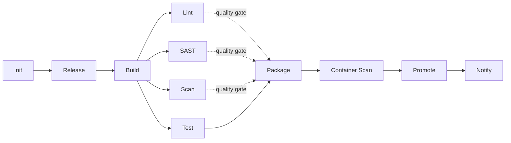

# Fixed flows

> Brik has two flows -- CI builds one signed artifact, CD deploys a pinned
> digest -- selected by the trigger, never one monolith you edit.

**Audience:** users, operators &nbsp;·&nbsp; **Type:** Explanation

## What it is (functionally)

A Brik project does not have *a* pipeline. It has **two flows**, and which one
runs is decided by **how the run was triggered**, not by a file you edit:

- **CI flow** -- runs on a push, a tag, or a merge request. It builds, tests,
  scans, and packages your project into **one immutable, digest-addressed
  artifact**, then publishes it to a channel. It never deploys.
- **CD flow** -- runs on an explicit deploy request. It takes a version that CI
  *already built*, proves it, and deploys that exact artifact to one
  environment. You can run it again and again -- staging today, production next
  week -- always against the **same digest**.

Within each flow the stages are **fixed**: the same steps in the same order, on
every project and every platform. You never define pipeline structure. You
configure behaviour *inside* the stages through `brik.yml`.

## Why it matters

The shape of the flow is a **guarantee**, not a convention:

- **Build once, deploy many.** The artifact you tested in CI is the byte-for-byte
  artifact you deploy -- there is no rebuild between "tested" and "shipped".
- **You cannot accidentally ship broken or unverified code by editing the
  pipeline, because there is no pipeline to edit.** "Tests pass before we
  package" and "the artifact is verified before we deploy" are structural
  properties of the flow, not steps someone might delete.
- **Decoupled in time.** Because CD consumes an existing artifact instead of
  rebuilding, a deploy is just `(version, environment)` -- which makes rollback
  free: deploying the previous version is the same verb.
- **Same outcome everywhere.** The two flows render to native constructs on
  GitLab, Jenkins, and your laptop, but the order and the gates are identical.

## How it works

### The CI flow



Lint, SAST, Scan, and Test fan out **in parallel** after Build. The stages, in
order:

| Stage | What it does for you |
|-------|----------------------|
| **Init** | Validates `brik.yml`, detects your stack, resolves the runner image, checks prerequisites. Always runs. |
| **Release** | Computes the semantic version from git tags and optionally cuts a changelog and tag. Runs in a release context. |
| **Build** | Compiles or builds with your stack's native toolchain. |
| **Lint** | Lint, format check, and type check. |
| **SAST** | Static analysis, license, and IaC scans. Always runs -- shift-left, no opt-out. |
| **Scan** | Dependency audit and secret scan. Always runs -- shift-left, no opt-out. |
| **Test** | Runs your test suite (with coverage and JUnit reports when enabled). |
| **Package** | Builds the container image. |
| **Container Scan** | Scans the image and signs an SBOM + SLSA provenance onto its digest. |
| **Promote** | Copies the artifact **and its evidence graph** to the release channel, refusing to overwrite a different digest under the same version. Runs in a release context; self-skips when not configured. |
| **Notify** | Assembles the report and sends notifications. |

**The quality gate** is the dependency rule at **Package**: Package waits for
Test to pass *and* for Lint, SAST, and Scan to succeed (or be cleanly skipped).
That is what makes "broken code never gets packaged" structural.

### The CD flow


CD resolves the version to a digest in the channel the environment accepts,
walks three **fail-closed** gates (digest, attestation, eligibility -- see
[supply-chain](supply-chain.md)), deploys the pinned digest, checks rollout
health, reads the live state back, and journals the result. The journal entry
is written **only after** a live read-back agrees with the pinned digest: a
record never vouches for a state that was not observed.

`brik status --environment <e>` then reports the environment as **three
layers** -- the last journaled deploy, the definition a deploy would apply now,
and the live digest -- and flags definition drift and live drift separately. On
a gitops target the reconciler corrects live drift; on a push-based target it is
detected but not corrected.

### Not a monolith

The two flows are distinct runs, never one pipeline with a deploy stage tacked
on. The verbs that drive them:

```bash
brik integrate                                       # CI flow
brik deploy --version v1.2.3 --environment staging   # CD flow (re-invocable)
brik promote --version v1.2.3                        # copy artifact + evidence between channels
brik authorize --version v1.2.3 --for production     # grant a digest for an environment
brik status --environment staging                    # journal + desired + live, with drift
```

## Configuration & reference

The functional flow above is fixed. What you *configure* is behaviour inside it.
For every `brik.yml` section -- what it is for and how to set it -- see the
**[`brik.yml` reference](../reference/configuration/README.md)**.

- **Stage order and runner classes** are declared in the stage manifests under
  [`lib/registry/manifests/stages/`](../../lib/registry/manifests/stages) and
  executed by `pipeline.run` (`lib/pipeline/pipeline.sh`); each platform adapter
  mirrors the same fan-out. Stages run in their declared **runner-class image**
  -- see [runner-classes](runner-classes.md).
- **Which stages run on a given commit** is decided up front by the
  [plan](plan.md) (`brik plan --explain`); on GitLab/Jenkins a `brik-plan` job
  computes it and each stage consults it via `brik plan gate`.
- **Opt-in stages and triggers.** Release, Package, Container Scan, Deploy, and
  Notify declare `gate.mode: opt_in` in their manifests and run only when the
  matching context flag (`--with-release`, `--with-package`, `--with-deploy`) is
  set, or when a `release.trigger` / `package.trigger` / `deploy.trigger` block
  in `brik.yml` matches. See the
  [release](../reference/configuration/release.md),
  [package](../reference/configuration/package.md), and
  [deploy](../reference/configuration/deploy.md) reference pages.
- **Test reports.** Set `test.reports.enabled: true` to inject per-stack
  coverage and JUnit reporters; see the
  [test reference](../reference/configuration/test.md).
- **Proof and journals.** When `.artifacts.evidence.repo` is declared, both
  flows write append-only, optionally ssh-signed commits to a state-repo holding
  three trees -- `evidence/` (SBOM + provenance), `promotions/` (the grants
  `requires_eligibility` reads), and `deployments/` (one `deployed` event per
  digest per environment, carrying the `definition_hash` drift anchor). brik
  stays stateless: authority is the signed commit, never a field in the
  document.
- **Source of truth:** the stage source lives under
  [`lib/stages/`](../../lib/stages); the CD verbs under
  [`lib/cli/`](../../lib/cli).

## Related

- [Supply-chain gates](supply-chain.md) -- the three fail-closed gates the CD flow enforces
- [The plan](plan.md) -- how Brik decides which stages run on a commit
- [Pipeline context](pipeline-context.md) -- snapshot vs release, and what each changes
- [Business outcome](business-outcome.md) -- how a stage result becomes a pipeline verdict
- [Runner classes](runner-classes.md) -- the image each stage runs in
- Contributor deep-dive: [extending a stage](../contributing/extending-stage.md)
