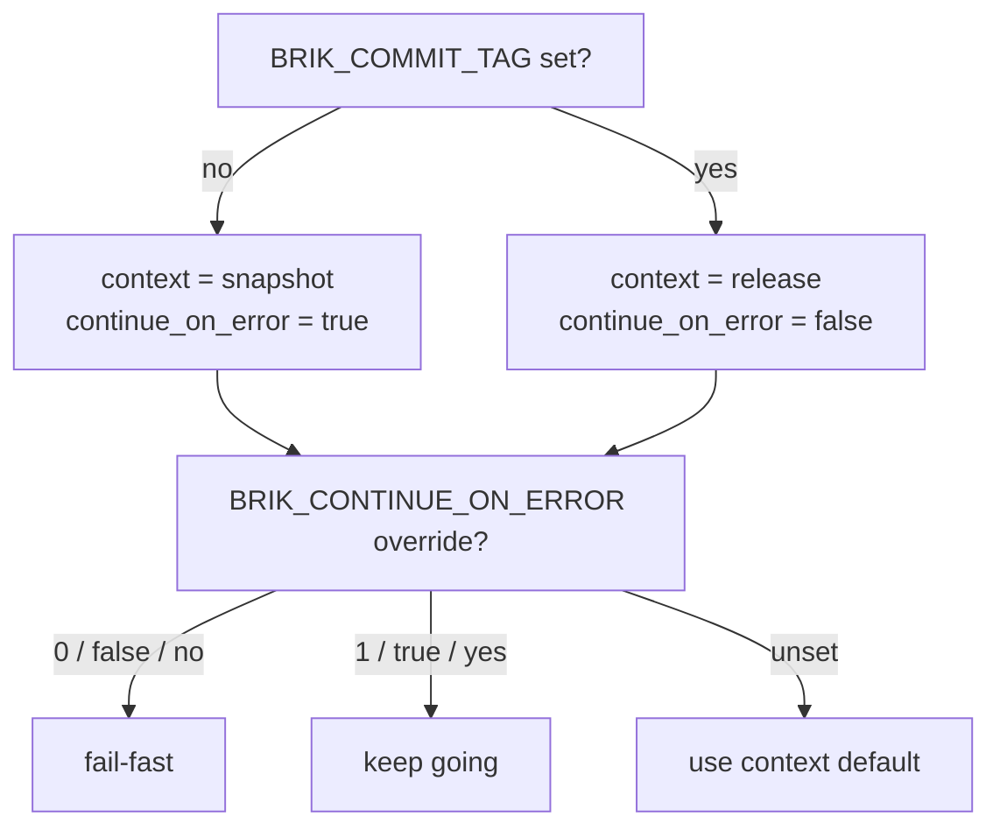

# Pipeline Context

Every Brik run resolves to one of two execution contexts. The context decides
the default fail-fast behavior and how stage failures are scored.

- **snapshot** -- a short-lived run on a feature branch or an unbound commit.
  Default: keep going past failures so the operator gets a full report.
- **release** -- a promotion run tied to a versioned commit. Default: fail-fast
  so a broken stage cannot mask downstream issues.

## How the context is resolved

The context is derived from `BRIK_COMMIT_TAG` -- nothing else:

| `BRIK_COMMIT_TAG` | Resolved context |
|---|---|
| unset or empty | `snapshot` |
| any non-empty string | `release` |



The resolved value is persisted under `pipeline.context` in
`aggregate-report.json`, in both local and CI mode.

Pre-release tags such as `v1.2.3-rc1` are treated as `release`. The runtime does
not parse the tag string -- the presence of any non-empty tag is enough.
Refining this (treating rc differently from a final tag) is intentionally out of
scope; callers that need a different policy override the context indirectly via
`BRIK_CONTINUE_ON_ERROR`.

## `continue_on_error` precedence

Three layers decide whether the pipeline keeps going past a failed stage,
highest priority first:

1. **`BRIK_CONTINUE_ON_ERROR=0|1`** -- explicit operator override. Wins over
   everything. Truthy: `1`, `true`, `yes`. Falsy: `0`, `false`, `no`. Any other
   value falls through.
2. **`--continue-on-error` CLI flag** -- legacy shortcut, equivalent to
   `BRIK_CONTINUE_ON_ERROR=1` when no env override is set.
3. **Context default** -- `snapshot` => keep going, `release` => fail-fast.

```bash
# Snapshot, keep going past failures (default).
brik integrate

# Snapshot, force fail-fast for a CI lane that wants strict gating.
BRIK_CONTINUE_ON_ERROR=0 brik integrate

# Release, force continue to collect every stage report.
BRIK_COMMIT_TAG=v1.2.3 BRIK_CONTINUE_ON_ERROR=1 brik integrate
```

## Pipeline outcome and the gatekeeper

The context does not change a stage's *technical* result -- it changes how that
result is *scored*. A failing stage in snapshot maps to `business.status=warning`
and the run still exits `0`; the same failure in release maps to
`business.status=error` and the run exits `1`. See [business outcome](business-outcome.md)
for the full mapping.

The pipeline-wide verdict is `pipeline.business.status`, the worst per-stage
`business.status` (order: `error > warning > success`). Two callers gate the
exit code off it:

| Caller | Behavior |
|--------|----------|
| `pipeline.run` | Returns `BRIK_EXIT_FAILURE` when the worst status is `error`; `0` for `warning` or `success`. |
| `stages.notify` | Same contract. CI jobs that wire Notify as the final stage inherit the pipeline exit code through it. |

`aggregate-report.md` carries a **Business outcome** block right after the
summary:

```markdown
## Business outcome

- **Status:** [WARN] warning
- **Counts:** success=2, warning=1, error=0
```

## See also

- [Business outcome](business-outcome.md) -- the decision matrix that scores each stage
- [Fixed flow](fixed-flow.md) -- the stages whose results feed the verdict
- [Pipeline report](../operations/pipeline-report.md) -- where `pipeline.context` and the verdict are recorded
