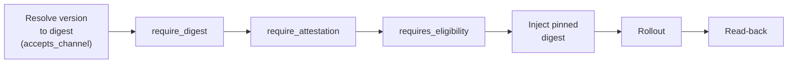

# Supply-chain gates

> [!NOTE]
> CI signs evidence onto every artifact; CD enforces three fail-closed gates
> (digest, attestation, eligibility) before deploying it.

**Audience:** operators, users &nbsp;·&nbsp; **Type:** Explanation

## What it is (functionally)

Brik splits supply-chain trust across the two flows:

- **CI produces proof.** Every artifact is addressed by its `sha256` digest and
  carries **signed proofs attached to that digest**: a CycloneDX SBOM (what is
  inside) and SLSA provenance (where it came from and who built it).
- **CD checks proof.** Before a deploy touches an environment, three gates each
  answer one question about the artifact:

| Gate | Question it answers | Set with |
|------|---------------------|----------|
| **Digest** | Is this exactly *this content*? | `require_digest: true` |
| **Attestation** | Where does it come from, *who attests it*? | `require_attestation: true` |
| **Eligibility** | Does it have the *blessing* for this environment? | `requires_eligibility: [...]` |

You turn gates on per environment. A low environment might require only the
digest; production typically requires all three.

## Why it matters

- **The artifact you verify is the artifact you deploy.** The digest is
  tamper-evident (change one byte and it is a different digest), so pinning to
  it closes the "we tested X but shipped Y" gap, including the
  deploy-a-mutable-`:latest`-tag gap.
- **Every gate is fail-closed.** Missing trust material, an unreachable journal,
  or an unverifiable signature **refuses the deploy**. There is never a silent
  pass: a gate you asked for but cannot enforce fails, it does not quietly skip.
- **Attestation is not eligibility.** Attestation is produced by CI and travels
  *with* the artifact (it says where it comes from). Eligibility is a *posterior
  decision*, recorded in a signed journal, that comes from a human
  `brik authorize` or a validated deploy on the previous environment (it says
  where it may go). A
  perfectly attested artifact may still not be eligible for production; a grant
  never replaces the authenticity check.

## How it works

At deploy time the gates run in a **fixed order**, each fail-closed:



- **Digest**: the version is resolved to its `sha256` in the channel the
  environment accepts (`accepts_channel`); content-addressing *is* the proof.
- **Attestation**: `cosign` verifies the signed in-toto attestations on the
  digest against the **profile's trust material**, then checks the provenance
  against the deploy expectations: the version being deployed (anti-substitution),
  the builder identity, and the source repository.
- **Eligibility**: the signed promotion journal is cloned, its tip signature
  verified, and every required grant must exist *for this digest and this
  environment*. Grants come from `brik authorize` (`artifact_authorized_for`) or,
  in a declarative chain, from a green deploy on the previous environment
  (`artifact_validated_for`).

**Declarative promotion chains.** An environment names the next link with
`validates_for`; a successful CD run on it journals `artifact_validated_for` for
that next environment, so a green staging deploy can bless production. The
grant is written **after** the rollout, only once a live read-back agrees with
the pinned digest (a reconciling controller gets a bounded window to converge);
a read-back that never converges withholds the grant and fails the run.

**Re-entry converges.** Re-running a deploy for the same `(version,
environment)` re-evaluates the gates against the same digest, applies
idempotently, and reads back the same digest. Journal and evidence writes are
append-only: a re-run adds to history, never rewrites it.

## Configuration & reference

A production environment wiring all three gates:

```yaml
deploy:
  environments:
    production:
      accepts_channel: release
      gates:
        require_digest: true
        require_attestation: true
        expected_builder: "^https://gitlab\\.example\\.com/-/brik/"
        expected_source: "gitlab\\.example\\.com/team/app$"
        requires_eligibility: [artifact_authorized_for]
```

### Builder-identity convention

The provenance predicate CI emits carries a verifiable builder identity that
`require_attestation` checks (on the cosign-verified payload only):

- `runDetails.builder.id` = `<orchestrator-url>/-/brik/<runner-class>`, combining
  the orchestrator base URL (`CI_SERVER_URL`, `JENKINS_URL`, or `https://brik.sh/local`)
  and the stage's runner class.
- `buildDefinition.externalParameters.version` = the git tag being built
  (matched tolerant of `release.tag_prefix`).
- `buildDefinition.resolvedDependencies[0].uri` = the source repository
  (matched against `gates.expected_source` when set).

### SLSA posture (honest claim)

- **Build L1** is claimed on every profile: provenance generated, attached, and
  verified at deploy.
- **Build L2** is claimable only when the signing credential is scoped to the
  signing phase, so user-defined commands cannot read it. Brik provides the
  isolation mechanics (the `BRIK_SIGNING_` prefix delivers the credential to the
  `container-scan` stage only, via the `brik/signing` GitLab environment or a
  dedicated Jenkins env-file); the claim holds only when the operator actually
  scopes it. `kms` and `keyless` backends can claim L2; a `file://` private key
  in the referential cannot.
- **Build L3** is out of reach self-hosted and is **never** claimed.

### Trust material and verification

- Verification never needs the signing credential: declare `verification_key`
  (the exported public key) on the Signing endpoint and every verifier checks
  signatures without key access or a KMS round-trip.
- Trust material, endpoints, and credential references live in the
  [infrastructure referential](../how-to/manage-credentials.md); credentials are
  references (`env://`, `file://`), never values, and Brik validates the
  referential fail-closed at init and deploy.

### Credential separation

Keep CI publish credentials (registry write) and CD resolution credentials
(registry read + state-repo write) as **distinct accounts**, so revoking one
does not strand the other and the production pull account cannot push. Token
lifetime is a secret-manager parameter, not Brik code: Brik reads every
credential at use time through `env://`, so rotating a short-lived token is
invisible to it.

### Source of truth

- Gate logic: [`lib/cli/deploy.sh`](../../lib/cli/deploy.sh)
- Signing / verification: [`lib/transverse/attest.sh`](../../lib/transverse/attest.sh)
- Journals and the state-repo: [`lib/transverse/state_repo.sh`](../../lib/transverse/state_repo.sh)

## Related

- [Fixed flows](fixed-flows.md): where the gates sit in the CD flow
- [Manage credentials](../how-to/manage-credentials.md): the infrastructure referential and credential scoping
- [Organisation policy](../how-to/configure-org-policy.md): enforcing gate requirements org-wide
- [Data layout](data-layout.md): where evidence and journals live on disk
