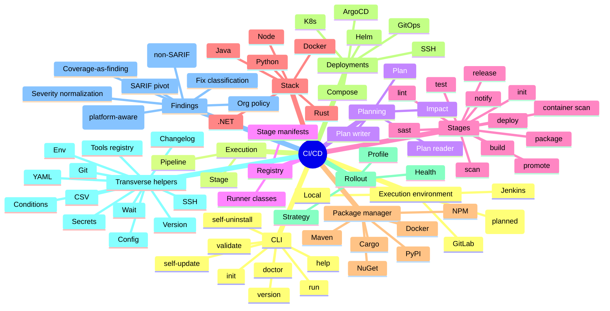
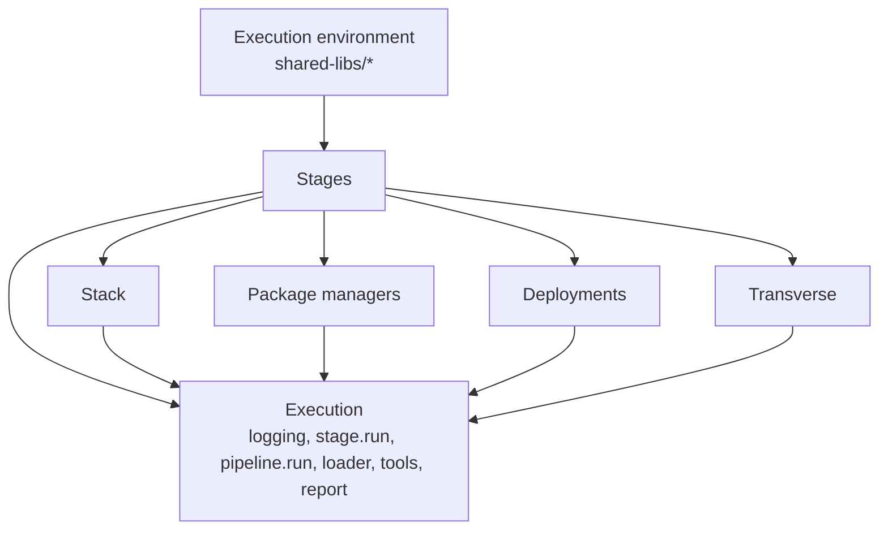

# Brik Domain Layout

The `lib/` tree is organized around **eleven notions** that form Brik's domain
vocabulary. Ten map to a directory under `lib/`; one (execution environment)
maps to `shared-libs/`. Functions are named `<notion>.<submodule>.<verb>`
(e.g. `stages.build`, `stacks.node.build`, `transverse.wait.until`,
`cli.validate.run`).

This document is the layout reference. For design rationale see
[architecture.md](../concepts/architecture.md).

## Mindmap

Notes on the mindmap:

- **Stages** lists the 12 CI-visible stages. Before the stage loop, a
  platform-level **plan gate** runs: a `brik-plan` job computes `plan.json` and
  each stage job consults it via `brik plan gate` to decide which stages run
  (see the **Planning** notion). The internal umbrella directory
  `lib/stages/verify/` (host of `_cfg.sh`, `format.sh`, `lint.sh`, `scan/`,
  `type_check.sh`, `verify.sh`) is used by `lint`, `sast`, and `scan`, but is
  not itself a CI-visible stage. Promoting `verify` to a top-level stage is an
  optional, deferred change.
- **Stages.sonar** is on the roadmap but blocked on a SonarQube component in
  briklab.
- **Transverse helpers** still do not include `cache` (out of scope).
  `artifacts` was reintroduced to support `business.artifact.main_file`
  and the HTML report download, but stays scoped to the `business` / `report`
  modules -- it is not a transverse helper.
- **CLI** is not part of the domain notions; it is a command layer that sits
  above the notions and delegates into them.

## The Eleven Notions (table)

| #  | Notion               | Directory                       | Responsibility                                                                  |
|----|----------------------|---------------------------------|---------------------------------------------------------------------------------|
| 1  | Execution environment | `shared-libs/<platform>/`      | Map the fixed flow to a CI platform (GitLab, Jenkins, local, GitHub planned).   |
| 2  | Stack                | `lib/stacks/`                   | Per-stack build, test, install_deps (`node`, `java`, `python`, `rust`, `dotnet`, `docker`). |
| 3  | Stages               | `lib/stages/`                   | The 12 pipeline stages (`init`, `release`, `build`, `lint`, `sast`, `scan`, `test`, `package`, `container_scan`, `promote`, `deploy`, `notify`). |
| 4  | Deployments          | `lib/deployments/`              | Deploy targets (`k8s`, `helm`, `compose`, `ssh`, `gitops`, `argocd`).           |
| 5  | Transverse           | `lib/transverse/`               | Cross-cutting helpers (`git`, `version`, `env`, `changelog`, `conditions`, `config`, `csv`, `secrets`, `ssh`, `wait`, `yaml`, `tools`, `binary_path`). |
| 6  | Execution            | `lib/pipeline/`                 | Runtime mechanics: `stage.run`, `pipeline.run`, `loader`, `logging`, `context`, `report`, `report_html`, `hooks`, `tools`, `bootstrap`, `business` (pipeline gatekeeper aggregating per-stage business results), `error`, `summary`, `runner-images`, `banner`, `_branding`, `pipeline-env`, `version-info`. |
| 7  | Package managers     | `lib/package-managers/`         | Publish to registries (`npm`, `pypi`, `maven`, `cargo`, `nuget`, `docker`).     |
| 8  | Rollout              | `lib/rollout/`                  | Post-deploy rollout semantics (`health`, `strategy`, `profile`).                |
| 9  | Findings             | `lib/transverse/findings*`      | Quality data normalization: SARIF pivot, non-SARIF converters, platform-aware exporters, fix-classification, severity normalization, coverage-as-finding, org policy resolution. Physically nested under `transverse/` for now; promotion to a top-level `lib/findings/` is left for a follow-up to avoid a mass rename of `transverse.findings.*` callers. |
| 10 | Planning             | `lib/planning/`                 | Stage-selection planning: `plan` (build the selection plan), `impact` (path-change impact analysis), `plan_reader` / `plan_writer` (read and emit `plan.json`). |
| 11 | Registry             | `lib/registry/`                 | Stage and stack manifests (`manifests/stages/`, `manifests/stacks/`) plus their loader, validator, and cache -- the declarative source for gate modes and runner classes. |

Plus one CLI-only directory not part of the domain notions but kept under `lib/`
for consistency with the loader:

| Aux | Directory   | Responsibility                                                       |
|-----|-------------|----------------------------------------------------------------------|
| CLI | `lib/cli/`  | Command implementations (`validate`, `doctor`, `version`, `help`, `init`, `run`, `self_update`, `self_uninstall`) + shared helpers. |

## Primary Dependencies

Dependencies flow downward. Every arrow reads "uses".

Key relations:

- **Execution environment -> Stages**: the shared library (GitLab/Jenkins/local)
  picks up `brik.yml` and invokes each stage through `stage.run`.
- **Stages -> Stack**: build/test stages dispatch to the right stack via
  `brik.use "stacks.${stack}"`.
- **Stages -> Package Manager**: the package stage dispatches to the right
  registry publisher.
- **Stages -> Deployments**: the deploy stage dispatches to the right target.
- **Deployments -> Rollout**: k8s/helm/gitops deployments call rollout helpers
  (`rollout.health.wait`, `rollout.strategy.apply`, `rollout.profile.merge`).
- **Stages -> Transverse**: every stage may use transverse helpers (config,
  env, git, yaml, wait, secrets, tools).
- **Execution -> Stages**: `pipeline.run` orchestrates the 12 stages; each stage
  is wrapped by `stage.run`.
- **Stack -> Package Manager**: stack-specific install_deps may delegate to a
  package manager client (e.g. `npm install` for the `node` stack).

## Invariants

- No `lib/core/` directory. The old dispatcher layer was inlined into the stages
  and CLI it fed.
- No indirect expansion (`${!var}`) outside `lib/transverse/env.sh`. All indirect
  reads go through `transverse.env.resolve_indirect`.
- No manual poll loops. The only `while elapsed < timeout; check; sleep` pattern
  lives in `transverse.wait.until`; `deploy.gitops.wait_sync` and
  `rollout.health.wait` delegate to it. Tool-native waits
  (`argocd app wait --health`, `kubectl rollout status --timeout`) stay as-is.
- No duplicated `yq -i` setters. `transverse.yaml.{merge,patch,set_image_tag}`
  centralizes YAML mutation; profile merge, gitops render/push use it.
- No duplicated tool registry. `transverse.tools.{register,resolve,exec}`
  (promoted from the former `verify/_tools.sh`) is the single 3-tier registry
  for all scan modules.
- Tool registry vs. binary-path resolution are distinct concerns.
  `transverse.tools` is the registry that scan modules use to declare and
  invoke their CLI dependencies by category; `transverse.binary_path`
  (`binary_path.resolve`, `binary_path.is_available`) walks the
  project -> $PATH -> bundled chain to locate one binary and emit a JSON
  descriptor (`{path, version, provenance}`). They share neither callers
  nor return contracts.
- `lib/cli/` contains the command logic; `bin/brik` is a thin bootstrap + dispatcher.

## File-to-Notion Cheat Sheet

| If you're touching...                        | You're in notion...       |
|----------------------------------------------|---------------------------|
| A pipeline stage's top-level behavior        | 3 (stages)                |
| Node/Python/Java/Rust/.NET build logic       | 2 (stack)                 |
| A deploy target's connector logic            | 4 (deployments)           |
| A cross-cutting helper (git, yaml, wait)     | 5 (transverse)            |
| `stage.run` lifecycle / pipeline.run / report | 6 (execution)            |
| An `npm publish` / `docker push` wrapper     | 7 (package managers)      |
| Post-deploy health / strategy / profile      | 8 (rollout)               |
| SARIF aggregation / converter / exporter / fix-classification | 9 (findings) |
| Stage-selection plan / impact analysis       | 10 (planning)             |
| A stage/stack manifest or its loader         | 11 (registry)             |
| A `brik <cmd>` CLI command                   | CLI (aux)                 |
| A platform template or wrapper               | 1 (execution environment) |

