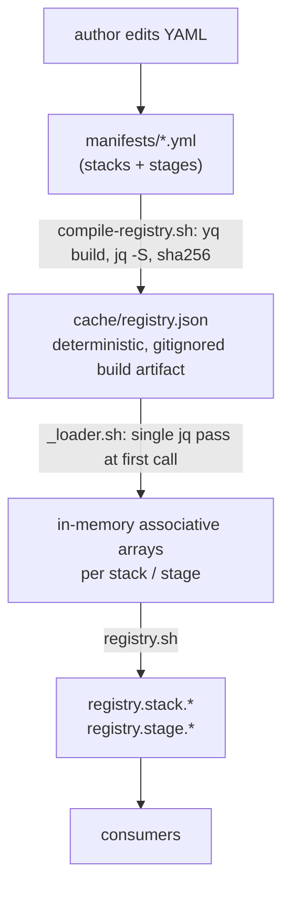

# Registry architecture

Four layers, decoupled by file formats and one function boundary:

| Layer | Format | Owned by |
|---|---|---|
| Source | YAML | extension author |
| Cache | JSON | compiler |
| Loader | bash assoc. arrays | runtime |
| API | `registry.stack.*` / `registry.stage.*` | consumers |

## Why YAML at author time and JSON at runtime

The rationale, in short:

- YAML is what humans edit. It supports comments, multi-line strings,
  and reads naturally for the shape of a manifest (nested
  `spec.detect.markers.any`).
- JSON is what the runtime parses. `jq` is in every brik-runner image,
  `yq` is not. End users running `brik integrate` never have to install `yq`.
- The compiler runs `yq -o=json` then pipes through `jq -S` to get a
  deterministic byte stream. The sha256 of the cache is stable across
  OSes; CI verifies this via `scripts/compile-registry.sh --check`.

## Cache reproducibility contract

`scripts/compile-registry.sh` guarantees that two runs over the same
manifest tree produce byte-identical output:

- key ordering: `jq -S` sorts top-level keys recursively.
- array stability: arrays from `yq` keep author order; `jq -S` does
  not touch them. Manifest fields that need ordering (e.g. stage
  placement) preserve it.
- no timestamps, no working directory paths, no machine-specific data
  baked into the cache.

CI runs `scripts/compile-registry.sh --check`. The cache is a
gitignored build artifact, not a committed file; the check recompiles
from the manifests and fails if the result is not byte-stable, which
guards the reproducibility contract.

## Loader lifecycle

`lib/registry/_loader.sh` reads the cache once per shell, into bash
associative arrays keyed by `<id>`. The loader is invoked lazily by
`registry.use` (the public idempotent entry point) so consumers can
source `registry.sh` cheaply.

Refresh paths:

- `registry.use`: idempotent; subsequent calls are no-ops.
- `_registry._reset`: internal, drops the in-memory state. Used in
  ShellSpec to test scenarios where extensions are added.
- `_registry._reload`: internal, equivalent to `_reset` + `_load`.

The loader is **never** called from production code outside
`registry.*`. Consumers depend on the API, not the cache shape.

## Validator

`lib/registry/_validator.sh` validates each manifest individually
against the JSON schema (`schemas/registry/v1/{stack,stage}.schema.json`)
using `jv`. The validator runs:

- at compile time (`scripts/compile-registry.sh` aborts on invalid
  manifest with the failing path),
- in CI (`shellspec spec/registry/validator_spec.sh`),
- on-demand for extension authors who source the validator directly.

Validation is per-manifest, not per-cache: errors point at the
offending file, which is what the author needs.

## Extension overlay

The compiler supports `BRIK_REGISTRY_EXTENSIONS_DIRS` (colon-separated)
to overlay user-supplied manifests on top of the builtins. See
[`extensions.md`](../../how-to/use-extensions.md) for the walkthrough.

Conflict policy: if the same `metadata.id` appears in both a
builtin and an extension, the compile aborts. A future release
introduces explicit overrides; until then, name your stack
unambiguously (`acme-java`, not `java`).

## Stage placement and topological order

Stage manifests declare `spec.placement.{slot, after, before}`. The
loader (`_loader.sh`) resolves these into a total order via a
depth-based topological sort run at cache load time; `registry.stage.list`
returns ids in that order. The order is the only thing exposed: there
is no per-stage rank field in the cache or the public API.

The sort has a depth fallback: a stage whose `after`/`before`
constraints cannot be resolved (e.g. a circular dependency) is assigned
a sentinel depth and sorted last rather than aborting the load. Neither
the loader nor `compile-registry.sh` performs an explicit cycle-detection
abort, so author your `after`/`before` edges carefully.

## Runner-class registry (image mapping)

Alongside stacks and stages, the registry carries a third map: which
container image runs each stage. It lives in
`lib/registry/runner_classes.yml` and is the single source of truth for
the runner-class -> OCI image mapping, consumed identically by every
adapter. Full model in [runner-classes.md](../../concepts/runner-classes.md).

- Five classes: `base`, `stack`, `analysis`, `scanner`, `deploy`.
- `base`/`analysis`/`scanner`/`deploy` are static (`image` + `tag`);
  `stack` is dynamic (`image_env: BRIK_CI_IMAGE`, computed by the init
  stage from the project's language stack).
- `registry.runner_class.image <class>` resolves a class to its image.
  The init stage calls it for all five classes and posts the results into
  `.brik-logs/pipeline.env` as `BRIK_IMG_BASE/ANALYSIS/SCANNER/DEPLOY` +
  `BRIK_CI_IMAGE`/`BRIK_IMG_STACK` (the dotenv contract). GitLab job
  templates reference `${BRIK_IMG_<CLASS>}`; the Jenkins
  `brikDriver.resolveImage` helper reads the same variables.
- `BRIK_RUNNER_CLASSES_FILE` points the resolver at an alternate copy of
  the file (mirror, air-gapped registry, e2e stub fleet) to supersede
  every image without editing the bundled default.

This is orthogonal to language-stack image *versions*, which live in the
stack manifests (`spec.runner.{image,defaultVersion,versions}`, see
[manifest-stack.md](manifest-stack.md)). `lib/pipeline/runner-images.sh`
owns only the last-resort base-image fallback (`runner.base_image`,
`runner.resolve_stack_or_base`); the registry is canonical on the normal
path.

## What lives outside the registry

The registry deliberately does **not** carry:

- Stage runtime logic (`lib/stages/*.sh`), only references to it
  via `spec.module` / `spec.function`.
- Stack-specific tooling (`lib/stacks/*.sh`), only references via
  `spec.module`.
- Site-specific configuration (registry URLs, auth), which lives in
  `brik.yml` (per project) or platform secrets.

Keeping behavior out of the registry is what lets the same cache feed
GitLab, Jenkins, and local execution without modification.
