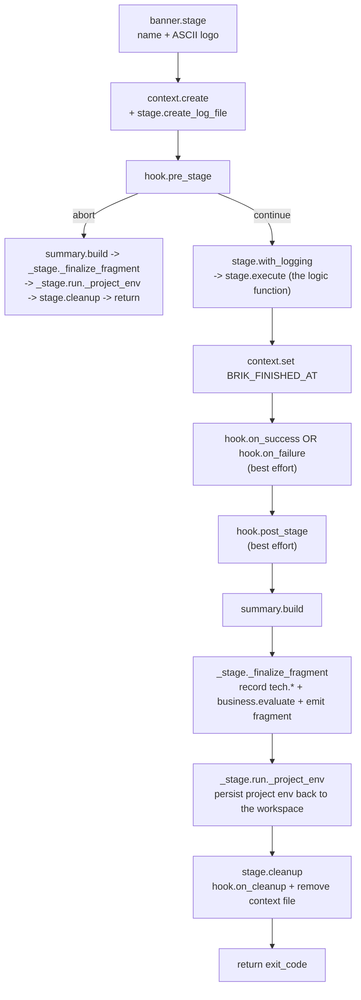

# Stage Lifecycle

Every stage runs through `stage.run`, the lifecycle engine in
`lib/pipeline/stage.sh`. `stage.run` gives each stage a consistent shape:
banner, context, logging, hooks, summary, report fragment, cleanup. The stage
logic function itself only does the CI/CD work; everything around it is the
runtime's job.

## The `stage.run` lifecycle

`_stage._finalize_fragment` records `tech.{duration_ms, exit_code, status}` into
`aggregate-report.json`, calls [`business.evaluate`](../concepts/business-outcome.md)
to derive `business.{status, reason}`, and emits the per-stage fragment to
`brik-artifacts/<stage>/<stage>.json`, unless `BRIK_DISABLE_REPORT_FRAGMENTS=1`
is set (the local all-in-one path sets it so it does not trigger CI aggregation
mode).

## Key invariants

- **Never `exit`.** Stages return exit codes; they never call `exit` directly.
  That lets the runtime always run cleanup and the summary.
- **Hooks are best-effort.** `on_success`, `on_failure`, and `post_stage` use
  `|| true`, so they cannot override the stage's real exit code.
- **Pre-stage can abort.** `hook.pre_stage` is the only hook that can prevent
  stage execution (skip conditions, environment gates).
- **Each stage has its own context.** An isolated context file holds
  stage-specific variables; `stage.cleanup` removes it on every exit path.

## Hook resolution

`hooks.sh` resolves each hook in three layers, first match wins:

1. Project file: `${BRIK_PROJECT_DIR}/.brik/hooks/<hook_name>.sh`
2. `brik.yml` inline: `hooks.pre_<stage>` / `hooks.post_<stage>` (exported as
   `BRIK_HOOK_PRE_<UPPER_STAGE>` / `BRIK_HOOK_POST_<UPPER_STAGE>`)
3. Default file: `${BRIK_HOME}/hooks/<hook_name>.sh`

See the [hooks reference](../reference/configuration/hooks.md) for the
`brik.yml` side.

## Pipeline report in CI mode

The fragment / aggregate split makes `aggregate-report.{md,json,html}` work
identically in local mode and in multi-container CI.

- **Local mode** (`brik integrate`). One process, one `$BRIK_LOG_DIR`.
  `pipeline.run` calls `report.init`, every stage records into the same
  `aggregate-report.json` backend, and `report.render` produces the final
  Markdown / JSON / HTML triple. Each `stage.run` also writes a
  `brik-artifacts/<stage>/<stage>.json` fragment (a harmless side effect).
- **CI mode** (GitLab, Jenkins). Each stage runs in its own container with its
  own `$BRIK_LOG_DIR`, so the JSON backend cannot be shared. Each stage ships
  its `brik-artifacts/<stage>/<stage>.json` fragment as a job artifact (GitLab
  `artifacts.paths`) or stash (Jenkins). The Notify job collects them, detects
  "CI aggregation mode" by the presence of valid fragments, and calls
  `report.aggregate_fragments` to merge them into the canonical
  `aggregate-report.{md,json,html}`. `stages.notify` then patches
  `pipeline.notify` into the JSON and re-renders the HTML.

Fragments and aggregate are versioned; the aggregator's behavior on an unknown
`schema_version` is **warn-and-skip**, so a future `v2.0` fragment landing in a
`v1.x` consumer does not abort the pipeline. See
[operations/pipeline-report.md](../reference/pipeline-report.md#schema-versions)
for the schema versions.

## See also

- [Architecture](../concepts/architecture.md): the 4-layer model `stage.run` sits in
- [Fixed flow](../concepts/fixed-flows.md): the stages this lifecycle wraps
- [Business outcome](../concepts/business-outcome.md): what `_finalize_fragment` computes
- [Pipeline report](../reference/pipeline-report.md): the report the fragments build
