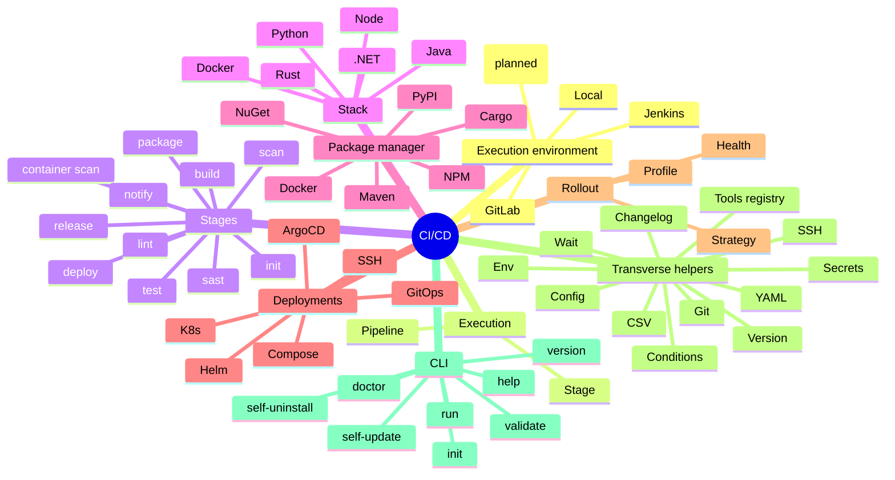

# Brik Domain Layout

The `lib/` tree is organized around **eight notions** that form Brik's domain
vocabulary. Each notion maps to one directory under `lib/`. Functions are named
`<notion>.<submodule>.<verb>` (e.g. `stages.build`, `stacks.node.build`,
`transverse.wait.until`, `cli.validate.run`).

This document is the layout reference. For design rationale see
[architecture.md](architecture.md); for per-function signatures see
[reference.md](reference.md).

## Mindmap



Notes on the mindmap:

- **Stages** lists the 11 CI-visible stages. The internal umbrella directory
  `lib/stages/verify/` (host of `format.sh`, `type_check.sh`, `scan/`) is used
  by `lint`, `sast`, and `scan`, but is not itself a CI-visible stage. Phase 4bis
  (optional, deferred) would promote `verify` to a top-level stage.
- **Stages.sonar** is on the roadmap but blocked on a SonarQube component in
  briklab. Design frozen in `docs/chantiers/20260421_sonar-quality-gate.md`.
- **Transverse helpers** no longer include `cache` or `artifacts` (removed in
  Phase 1 YAGNI).
- **CLI** is not part of the domain notions; it is a command layer that sits
  above the notions and delegates into them.

## The Eight Notions (table)

| # | Notion               | Directory                 | Responsibility                                                                  |
|---|----------------------|---------------------------|---------------------------------------------------------------------------------|
| 1 | Execution environment | `shared-libs/<platform>/` | Map the fixed flow to a CI platform (GitLab, Jenkins, local, GitHub planned).   |
| 2 | Stack                | `lib/stacks/`             | Per-stack build, test, install_deps (`node`, `java`, `python`, `rust`, `dotnet`, `docker`). |
| 3 | Stages               | `lib/stages/`             | The 11 pipeline stages (`init`, `release`, `build`, `lint`, `sast`, `scan`, `test`, `package`, `container_scan`, `deploy`, `notify`). |
| 4 | Deployments          | `lib/deployments/`        | Deploy targets (`k8s`, `helm`, `compose`, `ssh`, `gitops`, `argocd`).           |
| 5 | Transverse           | `lib/transverse/`         | Cross-cutting helpers (`git`, `version`, `env`, `changelog`, `conditions`, `config`, `csv`, `secrets`, `ssh`, `wait`, `yaml`, `tools`). |
| 6 | Execution            | `lib/pipeline/`           | Runtime mechanics (`stage.run`, `pipeline.run`, loader, logging, context, report, hooks, tools, bootstrap). |
| 7 | Package managers     | `lib/package-managers/`   | Publish to registries (`npm`, `pypi`, `maven`, `cargo`, `nuget`, `docker`).     |
| 8 | Rollout              | `lib/rollout/`            | Post-deploy rollout semantics (`health`, `strategy`, `profile`).                |

Plus one CLI-only directory not part of the domain notions but kept under `lib/`
for consistency with the loader:

| Aux | Directory   | Responsibility                                                       |
|-----|-------------|----------------------------------------------------------------------|
| CLI | `lib/cli/`  | Command implementations (`validate`, `doctor`, `version`, `help`, `init`, `run`, `self_update`, `self_uninstall`) + shared helpers. |

## Primary Dependencies

Dependencies flow downward. Every arrow reads "uses".

```
  Execution environment (shared-libs/*)
           │
           ▼
        Stages  ──────┬──────┬──────┬──────┐
           │          ▼      ▼      ▼      ▼
           │        Stack  Pkg Mgr  Deploy  Transverse
           │                                   │
           ▼                                   │
        Execution ◄─────── all notions ────────┘
                           (logging, stage.run, pipeline.run,
                            loader, tools, report)
```

Key relations:

- **Execution environment -> Stages**: the shared library (GitLab/Jenkins/local)
  picks up `brik.yml` and invokes each stage through `stage.run`.
- **Stages -> Stack**: build/test stages dispatch to the right stack via
  `brik.use "stacks.${stack}"`.
- **Stages -> Package Manager**: the package stage dispatches to the right
  registry publisher.
- **Stages -> Deployments**: the deploy stage dispatches to the right target.
- **Deployments -> Rollout**: k8s/helm/gitops deployments call rollout helpers
  (`rollout.health.wait`, `rollout.strategy.apply`, `rollout.profile.merge`).
- **Stages -> Transverse**: every stage may use transverse helpers (config,
  env, git, yaml, wait, secrets, tools).
- **Execution -> Stages**: `pipeline.run` orchestrates the 11 stages; each stage
  is wrapped by `stage.run`.
- **Stack -> Package Manager**: stack-specific install_deps may delegate to a
  package manager client (e.g. `npm install` for the `node` stack).

## Invariants

- No `lib/core/` directory. The old dispatcher layer was inlined into the stages
  and CLI it fed (Phase 4.5 Lot 1-8).
- No indirect expansion (`${!var}`) outside `lib/transverse/env.sh`. All indirect
  reads go through `transverse.env.resolve_indirect`.
- No manual poll loops. The only `while elapsed < timeout; check; sleep` pattern
  lives in `transverse.wait.until`; `deploy.gitops.wait_sync` and
  `rollout.health.wait` delegate to it. Tool-native waits
  (`argocd app wait --health`, `kubectl rollout status --timeout`) stay as-is.
- No duplicated `yq -i` setters. `transverse.yaml.{merge,patch,set_image_tag}`
  centralizes YAML mutation; profile merge, gitops render/push use it.
- No duplicated tool registry. `transverse.tools.{register,resolve,exec}`
  (promoted from the former `verify/_tools.sh`) is the single 3-tier registry
  for all scan modules.
- `lib/cli/` contains the command logic; `bin/brik` is a thin bootstrap + dispatcher.

## File-to-Notion Cheat Sheet

| If you're touching...                        | You're in notion...       |
|----------------------------------------------|---------------------------|
| A pipeline stage's top-level behavior        | 3 (stages)                |
| Node/Python/Java/Rust/.NET build logic       | 2 (stack)                 |
| A deploy target's connector logic            | 4 (deployments)           |
| A cross-cutting helper (git, yaml, wait)     | 5 (transverse)            |
| `stage.run` lifecycle / pipeline.run / report | 6 (execution)            |
| An `npm publish` / `docker push` wrapper     | 7 (package managers)      |
| Post-deploy health / strategy / profile      | 8 (rollout)               |
| A `brik <cmd>` CLI command                   | CLI (aux)                 |
| A platform template or wrapper               | 1 (execution environment) |

