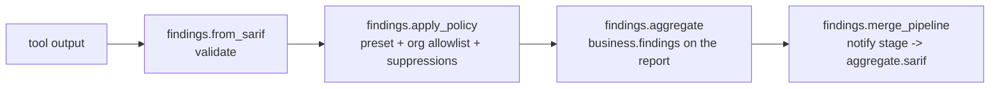

# Findings Management

Brik unifies every static-analysis, scan, and test outcome behind a single
**SARIF 2.1.0** pipeline. This page documents the runtime behavior: how a tool's
output becomes a classified finding, how presets and policy decide what blocks,
and how severity is normalized. For the org-side policy file see
[policy.md](policy.md); for the operating discipline around accepted risk see
[risk-management.md](risk-management.md).

## The SARIF pipeline

The flow is identical for every stage that emits findings:



Tools that already emit SARIF (semgrep, grype, gitleaks, eslint, osv-scanner,
checkov, ...) plug in directly. Tools without native SARIF (ruff, bandit,
clippy, dockle, trufflehog, scancode, junit-xml) go through a converter under
`lib/transverse/findings/converters/<tool>.sh` -- see
[policy.md](policy.md#adding-a-converter) for adding one.

## Built-in policy presets

`quality.findings.policy` selects how a finding is classified into **failing**
vs **ignored**. The default is `pragmatic`, which automatically ignores findings
below the severity floor and findings with no upstream fix.

| Preset | Ignores below floor | Ignores `not-fixed` | Ignores `wont-fix` | Failing |
|--------|---------------------|---------------------|--------------------|---------|
| `pragmatic` | yes | yes | yes | the rest |
| `strict` | yes | no | no | the rest |
| `permissive` | floor = critical | yes | yes | only critical with an upstream fix |

A result that already carries a non-empty `suppressions[]` (a tool-native
allowlist, an inline annotation, ...) is never re-classified -- the SARIF owner
keeps full control.

## Severity resolution

The canonical Brik severity vocabulary is `{critical, high, medium, low, info}`.
For grype-style SARIF (sparse results, severity on the rule) Brik reads CVSS at
`runs[].tool.driver.rules[].properties["security-severity"]` and falls back to
`result.level` (`error|warning|note|none`). For ruff/bandit-style linters, the
converter populates `result.properties` directly.

CVSS bands map to Brik buckets:

| CVSS | Bucket |
|------|--------|
| >= 9.0 | critical |
| >= 7.0 | high |
| >= 4.0 | medium |
| > 0 | low |
| 0 / N/A | info |

### Tool-native severity

`lib/transverse/severity.sh` maps a tool-native severity to the canonical
5-bucket scale. `severity.is_tool_blocking <tool> <tool_severity>` returns `true`
when the tool itself treats the finding as blocking by default.

| Tool | Severity (tool-native) | Bucket | Blocking |
|------|------------------------|--------|----------|
| eslint | `error` / `2` | high | yes |
| eslint | `warn` / `warning` / `1` | low | no |
| eslint | `off` / `0` / other | info | no |
| ruff | `error` / `E#` / `F#` | high | yes |
| ruff | `warning` / `W#` / `I#` | low | no |
| ruff | `info` / `note` / other | info | no |
| checkstyle | `error` | high | yes |
| checkstyle | `warning` | low | no |
| checkstyle | `info` / `ignore` | info | no |
| dotnet-format | `error` | high | yes |
| dotnet-format | `warning` | low | no |
| dotnet-format | `info` / `silent` / `hidden` / `suggestion` | info | no |
| semgrep | `ERROR` | high | yes |
| semgrep | `WARNING` | medium | no |
| semgrep | `INFO` | info | no |
| grype | `Critical` | critical | yes |
| grype | `High` | high | yes |
| grype | `Medium` | medium | no |
| grype | `Low` | low | no |
| grype | `Negligible` / `Unknown` | info | no |
| osv-scanner | `CRITICAL` | critical | yes |
| osv-scanner | `HIGH` | high | yes |
| osv-scanner | `MODERATE` | medium | no |
| osv-scanner | `LOW` | low | no |
| gitleaks | any (no native scale) | high | yes |

Unknown tools fall back to the SARIF level vocabulary
(`error|warning|note|none`) and the canonical bucket names. Empty inputs
collapse to `info` / non-blocking. The module is pure (no IO, no jq) so it is
safe to invoke from any pipeline hook.

## Tool-blocking annotation

For the **lint** and **format** stages, `fix_classifier.classify_sarif` adds a
second annotation next to `brikFixClassification`:

| Property | Source | Effect |
|----------|--------|--------|
| `brikFixClassification` | per-stage heuristic | drives the has_fix / no_fix matrix |
| `brikToolBlocking` | tool name + severity input | filters which findings count in `business.findings.failing.has_fix` / `no_fix` |

`findings.aggregate` skips any failing result with `brikToolBlocking == false`
when counting `has_fix` and `no_fix` (the value is still preserved in
`failing.total`). Other stages do not receive the annotation, so the legacy
semantic stands there: every non-suppressed result counts.

Per-tool blocking decisions (driver name lowercased):

| Tool | Blocking when |
|------|---------------|
| eslint | `result.level == "error"` |
| ruff | `ruleId` starts with `E#` / `F#`, or `level=error` |
| checkstyle | `result.level == "error"` |
| dotnet-format | `result.level == "error"` |
| other | `result.level == "error"` (default fallback) |

Consequence: a project with an eslint `error` produces `failing.has_fix > 0` and
`business.evaluate` returns `error` in release. A project with only eslint
`warning` stays at `success` or `warning` even in release.

## Tool resolution

`lib/transverse/binary_path.sh` (`binary_path.resolve <tool>`) walks three
layers in priority order and emits a JSON descriptor `{path, version,
provenance}`:

| Priority | Source | Provenance |
|----------|--------|------------|
| 1 | `<BRIK_WORKSPACE>/node_modules/.bin/<tool>` | `project` |
| 2 | `command -v <tool>` (current `$PATH`) | `image` |
| 3 | `<BRIK_HOME>/tools/<tool>` | `bundled` |
| 4 | not found anywhere | `missing` |

Version detection is best-effort: the resolver runs `<path> --version` (then
`-v`), strips ANSI sequences, and keeps the first dotted numeric token. Silent
or missing tools report `version=unknown`. `binary_path.is_available <tool>`
returns `true`/`false` without running `--version`, for hot paths.

## Per-stage artifacts layout

Each stage that emits findings writes two files side by side:

```
brik-artifacts/<stage>/
  <tool>.sarif      -- raw output from the tool (preserved for audit)
  findings.sarif    -- after apply_policy: same results, with Brik-managed
                       entries appended to result.suppressions[]
```

The Notify stage produces three pipeline-level artifacts:

```
brik-artifacts/
  aggregate.sarif            -- multi-runs SARIF: one runs[] entry per stage source
  gl-sast-report.json        -- GitLab non-Ultimate report (vulnerabilities[])
  aggregate-report.{md,json} -- pipeline report with the Active policy / Failing /
                                Ignored / Expiring soon sections
```

## Knobs

| Variable | Default | Effect |
|----------|---------|--------|
| `quality.findings.policy` | `pragmatic` | Active built-in preset |
| referential `Policy` document | none | Fetches the org policy at init; fail-closed when unreachable |
| `BRIK_SECURITY_SEVERITY_THRESHOLD` | `high` | Severity floor used by `apply_policy` |
| `BRIK_FINDINGS_EXPIRING_SOON_DAYS` | `30` | Window for `findings.expiring_soon` warnings at init |
| `BRIK_POLICY_CACHE_PATH` | `${BRIK_WORKSPACE}/brik-artifacts/.policy.cache.json` | Compiled-policy cache location |

## Expiring-soon notice

When the referential declares a `Policy` document, the Init stage calls `findings.expiring_soon` and
surfaces every allowlist entry whose `expires` falls within
`BRIK_FINDINGS_EXPIRING_SOON_DAYS`. The notice is visible (logged and recorded
under `business.policy_expiring_soon`) but non-blocking, so the DSI sees upcoming
churn before it bites.

## See also

- [Policy](policy.md) -- the org-wide `brik-policy.yml` schema and distribution
- [Risk management](risk-management.md) -- when and how to accept a finding
- [Business outcome](../concepts/business-outcome.md) -- how findings counts feed `business.evaluate`
- [security reference](../configuration/reference/security.md) -- the `security.*` keys per scanner
