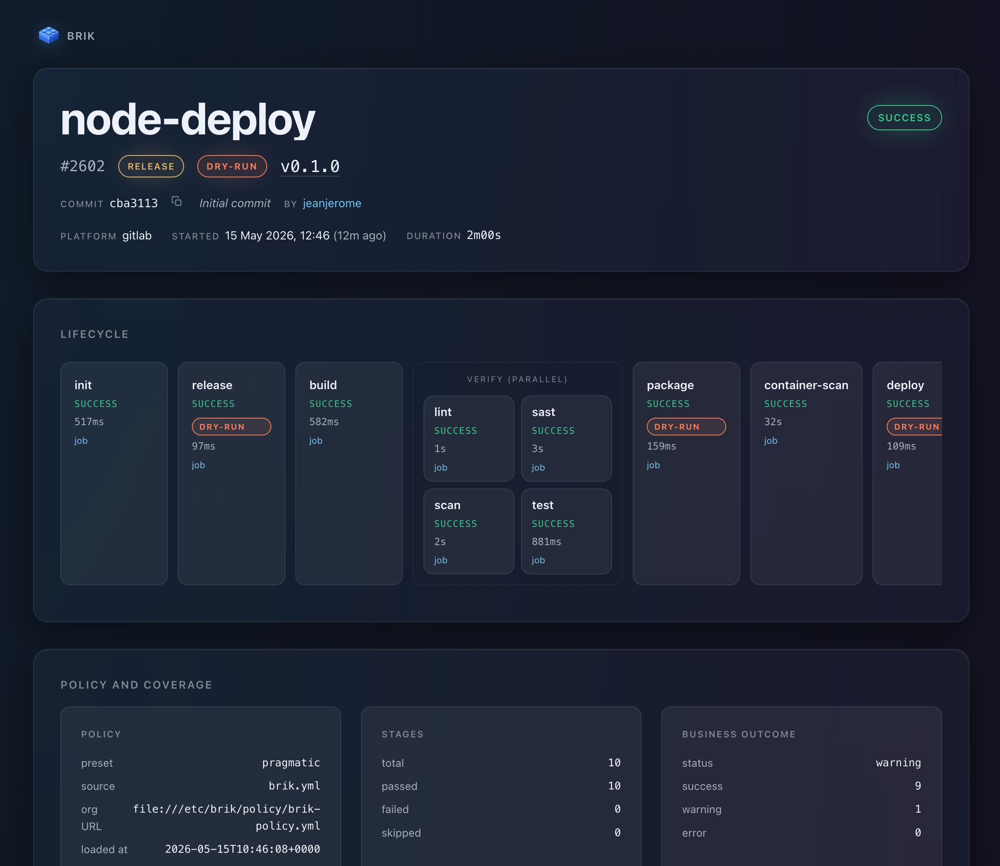

# Pipeline Report

Every pipeline run produces `aggregate-report.json` plus Markdown and
self-contained HTML renderings (`aggregate-report.{md,html}`) under
`${BRIK_LOG_DIR}` (local mode) or `${BRIK_WORKSPACE}/brik-artifacts/` (CI mode).
The HTML view inlines its CSS, JS, and the Brik logo so it stays browseable as a
standalone CI artifact.

  

  <em><a href="https://htmlpreview.github.io/?https://raw.githubusercontent.com/getbrik/brik/main/docs/aggregate-report.html">Open the full interactive HTML report</a> (sample from a <code>node-complete</code> run)</em>

This page is the producer field contract. Producers emit `schema_version: "1.1"`
today; consumers should match on `^1\.` to accept future minor 1.x evolutions.

## Schema versions

Two schema versions coexist under [`schemas/report/`](../../schemas/report/):

| Version | Status | When to use |
|---------|--------|-------------|
| [`v1.1`](../../schemas/report/v1.1/) | Active producer schema. `business.status` is required and typed; `pipeline.context`, `pipeline.business.status`, and `summary.business` are required on the aggregate; the legacy `tech.warning`, `tech.warning_reason`, and `summary.warnings` are rejected. `tech` and `business` keep `additionalProperties: true` so per-stage telemetry lands without a schema bump. | Today (all producers) |
| [`v1`](../../schemas/report/v1/) | Read-only legacy schema. Kept so archived fragments and external producers that have not migrated keep aggregating. The aggregator accepts 1.0 and 1.1 fragments on input and always emits 1.1. | Reading historical artifacts only |

The v1.1 deltas in detail:

- **`business.status`** (enum `success | warning | error`) -- outcome derived by
  the [business filter](../concepts/business-outcome.md) from the technical exit
  code, the [pipeline context](../concepts/pipeline-context.md), and
  stage-emitted side-band signals. Required on every fragment.
- **`business.reason`** (string) -- human-readable explanation of a non-`success`
  outcome. Optional, but conventionally required when `status != success`.
- **`tech.kind`** (12-value enum: `ok`, `failure`, `invalid-input`,
  `missing-dependency`, `invalid-environment`, `external-service-unavailable`,
  `io-failure`, `configuration-error`, `timeout`, `interrupted`, `check-failed`,
  `not-applicable`) -- readable label derived from the exit code.
- **`pipeline.context`** (enum `snapshot | release`) -- `release` when
  `pipeline.commit.tag` is non-null, `snapshot` otherwise.
- **`pipeline.business.status`** -- pipeline-wide outcome aggregated from
  per-stage `business.status` (`error` if any stage is `error`, `warning` if any
  is `warning` and none `error`, `success` otherwise).
- **`summary.business`** -- typed counts `{success_count, warning_count,
  error_count}` across the `stages` array.
- The legacy `tech.warning` boolean and `summary.warnings[]` array are rejected
  by v1.1; the same information lives in `business.{status, reason}`.

## Top-level `pipeline.commit`

Carries the commit identity for at-a-glance auditing. Mirrors the fields under
`init.business.commit` so dashboards can lift them without walking `stages[]`.

| Field | Source | Notes |
|-------|--------|-------|
| `sha` | `BRIK_COMMIT_SHA` | 40-char hex |
| `short_sha` | `BRIK_COMMIT_SHORT_SHA` | 7- or 8-char prefix |
| `ref` | `BRIK_COMMIT_REF` | branch or tag name (CI-platform native) |
| `branch` | `BRIK_COMMIT_BRANCH` | empty on tag-only builds |
| `tag` | `BRIK_COMMIT_TAG` | absent on branch builds |
| `author` | `CI_COMMIT_AUTHOR` parsed or `git log -1 --format=%an` | author name only |
| `author_email` | parsed from `CI_COMMIT_AUTHOR` or `git log -1 --format=%ae` | -- |
| `timestamp` | `CI_COMMIT_TIMESTAMP` or `git log -1 --format=%aI` | ISO-8601 strict |
| `message_subject` | `CI_COMMIT_TITLE` or `git log -1 --format=%s` | first line only |
| `repo_url` | `CI_PROJECT_URL` / `GIT_URL` / `git config remote.origin.url` | browseable HTTPS URL; credentials stripped, SSH forms converted to HTTPS, `.git` dropped |

## Top-level `pipeline.tech`

Pipeline-wide technical metadata stamped onto the aggregate (rather than on
any single stage). Currently carries the dry-run flag; future infrastructure
signals would live here as well.

| Field | Type | Source |
|-------|------|--------|
| `tech.dry_run` | bool | `BRIK_DRY_RUN` -- present and `true` only when the run was launched with `BRIK_DRY_RUN=true`; absent otherwise. Stamped by `_pipeline._stamp_dry_run` in local mode and by `report.aggregate_fragments` in CI mode. |

Renderers surface this field as a top-of-report `DRY-RUN` banner (Markdown
blockquote and HTML hero badge) so an operator scanning the report can tell
a dry-run from a real run at a glance.

## Per-stage fields

Each entry in `stages[]` carries `tech` (machine-targeted) and `business`
(persona-targeted) sub-objects alongside the runtime fields (`stage`, `status`,
`rc`, `runner`, `duration_ms`, `timestamp`).

### `init`

| Field | Type | Source |
|-------|------|--------|
| `tech.stack` | string | resolved `.project.stack` |
| `tech.stack_version` | string | `.project.stack_version` |
| `tech.config_file` | string | path to the active `brik.yml` |
| `tech.config_valid` | bool | JSON Schema validation result |
| `tech.prereqs_present` | object | `{yq, jq, jv}` booleans |
| `tech.tool_versions` | object | `{yq, jq, jv}` semver strings; absent tools omit their key |
| `business.project_name` | string | `.project.name` |
| `business.platform` | string | `gitlab` / `jenkins` / `local` |
| `business.commit.*` | object | same shape as `pipeline.commit` |
| `business.pipeline.{id, url}` | object | CI-native pipeline reference |
| `business.triggered_by` | string | user login or trigger source |

### `release`

| Field | Type | Source |
|-------|------|--------|
| `tech.strategy` | string | `.release.strategy` |
| `tech.tag_prefix` | string | `.release.tag_prefix` |
| `tech.dry_run` | bool | `BRIK_DRY_RUN` |
| `business.previous_version` | string | last tag matching `tag_prefix` |
| `business.new_version` | string | computed or `BRIK_TAG`-derived |
| `business.bump_type` | string | `none` / `explicit` |
| `business.tag.{name, sha, annotated, dry_run}` | object | created tag metadata |
| `business.changelog.{path, entries_count, generated_at}` | object | omitted on idempotent re-runs |

### `build`

| Field | Type | Source |
|-------|------|--------|
| `tech.stack` | string | resolved stack |
| `tech.tool` | string | `.build.tool` or `auto` |
| `tech.command` | string | `.build.command` or the stack default |
| `tech.cache_hit` | bool | `BRIK_BUILD_CACHE_HIT` when set |
| `business.artifact.{type, name, size_bytes, sha256, path}` | object | first non-empty build output directory, probed in a stack-aware order |
| `business.artifact.main_file` | string | representative shipped file (`.jar` for java, `.whl` for python, `.tgz` for node, `.nupkg`/`.dll` for dotnet, largest binary for rust); when present, `size_bytes` and `sha256` describe that file |

### `test`

| Field | Type | Source |
|-------|------|--------|
| `tech.framework` | string | `.test.framework` |
| `tech.tool` | string | `BRIK_TEST_TOOL` or `BRIK_TEST_FRAMEWORK` fallback |
| `tech.coverage_tool` | string | `BRIK_TEST_COVERAGE_FORMAT` |
| `business.tests.{total, passed, failed, skipped, duration_ms}` | object | parsed from the JUnit XML at `BRIK_TEST_JUNIT_PATH` |
| `business.coverage.line_pct` | string | from Cobertura `coverage.xml` or Jacoco `jacoco.xml` |
| `business.coverage.branch_pct` | string | omitted when the report has no branch metric |

### `lint`

| Field | Type | Source |
|-------|------|--------|
| `tech.checks` | array | configured checks (`lint`, `format`, `type_check`) |
| `tech.tools` | object | per-check tool name |
| `tech.commands` | object | per-check command override when set |
| `business.violations.total` | int | summed across present per-check SARIF files |
| `business.violations.by_severity` | object | `{critical, high, medium, low, info}` |
| `business.violations.by_check` | object | per-check totals, e.g. `{lint: 5, format: 6}` |
| `business.report` | object | `{format: "sarif", path: "brik-artifacts/lint/lint.sarif"}` |
| `business.fix_applied` | bool | `BRIK_QUALITY_LINT_FIX` |

The lint stage scans `brik-artifacts/lint/<check>.sarif` for each configured
check. Tools without native SARIF use a converter from `lib/transverse/sarif.sh`.
When no SARIF is produced, `business.*` is omitted (backward compatible).

### `sast`

| Field | Type | Source |
|-------|------|--------|
| `tech.tool` | string | `.security.sast.tool` (default `semgrep`) |
| `tech.ruleset` | string | `.security.sast.ruleset` |
| `business.findings.total` | int | `brik-artifacts/sast/sast.sarif` |
| `business.findings.by_severity` | object | `{critical, high, medium, low, info}` |
| `business.findings.cwe` | array | sorted, deduped CWE identifiers from rule tags |
| `business.report` | object | `{format: "sarif", path: ...}` |

### `scan`

| Field | Type | Source |
|-------|------|--------|
| `tech.deps.tool` | string | `.security.deps.tool` (default `osv-scanner`) |
| `tech.secret.tool` | string | `.security.secrets.tool` (default `gitleaks`) |
| `tech.severity_threshold` | string | `.security.deps.severity` or the global default |
| `business.deps.vulnerabilities.{total, by_severity}` | object | parsed from `brik-artifacts/scan/deps.sarif` |
| `business.deps.affected_packages` | int | from the CycloneDX SBOM |
| `business.deps.sbom_path` | string | path to the CycloneDX 1.5 file when produced |
| `business.secret.findings_count` | int | `brik-artifacts/scan/secret.sarif` |
| `business.secret.report` | object | `{format: "sarif", path: ...}` |
| `business.report` | object | rollup pointer to the deps SARIF |

### `package`

| Field | Type | Source |
|-------|------|--------|
| `tech.packager` | string | `docker` |
| `tech.dockerfile` | string | `.package.docker.dockerfile` |
| `tech.image_built` | bool string | `true` once `stacks.docker.build` succeeded |
| `tech.image_ref` | string | `<image>:<tag>` |
| `tech.build_duration_ms` | int string | wraps `stacks.docker.build` |
| `tech.dry_run` | bool string | `"true"` when `BRIK_DRY_RUN=true`; absent otherwise. Stamped by `_stage._finalize_fragment`; signals that the registry publish step was skipped. |
| `business.image.{name, tag, full_name, digest}` | object | `digest` from `docker inspect` post-push |
| `business.registry.{host, namespace, repository}` | object | parsed from the image reference |
| `business.registry.ui_url` | string | browseable registry UI URL; from `BRIK_PACKAGE_REGISTRY_UI_URL` or `.package.registry.ui_url`; omitted when neither is set |

### `container-scan`

| Field | Type | Source |
|-------|------|--------|
| `tech.tool` | string | `BRIK_SECURITY_CONTAINER_TOOL` or `auto` |
| `tech.target_image` | string | mirror of `package.tech.image_ref` |
| `tech.target_digest` | string | mirror of `package.business.image.digest` |
| `tech.scan_duration_ms` | int string | wraps `verify.scan.run` |

### `deploy`

| Field | Type | Source |
|-------|------|--------|
| `tech.environments` | array | configured env names |
| `tech.dry_run` | bool string | `"true"` when `BRIK_DRY_RUN=true`; absent otherwise. Stamped by `_stage._finalize_fragment`; signals that the destructive actions (`k8s apply`, `helm upgrade`, `compose up`, `argocd sync`, `rsync`) were skipped. |
| `business.environments[].name` | string | env name |
| `business.environments[].target` | string | k8s / helm / compose / ssh / gitops / argocd |
| `business.environments[].namespace` | string or null | configured namespace |
| `business.environments[].strategy` | string | rollout strategy (omitted when not configured) |

Skipped environments (failing `when`, missing target) are excluded from
`business.environments[]` so the array reflects only what executed.

### `notify`

`notify` is a meta-stage that produces the report itself, so it never emits a
per-stage fragment into `stages[]`. After the aggregate is built, `stages.notify`
patches it in place with a top-level `pipeline.notify` block and re-renders the
HTML. The notify job log remains the source of truth for actual delivery.

## Top-level `pipeline.notify`

Notification dispatch metadata, injected by `stages.notify`. Captures *intent*,
not delivery confirmation. Absent in pre-notify-v2 archives, so consumers must
treat it as optional.

| Field | Type | Notes |
|-------|------|-------|
| `channels[].type` | enum | `slack` / `email` / `webhook` |
| `channels[].configured` | bool | `true` when the channel trigger var is set at run time |
| `channels[].on` | string | dispatch policy; defaults to `always` when configured without a policy |
| `channels[].would_send` | bool | `true` when the channel was configured and its policy matched the outcome |
| `gatekeeper.decision` | enum | `pass` / `fail` -- `fail` when `pipeline.business.status` is `error` |
| `gatekeeper.business_status` | enum | mirrors `pipeline.business.status` |

## CI aggregation

In CI mode each stage runs in its own container and ships a
`brik-artifacts/<stage>/<stage>.json` fragment as a job artifact. The Notify job
collects the fragments and `report.aggregate_fragments` merges them into the
canonical `aggregate-report.{md,json,html}`. See
[internals/stage-lifecycle.md](../internals/stage-lifecycle.md#pipeline-report-in-ci-mode)
for the local-vs-CI split.

## See also

- [Business outcome](../concepts/business-outcome.md) -- how `tech.*` becomes `business.*`
- [Pipeline context](../concepts/pipeline-context.md) -- where `pipeline.context` comes from
- [Findings](findings.md) -- the SARIF pipeline behind the scan stage fields
- `lib/pipeline/report.sh` -- the producer implementation
