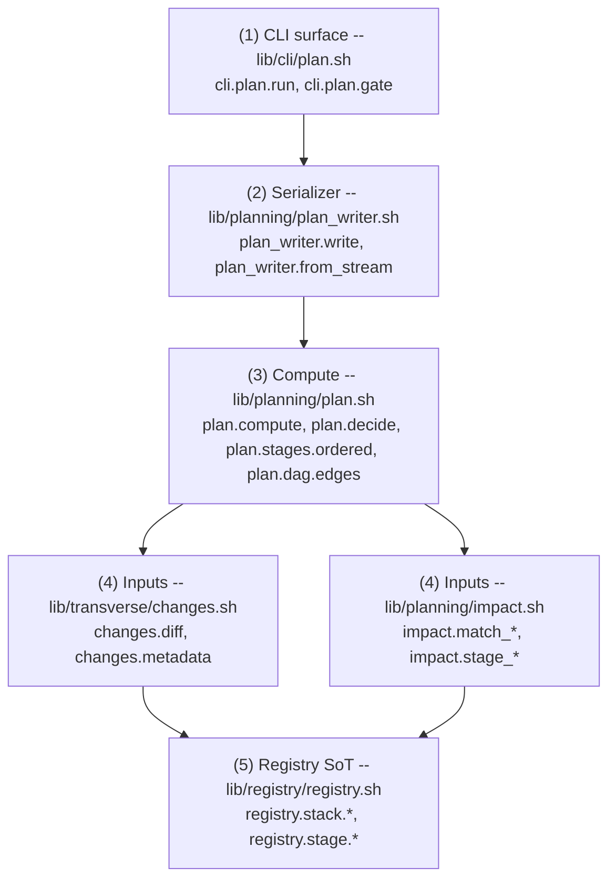

# Planning architecture

How a `brik plan` invocation flows through the planner's modules and
ends up as a serialized `plan.json` on disk.

## The five layers



Each layer has one responsibility (SRP); arrows point down because the
inner layer never reads anything above it.

## Layer 1 -- CLI surface

`cli.plan.run` parses CLI flags (`--workspace`, `--mode`, `--out`,
`--explain`, `--validate-only`, `--format`, the three `--with-*`
opt-ins) and decides which downstream action to take:

| Flag | Action |
|---|---|
| (default) | call `plan_writer.write` -> write `plan.json` to `${BRIK_WORKSPACE}/.brik-logs/plan.json` or to `--out`. |
| `--explain` | call `plan_writer.write` -> pretty-print via `cli.plan._render_explain` (jq template). |
| `--validate-only` | call `plan_writer.write` -> validate the bytes with `jv` (or `check-jsonschema` fallback). |
| `plan gate <id>` | call `pipeline.plan.should_run` against an existing plan; on skip, record the not-applicable fragment in the per-stage report. |

The CLI also normalizes platform CI variables via `_pipeline.detect_metadata`
so that, e.g., a GitLab tag-push pipeline (`BRIK_TAG` set by the wrapper)
becomes `BRIK_COMMIT_TAG` before `plan.compute` reads the context.

## Layer 2 -- serializer

`plan_writer.write` runs `plan.compute` and pipes its stream into
`plan_writer.from_stream`, which:

1. Parses header lines (`# workspace=`, `# mode=`, `# context=`,
   `# changes_source=`, `# changes_from=`, `# changes_to=`).
2. Collects per-stage records (`<id>\t<decision>\t<reason>\t<gate_mode>\t<runner_class>\t<function>\t<matched_globs>`).
3. Calls `plan.dag.edges` to compute the sorted edge list.
4. Builds the JSON with `jq -nS` (keys sorted at the top level).
5. Hashes the bytes (with `fingerprint=""`) and substitutes the hash.

The output is deterministic by construction: jq sorts keys, sort sorts
edges, no timestamps are emitted.

## Layer 3 -- compute

`plan.compute` is the heart of the planner:

```text
for each stage in registry.stage.list:
    decision, reason = plan.decide(stage, mode, context, with_*, stack_id, changes_file)
    print id, decision, reason, gate_mode, runner_class, function, matched_globs
```

`plan.decide` applies five filters in order:

1. **Context filter** -- if `gate.contexts` is non-empty and does not
   include the active context, skip with `context-mismatch`.
2. **Opt-in filter** -- if `gate.mode=opt_in` and the flag was not
   passed (or unknown), skip with `opt-in-flag-missing`.
3. **Mode short-circuit (safe)** -- `safe` mode runs everything that
   passed the two filters above, with reason `context-match`.
4. **Cold-start** -- if `changes.source=none`, run with reason
   `no-diff` (conservative fallback when no diff basis exists).
5. **Impact filter (balanced)** -- if the resolved glob set is empty
   declare `no-impact-declared` and run; otherwise match the changed
   files against `impact.stage_patterns` and emit `impacted` /
   `no-impact`.

`plan.dag.edges` resolves `after:` / `before:` from every stage's
manifest into a sorted directed-edge list `(from, to)`.

## Layer 4 -- inputs

### `changes.diff` (`lib/transverse/changes.sh`)

Normalizes the diff basis across three backends:

| Source | Detection | Range |
|---|---|---|
| `gitlab` | `CI_COMMIT_SHA` non-empty, `CI_COMMIT_BEFORE_SHA` not all-zero (or `CI_MERGE_REQUEST_DIFF_BASE_SHA` preferred for MRs) | `<before>..<sha>` |
| `jenkins` | `GIT_COMMIT` non-empty, `GIT_PREVIOUS_SUCCESSFUL_COMMIT` (or `GIT_PREVIOUS_COMMIT`) | `<prev>..<head>` |
| `local` | `BRIK_CHANGES_FROM` set, otherwise local default branch (`origin/main`, ...) | `<from>..<to>` |
| `none` | nothing usable (fresh clone, brand-new branch with no upstream) | empty file list |

Output is a NUL-separated stream of repo-relative paths so newlines or
spaces in filenames are safe. `BRIK_CHANGES_SOURCE` and
`BRIK_CHANGES_RANGE` are exported for downstream callers.

### `impact.*` (`lib/planning/impact.sh`)

Three thin layers on top of `[[ "$path" == $pattern ]]` with `shopt -s
globstar`:

- `impact.match_one <path> <pattern>` -- single-pattern bash glob.
- `impact.match_any <path> <pattern>...` -- short-circuit any-match.
- `impact.stage_patterns <stage> [<stack>]` -- resolves the effective
  glob set: stage's own `spec.impact.changes` wins, otherwise
  `spec.impact.use_stack_impact` redirects to the stack's source /
  test / build set.

## Layer 5 -- registry

The planner is a **read-only consumer** of `registry.stack.*` and
`registry.stage.*`. Every input it needs (gate mode, gate contexts,
opt-in flag, runner class, dispatch function, impact globs, DAG
relations) comes from the registry; no value is hard-coded in
`lib/planning/`.

This is what makes the planner extension-friendly: drop a manifest in
a user dir referenced by `BRIK_REGISTRY_EXTENSIONS_DIRS`, recompile
the registry, and `brik plan` picks the new stage up with no change
in `lib/planning/`.

## Performance

`brik plan` aims for **< 800 ms p50** on a 5000-file monorepo (CI gate
currently set wider at 1500 ms / 3000 ms while the cold-shot registry
load is the dominant cost). The bench harness lives in
[`scripts/bench-plan.sh`](../../scripts/bench-plan.sh) and runs in CI on
every PR (job `bench-plan`).

Hot path observations:

- `plan.dag.edges` is the only place that walks every stage twice
  (once per `after:`/`before:` direction). Sorting is `O(n log n)` on
  a list bounded by `sum(after) + sum(before)`, well under 50 entries
  for the builtin set.
- `plan.decide` is `O(stages * patterns * files)` in `balanced` mode,
  but `impact.match_any` short-circuits on the first match per file.
- `plan_writer.from_stream` reads the stream once and calls `jq -S`
  twice (one for the body, one for the fingerprint substitution).

## Failure modes

| Failure | Exit code | Where |
|---|---|---|
| Unknown CLI flag | `BRIK_EXIT_INVALID_INPUT` (2) | `cli.plan.run` |
| `--mode aggressive` | `BRIK_EXIT_INVALID_INPUT` (2) | `plan.compute` (stub: not yet implemented) |
| `--mode <bogus>` | `BRIK_EXIT_INVALID_INPUT` (2) | `plan.compute` |
| Empty stream after compute | `BRIK_EXIT_INVALID_INPUT` (2) | `plan_writer.from_stream` |
| `jq` missing | `BRIK_EXIT_MISSING_DEP` (69) | `plan_writer.from_stream`, `cli.plan._render_*` |
| `jv` and `check-jsonschema` both missing under `--validate-only` | `BRIK_EXIT_MISSING_DEP` (69) | `cli.plan.run` |
| `--validate-only` schema mismatch | `BRIK_EXIT_INVALID_INPUT` (2) | `cli.plan.run` |
| `plan gate <id>` skip decision | rc=1 (run/skip convention) | `cli.plan.gate` |
| `plan gate` missing stage id | `BRIK_EXIT_INVALID_INPUT` (2) | `cli.plan.gate` |
