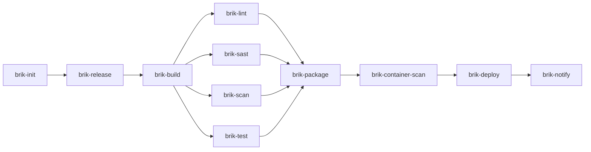

# GitLab CI

The canonical reference for running Brik on GitLab CI. For first-time setup see
[getting-started/gitlab.md](../getting-started/gitlab.md). For implementation
detail of the templates themselves see
[`shared-libs/gitlab/README.md`](../../shared-libs/gitlab/README.md).

## Platform status

| Platform | Status | Integration | Bootstrap file |
|----------|--------|-------------|----------------|
| GitLab CI | Functional | Shared library (pipeline template) | `.gitlab-ci.yml` |
| Jenkins | Functional | Jenkins shared library (CasC) | `Jenkinsfile` |
| GitHub Actions | `brik init --platform github` scaffolds a bootstrap; reusable workflows in progress | Reusable workflows | `.github/workflows/*.yml` |

The GitLab shared library is the primary platform adapter. It maps the
[fixed flow](../concepts/fixed-flow.md) to native GitLab CI stages and jobs.

## The job graph

`shared-libs/gitlab/templates/pipeline.yml` declares one job per stage. Lint,
SAST, Scan, and Test share the single GitLab `verify` stage and run in parallel
via separate `needs`:



The Init job emits `.brik-logs/pipeline.env` as a `reports: dotenv:` artifact
(produced by the post-stage projection hook from the report env section), so
downstream jobs receive `BRIK_CI_IMAGE` (the resolved
`brik-runner-<stack>:<version>` for the project) and the trigger gating flags.

## Runner images

The pipeline uses specialized [brik-images](https://github.com/getbrik/brik-images)
per stage:

| Variable | Default image | Used by |
|----------|---------------|---------|
| `BRIK_CI_IMAGE` | `ghcr.io/getbrik/brik-runner-base:latest` | Init, Release, Build, Lint, Test, Package, Notify |
| `BRIK_ANALYSIS_IMAGE` | `ghcr.io/getbrik/brik-runner-analysis:latest` | SAST |
| `BRIK_SCANNER_IMAGE` | `ghcr.io/getbrik/brik-runner-scanner:latest` | Scan, Container Scan |
| `BRIK_DEPLOY_IMAGE` | `ghcr.io/getbrik/brik-runner-deploy:latest` | Deploy |

The Init stage resolves `BRIK_CI_IMAGE` to a stack-specific image from
`project.stack` and `project.stack_version` -- no manual configuration:

| Stack | Resolved image |
|-------|----------------|
| node | `ghcr.io/getbrik/brik-runner-node:22` (or `:24`) |
| java | `ghcr.io/getbrik/brik-runner-java:21` (or `:25`) |
| python | `ghcr.io/getbrik/brik-runner-python:3.13` (or `:3.14`) |
| rust | `ghcr.io/getbrik/brik-runner-rust:1` |
| dotnet | `ghcr.io/getbrik/brik-runner-dotnet:9.0` (or `:10.0`) |

If `stack` is unset or unrecognized, the pipeline falls back to
`brik-runner-base:latest`. Overriding `BRIK_CI_IMAGE` from `.gitlab-ci.yml` is
not yet supported -- Init always resolves it from `brik.yml`.

### Custom images

If you bring your own images, ensure they have `bash 4+`, `git`, `yq`, `jq`, and
your stack tools. The job `before_script` detects the package manager (apk,
apt-get, yum, dnf) and installs missing prerequisites on the fly. Images
carrying a `/.brik-runner` marker file skip this step.

## How it works

Each GitLab CI job:

1. Checks for the `/.brik-runner` marker (skips prerequisite install if present).
2. Otherwise installs `yq`, `jq`, `git`, `bash` via the detected package manager.
3. Clones `brik/brik` to `/opt/brik` (depth 1, pinned to `BRIK_LIB_REF`).
4. Sources the GitLab wrapper script.
5. Calls `brik.gitlab.run_stage <stage_name>`, which invokes
   [`stage.run`](../internals/stage-lifecycle.md).

## Pipeline variables

| Variable | Default | Description |
|----------|---------|-------------|
| `BRIK_LIB_REF` | `v0.5.0` | Git ref of the Brik runtime to clone |
| `BRIK_REPO` | `${CI_SERVER_URL}/brik/brik.git` | URL of the Brik runtime repository |
| `BRIK_HOME` | `/opt/brik` | Path where the runtime is cloned |
| `BRIK_LOG_LEVEL` | `info` | Log verbosity (`debug`, `info`, `warn`, `error`) |
| `BRIK_PLATFORM` | `gitlab` | Platform identifier |
| `BRIK_CI_IMAGE` | `ghcr.io/getbrik/brik-runner-base:latest` | Default runner image (auto-resolved by Init) |
| `BRIK_ANALYSIS_IMAGE` | `ghcr.io/getbrik/brik-runner-analysis:latest` | SAST stage image |
| `BRIK_SCANNER_IMAGE` | `ghcr.io/getbrik/brik-runner-scanner:latest` | Scan / Container Scan image |
| `BRIK_DEPLOY_IMAGE` | `ghcr.io/getbrik/brik-runner-deploy:latest` | Deploy stage image |

## User-overridable inputs (Run pipeline form)

These variables are declared in the long form
(`value` / `description` / `options`) so they appear pre-populated in the
GitLab "Run pipeline" UI, where they can be overridden per run. Short-form
variables in `.gitlab-ci.yml` apply at runtime but stay invisible in the form,
which is why these two are declared with the explicit object syntax.

| Variable | Default | Type | Description |
|----------|---------|------|-------------|
| `BRIK_DRY_RUN` | `false` | enum (`false`, `true`) | Skip destructive deploy actions (compose up, k8s apply, helm upgrade, argocd sync, rsync). Print what would run instead. Mirrors the Jenkins `BRIK_DRY_RUN` `booleanParam`. |
| `BRIK_TAG` | `""` | string | Release tag for this build (e.g. `v0.1.0`). Leave empty for snapshot builds. Mirrors `CI_COMMIT_TAG` semantics. |

The `options:` dropdown for `BRIK_DRY_RUN` requires GitLab >= 15.7. Earlier
versions ignore the constraint and fall back to a free-form text field but
still honour the description and default. The wrapper enforces the contract:
only the exact string `true` enables dry-run; any other value (including
`1`, `yes`, `on`) is downgraded to `false` with a warning, keeping the
value `lib/` consumes always canonical.

## Cache relocation

GitLab CI requires caches to live within `$CI_PROJECT_DIR`. The template
redirects tool caches:

| Variable | Path |
|----------|------|
| `PIP_CACHE_DIR` | `$CI_PROJECT_DIR/.cache/pip` |
| `MAVEN_OPTS` | `-Dmaven.repo.local=$CI_PROJECT_DIR/.m2/repository` |
| `GRADLE_USER_HOME` | `$CI_PROJECT_DIR/.gradle` |
| `CARGO_HOME` | `$CI_PROJECT_DIR/.cargo` |
| `NUGET_PACKAGES` | `$CI_PROJECT_DIR/.nuget/packages` |

## Coverage reports

The `brik-test` job ships a `coverage_report` block so GitLab can render a
coverage badge on merge requests. GitLab's YAML schema only accepts `cobertura`
or `jacoco` for `coverage_format` and validates it at YAML parse time -- before
any job runs -- so the value cannot come from an init-stage dotenv. The template
hardcodes the cobertura defaults:

```yaml
coverage_report:
  coverage_format: cobertura
  path: coverage/coverage.xml
```

Out of the box:

| Stack | Coverage format produced | GitLab badge |
|-------|--------------------------|--------------|
| python (pytest-cov) | cobertura -> `coverage/coverage.xml` | works |
| dotnet (XPlat Code Coverage) | cobertura -> `coverage/<guid>/coverage.cobertura.xml` | flatten or override path |
| java (jacoco) | jacoco -> `brik-artifacts/test/coverage/jacoco.xml` | override format to jacoco |
| node (jest --coverage) | lcov -> `coverage/lcov.info` | override or accept no badge |
| rust (cargo-llvm-cov) | lcov -> `coverage/lcov.info` | override or accept no badge |

Stacks where the badge does not match still archive their coverage files and the
pipeline stays green -- only the inline MR-diff badge is missing.

### Coverage percentage badge (automatic)

The pipeline-level coverage % badge wires up automatically. After the Test stage
runs, Brik emits a single canonical log line:

```
[brik] coverage: 87.42%
```

The `brik-test` job ships a `coverage:` regex that parses it:

```yaml
brik-test:
  coverage: '/\[brik\] coverage: ([\d\.]+)%/'
```

`lib/transverse/coverage.sh` reads either `coverage/coverage.xml` (Cobertura) or
`brik-artifacts/test/coverage/jacoco.xml` (Jacoco) and computes the line
percentage -- no per-project regex, works for every stack.

### Project-level override

To enable the MR badge for jacoco, lcov, or a non-default path, override the
`brik-test` job in your own `.gitlab-ci.yml` -- GitLab merges the override into
the templated job:

```yaml
include:
  - project: 'brik/gitlab-templates'
    ref: v0.5.0
    file: '/templates/pipeline.yml'

# java example: switch the format to jacoco and point at the jacoco file.
brik-test:
  artifacts:
    reports:
      coverage_report:
        coverage_format: jacoco
        path: brik-artifacts/test/coverage/jacoco.xml
```

The rest of the templated `brik-test` job (script, cache, dependencies, paths,
junit) still applies.

## Requirements

- A GitLab CI Runner with the **Docker executor**.
- Access to `ghcr.io/getbrik/*` images, or a mirror on your private registry.
- `brik/brik` and `brik/gitlab-templates` projects on the same GitLab instance.

## See also

- [Getting started: GitLab CI](../getting-started/gitlab.md) -- first-time setup
- [Configuration overview](../configuration/overview.md) -- `brik.yml`
- [Credentials](../operations/credentials.md) -- wiring secrets
- [Troubleshooting](../operations/troubleshooting.md) -- common failures
