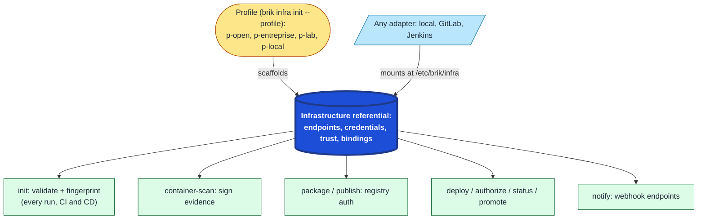

# Infrastructure referential reference

Brik keeps three concerns apart, and the referential owns one of them:

- `brik.yml` declares **what** a pipeline does (build, test, scan, package,
  deploy), independent of where it runs.
- The **infrastructure referential** declares **where** that pipeline lands and
  **with which credentials and trust**: the registries, git host, secret manager,
  signing backend, and deployment targets, plus the bindings between them.
- The **orchestrator** that runs the pipeline (local, GitLab, Jenkins) only
  *executes* those two declarations; it holds no infrastructure configuration of
  its own.

This is the same separation `brik.yml` already makes for the pipeline, now
applied to infrastructure. Just as one `brik.yml` runs unchanged on a laptop, on
GitLab, or on Jenkins, one referential describes your infrastructure once and
every orchestrator consumes it identically. Switching CI platform, or running the
real CI pipeline locally, never means rewriting where artifacts are pushed or how
evidence is signed: that lives in the referential, selected by an environment
**posture** (a profile), never baked into pipeline YAML or platform-specific job
files.

Concretely, the referential is a schema-validated tree of **endpoints**,
**credentials** (references, never values), **trust material**, and **bindings**.
Brik resolves and validates it fail-closed at the `init` stage of **every** run,
CI and CD alike. This page is the field-level contract for each document kind.



The referential is the hub: a profile scaffolds it, any adapter mounts it
unchanged at `/etc/brik/infra`, and the pipeline stages and CD verbs all read it
from there. The posture is declared once and every consumer sees the same thing.

For the why and the workflow, see:

- [Choose an infrastructure profile](../how-to/choose-infra-profile.md): pick and configure a posture (`p-open`, `p-entreprise`, `p-lab`, `p-local`)
- [Credentials](../how-to/manage-credentials.md): credential indirection and per-platform setup
- [Supply-chain gates](../concepts/supply-chain.md): how trust material and attestation are verified

## Where it lives and how it resolves

| Source | Meaning |
|--------|---------|
| `BRIK_INFRA_DIR` | path to a referential instance directory |
| `BRIK_INFRA_REPO` | a git repository holding the referential, resolved at runtime |
| neither set | on a **bare local host**, the bundled `p-local` default (CI core only). An orchestrated CI run never auto-falls-back: it must have a referential mounted, and the CD verbs (`deploy`/`authorize`/`status`/`promote`) always require an explicit one. |

The referential is **not** local-only: it is consumed on every run by every
adapter. The `init` stage resolves and validates it (so a misspelled key or an
invalid value refuses the run, never a silent skip) and records its
`infra.fingerprint` into `plan.json` for audit. Whichever orchestrator runs Brik
(local container runner, GitLab, Jenkins), the referential is mounted read-only
into every stage container at the same path, `/etc/brik/infra`. The validator
chain prefers `jv` (Go) and falls back to `check-jsonschema` (Python).

The schemas are the source of truth: [`schemas/referential/v1/`](../../schemas/referential/v1).

## Instance layout

```text
.brik/infra/
  referential.yml        # profile id + description (the instance header)
  endpoints/             # one document per endpoint (Registry, GitHost, Signing, ...)
  credentials/           # Credential documents (references only, never values)
  bindings/              # which credential serves which endpoint + capabilities
  policies/              # optional org Policy documents (kind: Policy)
  trust/                 # signing keys, verification keys, allowed signers
  schemas/               # a copy of the v1 schemas, for offline validation
```

Every document carries the same envelope:

```yaml
apiVersion: brik.dev/referential/v1
kind: <Registry|GitHost|Signing|Credential|Binding|...>
name: <kebab-case-name>      # except the Referential header, which uses `profile`
```

Schemas declare `additionalProperties: false`: an unknown field is an error.

## The Referential header

`referential.yml` identifies the instance. Required: `profile`.

| Field | Type | Notes |
|-------|------|-------|
| `profile` | string | the posture id (`p-open`, `p-entreprise`, `p-lab`, `p-local`) |
| `description` | string | free-text summary (optional) |

## Endpoints

An endpoint is a network service Brik talks to. All endpoints take `name` and,
where they speak TLS, a `tls` block (see [TLS posture](#tls-posture)).

### Registry (`kind: Registry`)

The OCI registry for container artifacts. Required: `name`, `url`, `tls`.

| Field | Type | Notes |
|-------|------|-------|
| `url` | string | registry base URL |
| `tls.trust` | enum | `system` / `custom-ca` / `insecure` |
| `referrers` | boolean | (deprecated) the registry supports the OCI referrers API (evidence graph) |
| `zone` | string | (deprecated) free-form channel-zone name for this registry |

### PackageRegistry (`kind: PackageRegistry`)

A language package registry for `publish`. Required: `name`, `format`, `url`, `tls`.

| Field | Type | Notes |
|-------|------|-------|
| `format` | enum | `npm` / `pypi` / `maven` / `cargo` / `nuget` |
| `url` | string | registry URL |
| `credential` | string | name of the `Credential` to authenticate with (absent means anonymous) |
| `tls.trust` | enum | `system` / `custom-ca` / `insecure` |

### GitHost (`kind: GitHost`)

The git host for the state-repo and config repos. Required: `name`, `product`,
`api_url`, `tls`.

| Field | Type | Notes |
|-------|------|-------|
| `product` | enum | `gitea` / `gitlab` / `github` |
| `api_url` | string | REST API base URL |
| `git_url` | string | git clone/push base URL (defaults to the `api_url` host) |
| `tls.trust` | enum | `system` / `custom-ca` / `insecure` |

### Signing (`kind: Signing`)

The cosign signing posture for evidence and attestations. Required: `name`,
`backend`, `transparency`.

| Field | Type | Notes |
|-------|------|-------|
| `backend` | enum | `keyless` (OIDC) / `key` (file) / `kms` (e.g. OpenBAO) |
| `transparency` | enum | `rekor-public` / `rekor-private` / `none` |
| `key` | string | private-key reference when `backend: key` (e.g. `file://trust/cosign.key`) |
| `kms_uri` | string | KMS key URI when `backend: kms` (e.g. `openbao://brik-signing`) |
| `verification_key` | string | exported public key used on verify; lets verifiers check signatures without the private key or a KMS round-trip |
| `fulcio_url`, `rekor_url`, `trusted_root`, `signing_config` | string | private-Sigstore overrides (for `rekor-private`); `fulcio_url` and `signing_config` are deprecated |

### SecretManager (`kind: SecretManager`)

A secret manager (OpenBAO) backing `bao://` references. Required: `name`, `url`,
`auth`, `tls`.

| Field | Type | Notes |
|-------|------|-------|
| `url` | string | manager base URL |
| `auth.method` | enum | `token` (deprecated) |
| `auth.ref` | string | `env://` or `file://` reference to the auth token |
| `transit_mount` | string | the Transit mount used for `kms` signing (optional) |
| `tls.trust` | enum | `system` / `custom-ca` / `insecure` |

### Deployment and notification endpoints

| Kind | Required | Key fields |
|------|----------|------------|
| `ArgoCD` | `name`, `url`, `tls` | `grpc_web` (boolean) |
| `K8sTarget` | `name`, `kubeconfig` | `kubeconfig` (reference), `context` |
| `SshTarget` | `name`, `hosts` | `hosts[]`, `user`, `port`, `known_hosts` (reference), `strict_host_key` (boolean) |
| `Notification` | `name`, `service`, `url`, `tls` | `service`: `slack` / `email` / `webhook` |

`SshTarget.known_hosts` is the host-key policy: an undeclared host fails closed
unless `strict_host_key: false` opts out.

### Policy (`kind: Policy`)

Points at the org-wide findings policy document. Required: `name`, `url`. See
[Configure org policy](../how-to/configure-org-policy.md).

## Credentials (`kind: Credential`)

Credentials are always **references**, never inline values. A schema pattern
rejects a literal secret. Required: `name`, `method`, plus the method's fields.

| `method` | Required fields | Reference fields |
|----------|-----------------|------------------|
| `token` | `token` | `token` |
| `basic` | `username`, `password` | `password` (username may be literal or a reference) |
| `ssh-key` | `private_key` | `private_key` |
| `mtls` | `client_cert`, `client_key` | both `client_cert` and `client_key` |
| `workload-identity` | (none) | resolved from the ambient workload OIDC identity, no static secret |
| `oidc` | (none) | (deprecated) resolved from the CI OIDC identity |
| `none` | (none) | anonymous |

Reference schemes (matched by `^(env|file|bao)://`):

| Scheme | Resolves to |
|--------|-------------|
| `env://NAME` | a runtime environment variable (CI variable, host env) |
| `file://trust/<name>` | a file under the referential's `trust/` directory |
| `bao://path#field` | a field in an OpenBAO secret (needs a `SecretManager`) |

## Bindings (`kind: Binding`)

A binding wires endpoints to credentials and declares which provider satisfies
each capability. Required: `name`.

| Field | Shape | Meaning |
|-------|-------|---------|
| `endpoints` | `{ <endpoint-name>: <credential-name> }` | the credential each endpoint authenticates with |
| `capabilities` | `{ <capability>: <provider> }` or `{ <capability>: { provider, endpoint } }` | which provider satisfies a capability, optionally pinned to a specific endpoint |

A capability value is a provider id, or a `{ provider, endpoint }` object that
pins a specific endpoint. When no endpoint is pinned, the provider's registry
manifest supplies the `endpoint_kind` that resolves the endpoint:
`capability -> provider -> endpoint_kind -> endpoint`. The deploy attestation
gate reads this map to resolve the Signing endpoint for `artifact-attestation`;
the remaining capabilities resolve through the same chain as their runtimes are
wired. An environment that binds no capability keeps the by-kind resolution of
the single endpoint of that kind.

Capabilities and the providers that implement them (from the registry):

| Capability | Providers | Contract |
|------------|-----------|----------|
| `artifact-attestation` | `cosign-key` / `cosign-keyless` / `cosign-kms-openbao` | `artifact-attestation/v1` |
| `evidence-commit-signing` | `ssh-signing` / `gitsign` | `evidence-commit-signing/v1` |
| `evidence-transport` | `oras-transport` | `evidence-transport/v1` |

Each capability is governed by a versioned **contract** its providers must
satisfy; `brik provider test <id>` verifies a provider against that contract
(its manifest, the required operations, and the infra-free unit obligations).

## TLS posture

Every TLS-speaking endpoint carries `tls.trust`:

| `trust` | Meaning |
|---------|---------|
| `system` | the system CA store validates the certificate (public services) |
| `custom-ca` | the runner trusts a corporate CA bundle provided to the container (the image's trust store), not a path in the referential |
| `insecure` | TLS verification is disabled, explicit and loud; test only |

## Related

- [Choose an infrastructure profile](../how-to/choose-infra-profile.md): the four postures and how to configure one
- [Credentials](../how-to/manage-credentials.md): credential indirection and per-platform secret setup
- [Supply-chain gates](../concepts/supply-chain.md): how attestation and trust material are verified at deploy
- [Declarations](../concepts/declarations.md): the schema-as-contract model the referential is part of
