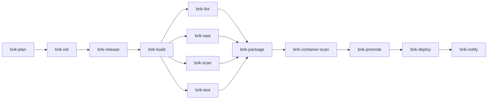

# GitLab CI

The canonical reference for running Brik on GitLab CI. For first-time setup see
[getting-started/gitlab.md](../../getting-started/gitlab.md). For implementation
detail of the templates themselves see
[`shared-libs/gitlab/README.md`](../../../shared-libs/gitlab/README.md).

## Platform status

| Platform | Status | Integration | Bootstrap file |
|----------|--------|-------------|----------------|
| GitLab CI | Functional | Shared library (pipeline template) | `.gitlab-ci.yml` |
| Jenkins | Functional | Jenkins shared library (CasC) | `Jenkinsfile` |
| GitHub Actions | `brik init --platform github` scaffolds a bootstrap; reusable workflows in progress | Reusable workflows | `.github/workflows/*.yml` |

The GitLab shared library is the primary platform adapter. It maps the
[fixed flow](../../concepts/fixed-flows.md) to native GitLab CI stages and jobs.

## The job graph

`shared-libs/gitlab/templates/brik-integrate.yml` is a single classic pipeline. A
`brik-plan` job computes the execution plan first; then one job per stage runs,
each gating itself on the plan. Lint, SAST, Scan, and Test share the single
GitLab `verify` stage and run in parallel via separate `needs`:



The Init job emits `.brik-logs/pipeline.env` as a `reports: dotenv:` artifact
(produced by the post-stage projection hook from the report env section), so
downstream jobs receive `BRIK_CI_IMAGE` (the resolved
`brik-runner-<stack>:<version>` for the project) and the trigger gating flags.

## Stage selection (the plan gate)

The `brik-plan` job runs first and computes `.brik-logs/plan.json`, the
provider-agnostic execution plan (see [concepts/plan.md](../../concepts/plan.md)).
Every stage job then sources `/tmp/brik-plan-gate.sh <stage>` as its first
script step, which calls `brik plan gate <stage>`:

- the plan says **run** -> the job proceeds with the stage;
- the plan says **skip** -> `brik plan gate` records a not-applicable
  fragment (`tech.kind=not-applicable`, `business.reason=<plan reason>`)
  and the job exits 0, showing as a green "skipped (per plan)" job.

Every job stays visible in the GitLab UI, in its natural stage. The
`brik-notify` job aggregates the run fragments and the not-applicable
fragments into the final report, so a skipped stage still appears in
`aggregate-report.{md,json}` with its reason. This is the same
`brik plan gate` mechanism the Jenkins adapter uses.

## Env propagation

`pipeline.env` is the single cumulative env file on Jenkins and local. On
GitLab the contract is more subtle: the file `.brik-logs/pipeline.env`
exists in every job's workspace, but its on-disk content in downstream
jobs is **not** guaranteed to be the cumulative state. The cumulative
state lives in the CI variable environment instead.

### Two transports, one canonical channel

Each brik job template declares both:

| Transport | What GitLab does with it | Cumulative? |
|---|---|---|
| `artifacts.paths: [.brik-logs/]` | Extracts upstream `pipeline.env` files into workspace | **No** -- merge order across colliding paths is undefined ([gitlab-org/gitlab#244714](https://gitlab.com/gitlab-org/gitlab/-/issues/244714), open since 2020). Init's snapshot frequently survives. |
| `artifacts.reports.dotenv: .brik-logs/pipeline.env` | Parses dotenv keys, promotes them as CI variables | **Yes** -- documented [union with last-wins](https://docs.gitlab.com/ci/variables/dotenv_variables/) across all upstream `needs:` dotenv reports. |

The CI variable channel is the one Brik relies on. When `release` exports
`BRIK_APP_VERSION=0.1.0` and `package` consumes `${BRIK_APP_VERSION}`,
the value flows through the dotenv promotion, not through the file. The
file is preserved primarily as a debugging artifact and as the canonical
mechanism on Jenkins/local where no dotenv-promotion exists.

**Every job template declares `reports.dotenv: .brik-logs/pipeline.env`.**
A single job missing the declaration drops its keys from the CI variable
merge in downstream jobs. The parity is enforced statically by
`spec/integration/gitlab_dotenv_parity_spec.sh`.

### needs ordering matters

When a job lists multiple `needs:` with `artifacts: true`, GitLab merges
the dotenv files in declaration order. **The last upstream wins on
colliding keys.** Templates list producers first
(init -> release -> build -> verify) and downstream stages last, so the
cumulative state always reaches the consumer through the CI variable
channel.

### Why the file is not cumulative

GitLab's artifact extraction order for `paths:` is officially unspecified
([gitlab-org/gitlab#244714](https://gitlab.com/gitlab-org/gitlab/-/issues/244714))
and its interaction with `reports.dotenv` is undocumented
([gitlab-org/gitlab#246777](https://gitlab.com/gitlab-org/gitlab/-/issues/246777)).
Empirically, downstream jobs receive init's snapshot of `pipeline.env`
even when later upstream jobs have appended keys. The cumulative state is
recovered through CI variables (the documented channel), not through the
file. Consumers should rely on `${VAR}` rather than on the on-disk
content of `pipeline.env` for cross-stage data on GitLab.

### Caveat: dotenv-compatible values

GitLab's dotenv parser is strict. Values must:

- Fit on one line (no newlines or carriage returns).
- Not contain binary data.
- Stay within the [GitLab dotenv size limit](https://docs.gitlab.com/ci/yaml/artifacts_reports/#artifactsreportsdotenv)
  (5 KB per file, 20 keys by default; configurable instance-side).

Stages publishing via `report.record env` should pass simple string
literals (versions, image refs, paths, flags). If a future stage needs to
publish a multi-line value or binary blob, the recommended path is to
write it to an `artifacts.paths` file and have downstream stages read the
file from the report aggregate (the dotenv channel is unsuitable for
non-trivial payloads).

## Runner images

The pipeline uses specialized [brik-images](https://github.com/getbrik/brik-images)
per stage:

| Variable | Default image | Used by |
|----------|---------------|---------|
| `BRIK_CI_IMAGE` | `ghcr.io/getbrik/brik-runner-base:latest` | Init, Release, Build, Lint, Test, Package, Notify |
| `BRIK_ANALYSIS_IMAGE` | `ghcr.io/getbrik/brik-runner-analysis:latest` | SAST |
| `BRIK_SCANNER_IMAGE` | `ghcr.io/getbrik/brik-runner-scanner:latest` | Scan, Container Scan |
| `BRIK_DEPLOY_IMAGE` | `ghcr.io/getbrik/brik-runner-deploy:latest` | Deploy |

The Init stage resolves `BRIK_CI_IMAGE` to a stack-specific image from
`project.stack` and `project.stack_version` -- no manual configuration:

| Stack | Resolved image |
|-------|----------------|
| node | `ghcr.io/getbrik/brik-runner-node:22` (or `:24`) |
| java | `ghcr.io/getbrik/brik-runner-java:21` (or `:25`) |
| python | `ghcr.io/getbrik/brik-runner-python:3.13` (or `:3.14`) |
| rust | `ghcr.io/getbrik/brik-runner-rust:1` |
| dotnet | `ghcr.io/getbrik/brik-runner-dotnet:9.0` (or `:10.0`) |

If `stack` is unset or unrecognized, the pipeline falls back to
`brik-runner-base:latest`. Overriding `BRIK_CI_IMAGE` from `.gitlab-ci.yml` is
not yet supported -- Init always resolves it from `brik.yml`.

### Custom images

If you bring your own images, ensure they have `bash 4+`, `git`, `yq`, `jq`, and
your stack tools. The job `before_script` detects the package manager (apk,
apt-get, yum, dnf) and installs missing prerequisites on the fly. Images
carrying a `/.brik-runner` marker file skip this step.

## How it works

Each GitLab CI job:

1. Checks for the `/.brik-runner` marker (skips prerequisite install if present).
2. Otherwise installs `yq`, `jq`, `git`, `bash` via the detected package manager.
3. Clones `brik/brik` to `/opt/brik` (depth 1, pinned to `BRIK_LIB_REF`).
4. Sources the GitLab wrapper script.
5. Calls `brik.gitlab.run_stage <stage_name>`, which invokes
   [`stage.run`](../../contributing/stage-lifecycle.md).

## Pipeline variables

| Variable | Default | Description |
|----------|---------|-------------|
| `BRIK_LIB_REF` | `v0.7.0` | Git ref of the Brik runtime to clone |
| `BRIK_REPO` | `${CI_SERVER_URL}/brik/brik.git` | URL of the Brik runtime repository |
| `BRIK_HOME` | `/opt/brik` | Path where the runtime is cloned |
| `BRIK_LOG_LEVEL` | `info` | Log verbosity (`debug`, `info`, `warn`, `error`) |
| `BRIK_PLATFORM` | `gitlab` | Platform identifier |
| `BRIK_IMG_BASE` | `ghcr.io/getbrik/brik-runner-base:latest` | Bootstrap image for Init/Release/Notify (posted to dotenv by Init) |
| `BRIK_CI_IMAGE` | `ghcr.io/getbrik/brik-runner-base:latest` | Stack runner image (auto-resolved by Init) |
| `BRIK_RUNNER_CLASSES_FILE` | _(unset)_ | Path to an alternate `runner_classes.yml` to override every runner image at once |
| `BRIK_INFRA_DIR` | _(unset)_ | Path to the infrastructure referential (endpoints, credentials, policies, trust material). Required for CD deployments with attestation verification. |

**Signing credentials** (`BRIK_SIGNING_*` variables) must be scoped to the
`brik/signing` environment with `action: prepare` so only the
`brik-container-scan` job receives them. See
[credentials.md](../../how-to/manage-credentials.md#gitlab-ci) for setup.

`BRIK_IMG_ANALYSIS` / `BRIK_IMG_SCANNER` / `BRIK_IMG_DEPLOY` are not
declared as pipeline variables: Init posts them into the dotenv from the
runner-class registry, and the job templates consume them from there.

## User-overridable inputs (Run pipeline form)

These variables are declared in the long form
(`value` / `description` / `options`) so they appear pre-populated in the
GitLab "Run pipeline" UI, where they can be overridden per run. Short-form
variables in `.gitlab-ci.yml` apply at runtime but stay invisible in the form,
which is why these two are declared with the explicit object syntax.

| Variable | Default | Type | Description |
|----------|---------|------|-------------|
| `BRIK_DRY_RUN` | `false` | enum (`false`, `true`) | Skip destructive deploy actions (compose up, k8s apply, helm upgrade, argocd sync, rsync). Print what would run instead. Mirrors the Jenkins `BRIK_DRY_RUN` `booleanParam`. |
| `BRIK_TAG` | `""` | string | Release tag for this build (e.g. `v0.1.0`). Leave empty for snapshot builds. Mirrors `CI_COMMIT_TAG` semantics. |

The `options:` dropdown for `BRIK_DRY_RUN` requires GitLab >= 15.7. Earlier
versions ignore the constraint and fall back to a free-form text field but
still honour the description and default. The wrapper enforces the contract:
only the exact string `true` enables dry-run; any other value (including
`1`, `yes`, `on`) is downgraded to `false` with a warning, keeping the
value `lib/` consumes always canonical.

## Cache relocation

GitLab CI requires caches to live within `$CI_PROJECT_DIR`. The template
redirects tool caches:

| Variable | Path |
|----------|------|
| `PIP_CACHE_DIR` | `$CI_PROJECT_DIR/.cache/pip` |
| `MAVEN_OPTS` | `-Dmaven.repo.local=$CI_PROJECT_DIR/.m2/repository` |
| `GRADLE_USER_HOME` | `$CI_PROJECT_DIR/.gradle` |
| `CARGO_HOME` | `$CI_PROJECT_DIR/.cargo` |
| `NUGET_PACKAGES` | `$CI_PROJECT_DIR/.nuget/packages` |

## Coverage reports

The `brik-test` job ships a `coverage_report` block so GitLab can render a
coverage badge on merge requests. GitLab's YAML schema only accepts `cobertura`
or `jacoco` for `coverage_format` and validates it at YAML parse time -- before
any job runs -- so the value cannot come from an init-stage dotenv. The template
hardcodes the cobertura defaults:

```yaml
coverage_report:
  coverage_format: cobertura
  path: coverage/coverage.xml
```

Out of the box:

| Stack | Coverage format produced | GitLab badge |
|-------|--------------------------|--------------|
| python (pytest-cov) | cobertura -> `coverage/coverage.xml` | works |
| dotnet (XPlat Code Coverage) | cobertura -> `coverage/<guid>/coverage.cobertura.xml` | flatten or override path |
| java (jacoco) | jacoco -> `brik-artifacts/test/coverage/jacoco.xml` | override format to jacoco |
| node (jest --coverage) | lcov -> `coverage/lcov.info` | override or accept no badge |
| rust (cargo-llvm-cov) | lcov -> `coverage/lcov.info` | override or accept no badge |

Stacks where the badge does not match still archive their coverage files and the
pipeline stays green -- only the inline MR-diff badge is missing.

### Coverage percentage badge (automatic)

The pipeline-level coverage % badge wires up automatically. After the Test stage
runs, Brik emits a single canonical log line:

```
[brik] coverage: 87.42%
```

The `brik-test` job ships a `coverage:` regex that parses it:

```yaml
brik-test:
  coverage: '/\[brik\] coverage: ([\d\.]+)%/'
```

`lib/transverse/coverage.sh` reads either `coverage/coverage.xml` (Cobertura) or
`brik-artifacts/test/coverage/jacoco.xml` (Jacoco) and computes the line
percentage -- no per-project regex, works for every stack.

### Project-level override

To enable the MR badge for jacoco, lcov, or a non-default path, override the
`brik-test` job in your own `.gitlab-ci.yml` -- GitLab merges the override into
the templated job:

```yaml
include:
  - project: 'brik/gitlab-templates'
    ref: v0.7.0
    file: '/templates/brik-integrate.yml'

# java example: switch the format to jacoco and point at the jacoco file.
brik-test:
  artifacts:
    reports:
      coverage_report:
        coverage_format: jacoco
        path: brik-artifacts/test/coverage/jacoco.xml
```

The rest of the templated `brik-test` job (script, cache, dependencies, paths,
junit) still applies.

## Pipeline workflow filter

`brik-integrate.yml` declares a top-level `workflow:` block that gates
pipeline creation **before** any job runs. GitLab evaluates this once
per push / API call and decides whether the pipeline exists at all.

The permitted pipeline sources are:

| `$CI_PIPELINE_SOURCE` | Purpose |
|---|---|
| `merge_request_event` | The canonical CI for branch work |
| (tag push) | Release context, drives `BRIK_COMMIT_TAG` |
| (commit on default branch) | "Merged to main" flow |
| `schedule` | Nightly E2E, scheduled rebuilds |
| `web` | On-demand re-run from the GitLab UI or API |

A push to a feature branch that already has an open MR is suppressed
(the MR pipeline is kept; the branch pipeline is dropped) -- this is
the anti-duplicate rule:

```yaml
workflow:
  rules:
    - if: $CI_COMMIT_BRANCH && $CI_OPEN_MERGE_REQUESTS
      when: never
    - if: $CI_PIPELINE_SOURCE == "merge_request_event"
    - if: $CI_COMMIT_TAG
    - if: $CI_COMMIT_BRANCH == $CI_DEFAULT_BRANCH
    - if: $CI_PIPELINE_SOURCE == "schedule"
    - if: $CI_PIPELINE_SOURCE == "web"
```

Other sources (`trigger`, `webide`, `pipeline` for external triggers)
are intentionally not in the allow-list. Add them locally if the project needs them; do not
remove the existing entries without replacing the parity they provide
(particularly the `schedule` and `web` entries -- losing them breaks
the on-call team's ability to re-run a pipeline manually).

## Anti-patterns checklist

Before opening a PR that touches `.gitlab-ci.yml` (or the shared
`shared-libs/gitlab/templates/*.yml`), confirm each of the following:

- [ ] **`only/except` is never mixed with `rules:`** -- the two
      mechanisms have intersecting semantics and GitLab's
      precedence ordering surprises everyone. Brik uses `rules:`
      exclusively. Override projects that pull our templates must
      keep this discipline.
- [ ] **No `deploy` from a Merge Request pipeline** -- in MR
      pipelines, `$CI_PIPELINE_SOURCE == "merge_request_event"`. A
      deploy job that fires in this context publishes against the
      MR's source branch state, not the target branch the
      reviewer is about to merge. Gate deploys on
      `$CI_COMMIT_BRANCH == $CI_DEFAULT_BRANCH` or
      `$CI_COMMIT_TAG`.
- [ ] **`workflow:` always allows `schedule` and `web`** -- the
      template ships both; do not remove them when copy-pasting.
      Operators rely on `web` for retries and `schedule` for the
      nightly run.
- [ ] **Pipeline triggers stay limited to the workflow allow-list**
      -- `trigger:`, `webide`, and `pipeline` (from an external
      orchestrator) all create pipelines outside the Brik flow. If
      you need to allow one, add an explicit entry with a rationale
      comment.
- [ ] **`resource_group:` on every deploy job that touches a
      shared environment** -- otherwise two pipelines on the same
      ref can race the same target.

This checklist enforces the Stephane Robert anti-pattern
recommendations (cf. <https://blog.stephane-robert.info/docs/pipeline-cicd/anti-patterns/#la-pipeline-monolithe>
and the `industrialisation/workflows/` follow-up). The 9-context
commit detection (`BRIK_COMMIT_CONTEXT`) is
not yet implemented; the checklist above is the manual equivalent
until the runtime detection lands.

## Requirements

- A GitLab CI Runner with the **Docker executor**.
- Access to `ghcr.io/getbrik/*` images, or a mirror on your private registry.
- `brik/brik` and `brik/gitlab-templates` projects on the same GitLab instance.

## See also

- [Getting started: GitLab CI](../../getting-started/gitlab.md) -- first-time setup
- [Configuration overview](../configuration/overview.md) -- `brik.yml`
- [Credentials](../../how-to/manage-credentials.md) -- wiring secrets
- [Troubleshooting](../../how-to/troubleshoot.md) -- common failures
